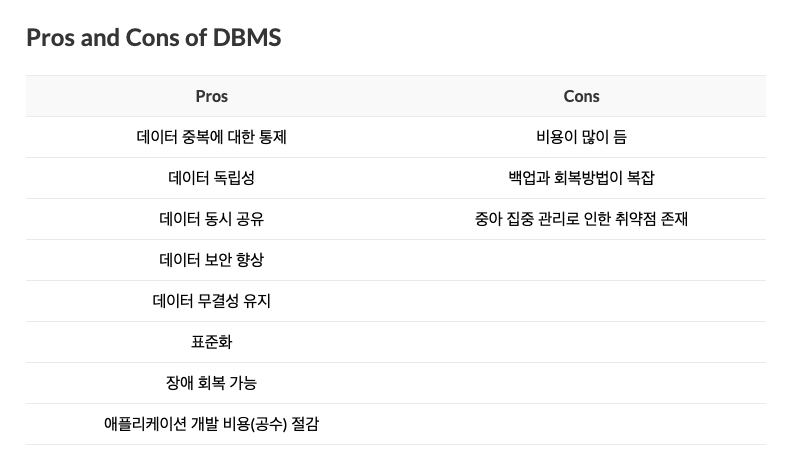
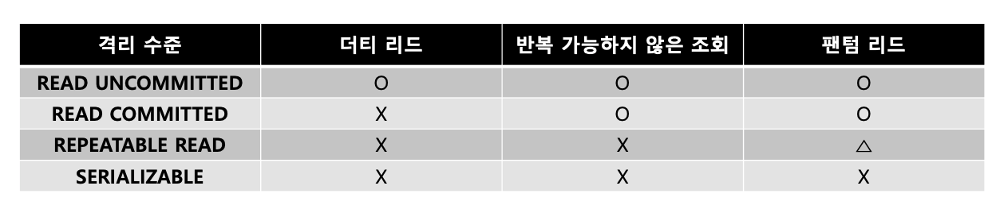
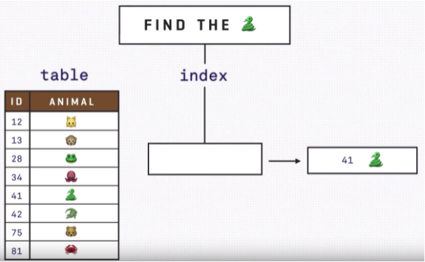
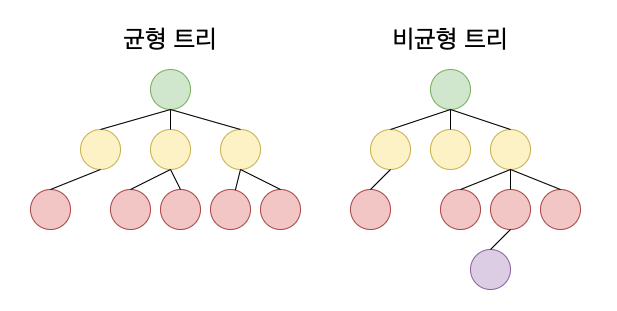
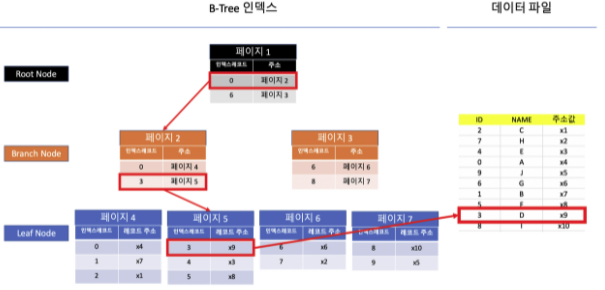
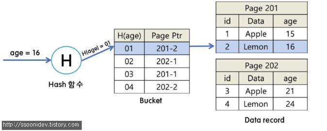

# Part 01 Database 답변

Made by. [이소희](https://github.com/ICanDoCS/ICanDo_Interview/01.database/lsh)

## Database

#### 💡 File vs DBMS

파일시스템의 단점을 보완해서 만들어 진 것이 DBMS입니다.

파일 시스템은 같은 데이터가 여러 파일에 저장되어 데이터 중복성이 발생할 수 있습니다. 운영자의 실수로 하나의 파일만 갱신하는 경우 데이터의 정합성에 문제가 생깁니다. 또한, 제약을 걸어야하는 경우 파일 시스템은 하나하나 확인하며 제약조건을 확인해야합니다. 또한, 파일을 서로 다른 클라이언트에서 동시에 수정할 수 없는 경우가 일반적입니다. 반면, DBMS는 동시에 같은 데이터를 갱신할 수는 없지만, 여러 클라이언트에서 서로 다른 데이터에 대한 조작이 가능합니다. File System에서는 파일을 사용하는 도중 장애가 발생한다면 원복이 쉽지 않습니다.

#### 💡 Schema가 무엇인가요?

데이터의 구조와 제약조건에 대한 명세입니다. 비관계형 DB는 가지고 있지 않고, 관계형 DB는 가지고 있습니다.

## Normalization

#### 💡 정규화를 왜 진행하나요?

불필요한 데이터를 제거해 중복을 최소화 합니다. 각종 이상 현상(Anomaly)을 방지하고, 테이블의 구성을 논리적이고, 직관적으로 하기 위해 진행합니다.

#### 💡 이상 현상이 무엇인가요?

이상 현상의 종류로는 삽입, 갱신, 삭제 이상이 있습니다.

1. 삽입 이상은 새 데이터를 삽입하기 위해 불필요한 데이터도 함께 삽입해야 하는 문제입니다.

2. 갱신 이상은 중복 튜플 중 일부만 변경하여, 데이터가 불일치하게 되는 모순의 문제입니다.

3. 삭제 이상은 튜플 삭제로 인해 꼭 필요한 데이터까지 함께 삭제되는 문제입니다.

#### 💡 데이터의 중복을 피할수있는데 역정규화는 왜실행하나요? / 모든 테이블에 정규화를 진행하나요?

함께 사용하는 테이블이 정규화로 인해 분리되었을 때 연산할 때마다 join 문을 실행해야합니다. join이 자주 일어나는 테이블의 경우에는 성능 저하를 방지하기 위해 역정규화를 실행합니다.

#### 💡 정규화 단계별 과정에 대해 설명하시오.

- 제 1정규형은 도메인 제약조건을 만족합니다.
- 제 2정규형은 부분적 함수종속을 제거합니다.
- 제 3정규형은 이행적 함수종속을 제거합니다.

## RDBMS/NoSQL

#### 💡 관계형 데이터베이스의 특징

* 데이터의 종속성을 관계로 표현하며, 테이블은 키와 값의 형태를 갖습니다. 
* 복잡한 데이터 구조를 표현하는데에 용이하고, 정렬,탐색,분류가 빠릅니다. 
* 데이터의 무결성을 보장합니다. 
* 데이터는 정해진 데이터 스키마에 따라 테이블에 저장됩니다.

#### 💡 무결성 제약조건이란 무엇인가?

먼저 무결성은 데이터에 결함이 없는 상태를 말합니다. 무결성 제약조건의 목표는 데이터베이스에 저장된 데이터의 무결성을 보장하고, 데이터베이스의 상태를 일관되게 유지하는 것입니다.

개체 무결성 (기본키는 null 값이 될 수 없다.), 참조 무결성(외래키는 참조할 수 없는 값을 가질 수 없다.), 키 무결성(관계에는 최소한 하나의 키가 존재해야 한다.), null 무결성(특정 속성은 null값을 가질 수 없음), 고유 무결성(특정 속성값은 서로 달라야 한다.)이 있습니다.

#### 💡 비관계형 데이터베이스(NoSQL)의 특징

* 스키마와 관계를 가지고 있지 않은 DB입니다.
* 수평적 확장(분산처리)의 기능을 쉽게 제공합니다. 
* 관계가 없기 때문에 Join이 불가능하고, 트랜잭션을 지원하지 않습니다.

#### 💡 SQL 데이터베이스 사용이 더 좋을 때

- 관계를 맺고 있는 데이터가 자주 변경되는 애플리케이션의 경우

  > NoSQL에서는 여러 컬렉션을 모두 수정해야 하기 때문에 비효율적

- 변경될 여지가 없고, 명확한 스키마가 사용자와 데이터에게 중요한 경우 (무결성)

- 예를 들어, 쇼핑몰을 만드는 경우 (개수같은 데이터가 정확해야하니까)

#### 💡 NoSQL 데이터베이스 사용이 더 좋을 때

- 정확한 데이터 구조를 알 수 없거나 변경/확장 될 수 있는 경우
- 읽기를 자주 하지만, 데이터 변경은 자주 없는 경우
- 데이터베이스를 수평으로 확장해야 하는 경우 (막대한 양의 데이터를 다뤄야 하는 경우)
- 예를 들어, 채팅 로그 같은 경우 (변경이 없음)

#### 💡 InnoDB

## Transaction

#### 💡 트랜잭션이란 무엇이고 특성에 대해 설명하시오.

트랜잭션은 작업의 완정성을 보장해주는 것입니다. 작업의 논리적 단위로 이해할 수 있습니다. 특성으로는 원자성, 일관성, 고립성, 지속성이 있습니다.

* 원자성(Atomicity)
  * 트랜잭션이 모두 반영되거나, 전혀 반영되지 않아야한다는 것.

* 일관성(Consistency)
  * 항상 작업처리결과가 일관적이어야한다. (중간에 데이터베이스 변경이 있더라도 트랜잭션 시작 기준으로 진행되어야한다.)

* 고립성(Isolation)
  * 둘 이상의 트랜잭션이 있을 때 어떤 하나의 트랜잭션도 다른 트랜잭션의 연산에 끼어들 수 없다.

* 지속성(Durability)
  * 결과가 영구적으로 반영되어야한다.

#### 💡 트랜잭션의 격리 레벨(수준)

트랜잭션의 네가지 주요 성질 중 고립성을 구현하는 개념입니다. 

- `READ UNCOMMITTED`: 잠금(lock)을 일절 실행하지 않아 미처 커밋되지 않고 트랜잭션이 진행 중인 기록 조차도 조회할 수 있는 격리 수준입니다. 가장 고립성을 덜 구현하는 느슨한 형태입니다. 더티 리드(트랜잭션이 종료된 후 변경되었거나 존재하지 않을 수도 있는 데이터를 읽어들이는 현상)가 발생할 수 있다.
- `READ COMMITTED`: 커밋이 완료된 데이터에 대해서만 조회를 허용합니다. 더티 리드를 방지할 수 있습니다. 하지만, 반복 가능하지 않은 조회(한 트랜잭션 내에서 같은 행이 두 번 이상 조회됐는데 그 값이 다른 경우)가 발생할 수 있습니다.
- `REPEATABLE READ`: MySQL InnoDB의 기본 격리 수준입니다. 잠금을 통해 쓰는 동안 읽을 수 없게하고, 동시에 읽는 동안 쓸 수도 없도록 합니다. 더티 리드, 반복 가능하지 않은 조회를 방지할 수 있지만 잠금이 적용되는 범위가 더욱 넓어져 성능과 속도가 느려질 수 있습니다.
- `SERIALIZABLE`: 한 트랜잭션과 다른 트랜잭션을 완전히 분리하여 가장 높은 고립성을 띕니다. 더티 리드, 반복 가능하지 않은 조회, 팬텀 리드(한 트랜잭션 내에서 같은 쿼리문이 실행되었음에도 불구하고 조회 결과가 다른 경우)를 완벽히 방지합니다. 성능, 동시성이 가장 낮습니다.

#### 💡 교착상태(Deadlock)란 무엇인가?

복수의 트랜잭션을 사용하다보면 일어날 수 있는 상태로, 두개 이상의 트랜잭션이 특정 자원의 잠금(lock)을 획득한 채 다른 트랜잭션이 소유하고 있는 잠금을 요구하면 아무리 기다려도 상황이 바뀌지 않는 상태가 됩니다. 이를 교착상태라고 합니다. 

* A가 foo라는 공유 변수에 Lock을 걸어두고, B가 bar라는 공유 변수에 lock을 걸어둔 상태에서 A가 bar 변수를 만나면 B가 선점하고 잇으므로 대기 상태로 전환, 동시에, B의 경우엔 foo 변수를 만나면 A가 선점하고 있으므로 대기 상태로 전환!

#### 💡 교착상태의 발생 네가지 필요 조건

상호 배제 조건, 점유와 대기 조건, 비선점 조건, 순환 대기 조건이 있습니다.

#### 💡 교착상태의 해결 방법

교착상태 예방, 회피, 탐지 및 복구, 무시 방법이 있습니다.

## Index

#### 💡 Index란 무엇인가?

* 책의 목차처럼 지정한 칼럼을 정렬하여 쉽게 찾을 수 있도록 만든 테이블입니다. 칼럼의 값과 해당 레코드가 저장된 주소를 키와 쌍의 값으로 인덱스를 생성합니다. 검색과 정렬 작업의 속도를 높이기 위해 사용됩니다.

  

#### 💡 Index의 자료구조는 어떤 것을 사용하나요?

* B-Tree(Balanced-Tree)와 Hash-Based Index 자료구조를 사용합니다. 

  * B-Tree

    한쪽 브랜치에만 데이터가 몰릴 수 있는 binary serach tree의 단점을 보완하기 위해 나온 자료구조입니다. DBMS에서 가장 범용적으로 사용되고 있습니다. 트리의 높이를 자동으로 바로잡아주는 기능이 있습니다. (균형 트리)

    

    

    가장 상단의 노드를 '루트 노드',  중간 노드들을 '브랜치 노드', 가장 아래 노드들을 '리프 노드' 라고 합니다.

    * 장점: 균일성(어떤 값에 대해서도 같은 시간에 결과를 얻을 수 있다.)
    * 시간 복잡도: O(logN)
    * B+tree: B-tree의 확장개념으로, 리프 노트에만 데이터와 키를 저장하고, 나머지 노드에는 데이터를 저장하지 않는 것(키만 저장하는 것)을 의미합니다. 메모리를 더욱 확보할 수 있습니다. 또한, 한 노드에 키를 여러개 저장할 수 있습니다. 단점으로는 리프 노드까지 가야 데이터가 존재한다는 점입니다. (리프 노드들끼리 링크드 리스트로 연결)

  * Hash-Based Index

    해시 인덱스는 검색하고자 하는 값을 해시함수에 입력한 후 그 결과와 Bucket의 내용을 비교하여 해당 데이터 레코드의 위치를 찾을 수 있는 인덱스 기법입니다. 

    * 장점: Equality 검색에 유용합니다. (column = 'value')
    * 단점: < , > , like, in과 같은 범위 탐색 연산은 느립니다.

    

#### 💡 Index 사용 시 장단점과 사용하면 좋은 경우와 나쁜 경우에 대해 설명하시오.

* 장점은 관계형 DBMS에서 검색 속도를 높일 수 있다는 점입니다. 
* 단점은 Index 생성시 .mdb 파일의 크기가 증가하고, 한 페이지를 동시에 수정할 수 있는 병행성이 줄어듭니다. 또한 데이터 인덱싱된 필드에서 갱신, 추가, 삭제시 성능이 저하됩니다.
* 사용하면 좋은 경우는 Where 절이 자주 사용되는 Column, 외래키가 자주 사용되는 Column, Join에 자주 사용되는 Column이 있습니다.
* 사용하면 나쁜 경우는 Data 중복도가 높은 Column , DML(insert, delete, update)이 자주 일어나는 Column입니다.

#### 💡 Index를 따로 설정하지 않은 경우의 테이블은 어떤가요? (수정 필요)

* 인덱스를 따로 설정하지 않아도 기본적으로 프라이빗 키(PK)값이 인덱스로 설정되어 있습니다.

#### 💡 모든 칼럼에 Index를 사용하면 좋나요?

아니요, 데이터가 긴 경우엔 사용하지 않는 것이 좋습니다. 또한 삽입, 갱신, 삭제가 일어날 때마다 인덱스가 갱신되기 때문에 삽입 갱신 삭제가 자주 일어나는 칼럼에 대해서는 인덱스를 사용하지 않는 것이 좋습니다.

#### 💡 Index는 어디에 사용하는게 좋아요?

* 자주 조회되는 칼럼
* 조회 시 오랜시간을 소모하는 컬럼

#### 💡 Cardinality가 무엇인가요?

전체 행에 대한 특정 컬럼의 중복 수치를 나타내는 지표입니다.

주민번호 처럼 유일한 값일 수록 카디널리티가 높아지고, 성별처럼 중복이 높을 수록 카디널리티가 낮아집니다. 카디널리티가 낮을 경우 인덱스는 사용하지 않는 것이 좋습니다.

> 참고 (데이터베이스)
>
> 1. https://yaboong.github.io/database/2017/09/01/database-1/
>
> 참고 (RDBMS / NoSQL)
>
> 1. https://kosaf04pyh.tistory.com/202
>
> 참고 (트랜잭션)
>
> 1. https://github.com/JaeYeopHan/Interview_Question_for_Beginner/tree/master/Database#index
> 2. https://hleee.medium.com/%EA%B2%A9%EB%A6%AC-%EC%88%98%EC%A4%80-3287d4bcc64d
>
> 참고 (인덱스)
>
> 1. https://beelee.tistory.com/37
> 2. https://zorba91.tistory.com/293
> 3. https://ssoonidev.tistory.com/12
> 4. https://gyoogle.dev/blog/computer-science/data-base/Index-.html
