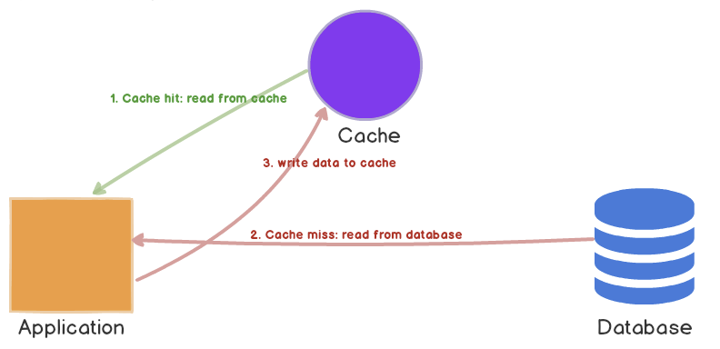
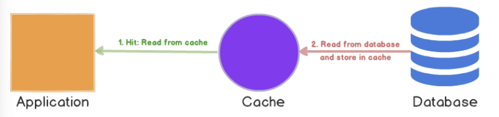

## 캐시

### 💡 Cache Miss 종류

- Compulsory Miss는 최초에 캐시가 비어있을 때, 메모리 주소를 부르면 발생하는 Miss이고,

  Capacity Miss는 캐시 메모리에 공간이 부족해서 발생하는 Miss입니다.

  마지막으로, Conflict Miss는 다른 데이터가 같은 캐시 메모리 주소에 할당되었을 때 발생하는 Miss입니다.

 

## 캐싱 전략

### 💡 Cache-Aside 는?

- DB에 들리기 전에 먼저 캐시에 데이터가 있는지 확인하고, 있으면 캐시에서, 없으면 DB에서 데이터를 가지고 옵니다. DB에서 가지고 올 경우, 데이터를 캐시에 저장해주는 전략입니다.

 

### 💡 Write-through란?

- 읽을 때는 캐시에서 바로 읽어오고, 쓸 때는 캐시를 거쳐서 캐시에 먼저 추가하거나 업데이트한 후, DB에 저장해주는 전략입니다.

 

### 💡 Read-Through는?

- 캐시 미스가 발생하면 데이터베이스에서 누락된 데이터를 로드하고 캐시를 채우고, 이를 어플리케이션에 반환하는 전략입니다.

 

 

## 🏃🏻‍♀️ 정리

### 캐시 메모리 (Cache Memory)

- 속도가 바른 저장 장치와 느린 저장 장치 사이에 속도 차이에 따른 병목현상을 줄이기 위한 범용 메모리

 

#### 특징

- **Locality (지역성)** : 블록 단위의 메모리 참조 (시간, 공간)
- **Mapping (매핑)** : 주기억 장치와 케시 메모리 간의 메모리 매핑 적용 (직접, 연관)
- **Coherence (일관성)** : 병렬 처리시 Local Cache와 공유 메모리간 데이터 일관성 유지 (공유 Cache)

 

 

### 캐시 미스 (Cache Miss)

- CPU가 참조하려는 데이터가 캐시 메모리에 없을 때, Cache Miss가 발생

 

#### 종류

1. **Compulsory Miss**
   - 최초 캐시 메모리가 초기화된 상태에서 발생하는 miss
   - = 최초에 캐시가 모두 비어있어 생기는 Miss
2. **Capacity Miss**
   - Cache 용량 부족으로 인한 miss
   - = Cache 메모리에 공간이 부족해서 나는 Miss
3. **Conflict Miss**
   - Cache의 같은 주소를 참조하는 서로 다른 memory block을 계속 반복해서 참조하는 Miss
   - = 캐시 메모리에 A 데이터와 B 데이터를 저장해야 되는데, A와 B가 같은 캐시 메모리 주소에 할당되어서 나는 Miss

 

 

### 캐싱 전략 (Caching Strategy)

#### Cache-Aside

- DB에 들리기 전에 먼저 캐시에 데이터가 있는지 확인하고, 있으면 캐시에서, 없으면 DB에서 데이터를 가지고 옵니다. DB에서 가지고 올 경우, 데이터를 캐시에 저장해주는 전략

  

##### 장점

- 읽기가 많은 워크로드에 적합
- 캐시 분리를 사용했기 때문에, 캐시 오류에 대해 탄력적

##### 단점

- 캐시에 없는 데이터의 경우, 더 오랜 시간이 걸린다.
- 동기화 문제가 발생할 수 있다.

 

#### Write-Through

- 읽을 때는 캐시에서 바로 읽어오고, 쓸 때는 캐시를 거쳐서 캐시에 먼저 추가하거나 업데이트한 후, DB에 저장해주는 전략

- 데이터를 데이터베이스에 작성할 때마다 캐시에 데이터를 추가하거나 업데이트한다. 이로 인해 캐시의 데이터는 항상 최신 상태로 유지할 수 있다.

  

##### 장점

- 항상 동기화 되어 있다.

##### 단점

- 쓰지 않는 데이터도 캐시에 저장되기 때문에 리소스가 낭비된다.
- 쓰기 지연 시간이 증가한다.

 

##### Read-Through

- 캐시 미스가 발생하면 데이터베이스에서 누락된 데이터를 로드해서 캐시를 채우고, 이를 어플리케이션에 반환한다.

- 처음 읽을 때만 데이터를 로드한다.

  

##### 장점

- 읽기가 많은 워크로드에 적합

##### 단점

- 데이터를 처음 요청하면 항상 캐시 미스가 발생하고, 그에 따른 패널티가 발생한다.
- 해결 방법으로 개발자가 직접 쿼리를 실행하여 첫 요청 캐시 미스를 나지 않게 하는 방법을 사용하기도 한다.

 

---

**[참고]**

[캐시 메모리](https://dheldh77.tistory.com/entry/%EC%9A%B4%EC%98%81%EC%B2%B4%EC%A0%9C-%EC%BA%90%EC%8B%9C-%EB%A9%94%EB%AA%A8%EB%A6%ACCache-Memory)

[Memory Hierarchy 1](https://velog.io/@embeddedjune/%EC%BB%B4%ED%93%A8%ED%84%B0%EA%B5%AC%EC%A1%B0-%EC%9A%94%EC%95%BD-%EC%A0%95%EB%A6%AC-10.-Memory-Hierarchy-1)

[캐시 메모리](https://conatuseus.tistory.com/10)

[캐싱 전략](https://wnsgml972.github.io/database/2020/12/13/Caching/)

[캐싱 전략](https://velog.io/@bahar-j/%EC%BA%90%EC%8B%B1-%EC%A0%84%EB%9E%B5)