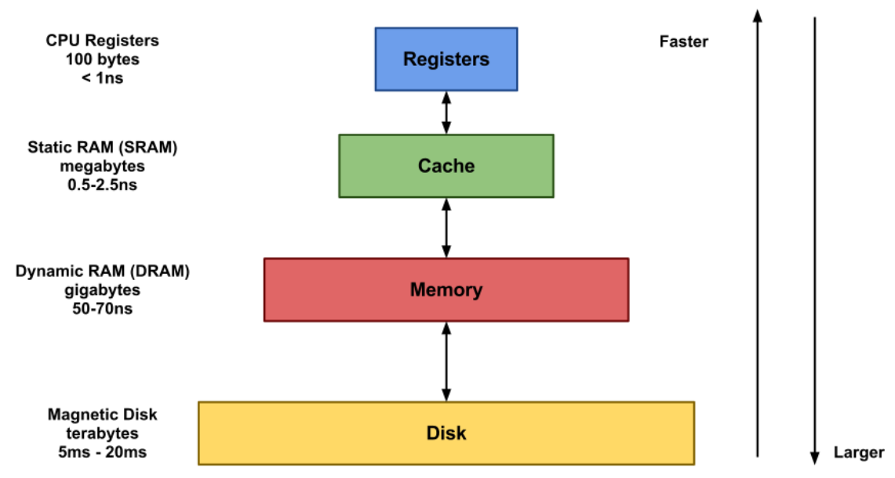

## 심화

### 💡 파일 시스템이란

- 컴퓨터에서 파일이나 자료를 쉽게 발견하고 접근할 수 있도록 유지, 관리하는 체제입니다.

 

### 💡 캐시와 레지스터의 차이점은 무엇인가요?

- 캐시는 메인 메모리와 CPU 간의 속도 차이를 극복하기 위해 사용하는 메모리입니다.

  레지스터는 CPU 안에서 연산을 처리하기 위해 데이터를 저장하는 공간입니다. (데이터와 명령어 저장)

 

 

## 🏃🏻‍♀️ 정리

### 파일 시스템

- 컴퓨터에서 파일이나 자료를 쉽게 발견할 수 있도록 유지, 관리하는 방법
- 파일을 관리하는 방법
- 사용자 영역이 아닌 커널 영역에서 동작
- 파일을 빠르게 읽기, 쓰기, 삭제 등 기본적인 기능을 원활히 수행하기 위한 목적

 

### 캐시와 레지스터

#### 캐시

- 컴퓨터 시스템의 성능을 향상시키기 위해 주로 CPU 칩 안에 포함되는 빠르고 작고 매우 비싼 메모리
- 메인 메모리에 있는 데이터를 캐시 메모리에 불러와두고, CPU가 필요한 데이터를 캐시에서 먼저 찾도록 하면 시스템 성능을 향상시킬 수 있다.

 

#### 레지스터

- CPU에 존재하는 저장 공간
- 데이터와 명령어를 저장하는 역할을 한다.

#### 메모리 계층 구조

 

---

**[참고]**

[파일 시스템이란?](https://security-nanglam.tistory.com/228)

[파일 시스템](https://hackforus.tistory.com/1)

[캐시와 레지스터의 차이](http://melonicedlatte.com/computer/2018/11/07/190754.html)