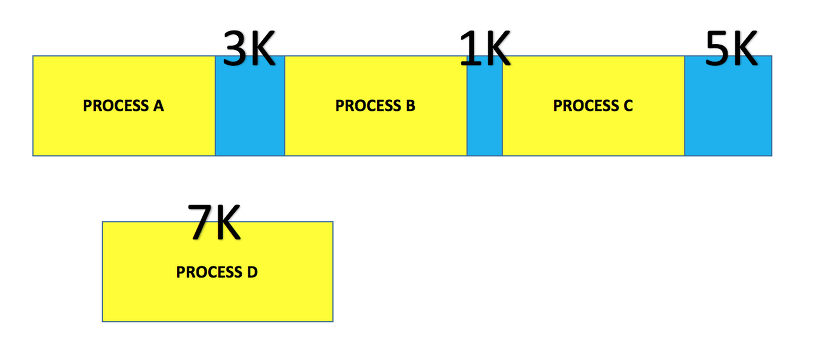
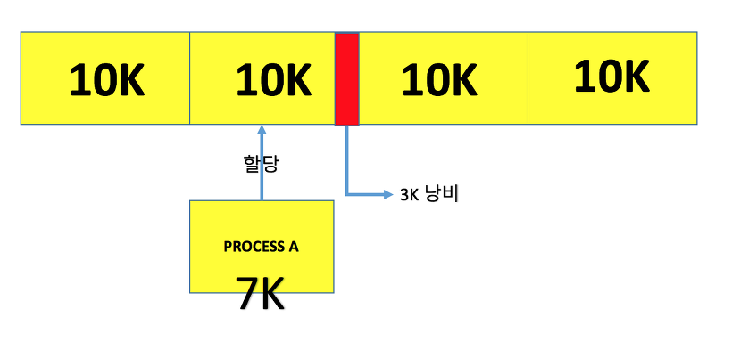
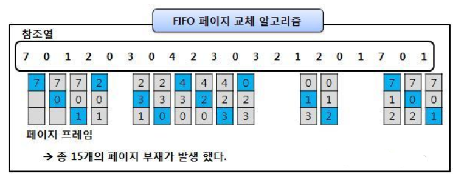
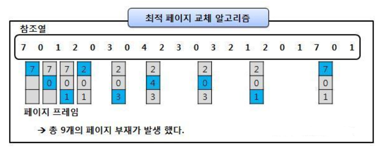
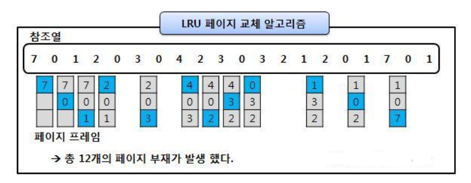

## 메모리 관리 전략

### 💡 교착상태 vs 기아상태

- 교착상태는 여러 프로세스가 동일한 자원 점유를 요청할 때 발생하고, 기아상태는 여러 프로세스가 부족한 자원을 점유하기 위해 경쟁할 때 발생합니다.

  교착상태는 하나 이상의 작업에 영향을 주기 때문에 무한 대기나 기아 상태보다 더 심각한 문제를 일으킵니다.

 

### 💡 교착 상태 4가지

- 교착 상태는 상호배제, 점유대기, 비선점, 순환대기 4가지 조건이 모두 성립할 때 발생할 가능성이 있습니다.

  상호배제는 여러 프로세스가 한 자원에 동시에 접근이 불가능한 것이고,

  점유대기는 자원을 가진 상태에서 다른 프로세스가 사용하고 있는 자원의 반납을 기다리는 것입니다.

  비선점은 다른 프로세스의 자원을 강제로 가져올 수 없는 것이고,

  순환대기는 각 프로세스는 순환적으로 다음 프로세스가 요구하는 자원을 가지고 있는 것입니다.

 

### 💡 외부 단편화와 내부 단편화란?

- 먼저, 메모리 단편화는 RAM에서 메모리의 공간이 작은 조각으로 나뉘어져 사용가능한 메모리가 충분히 존재하지만 할당이 불가능한 상태입니다.

  외부 단편화는 메모리가 할당 및 해제 작업의 반복으로 작은 메모리가 중간 중간에 사용하지 않는 메모리가 존재해서 총 메모리 공간은 충분하지만 실제로 할당할 수 없는 상황입니다. 즉, 여유 공간이 여러 조각으로 나뉘는 현상입니다.

  내부 단편화는 메모리를 할당할 때 프로세스가 필요한 양보다 더 큰 메모리가 할당되어서, 프로세스에서 사용하는 메모리 공간이 낭비되는 현상입니다.

 

### 💡 페이징의 장점과 단점은?

- 페이징은 프로세스를 일정 크기인 페이지로 잘라서 물리적 메모리에 불연속적으로 적재하는 방식입니다.

  페이징 기법을 사용하면 외부 단편화를 해결할 수 있고, 메모리 공간을 효과적으로 사용할 수 있다는 장점이 있습니다.

  하지만 내부 단편화 문제의 비중이 늘어난다는 단점이 있습니다.

 

### 💡 메모리 단편화 해결 기법에 대해 설명하시오.

- 메모리 단편화 해결 기법에는 크게 3가지 방법이 있습니다.

  첫째로, 페이징 기법은 프로세스를 같은 크기로 잘라 물리적 메모리에 불연속적으로 적재하는 방식입니다. 페이징 기법은 불연속적으로 적재하기 때문에 외부 단편화를 해결할 수 있지만, 내부 단편화가 발생할 수 있습니다.

  둘째로, 세그멘테이션 기법은 가상 메모리를 서로 크기가 다른 세그먼트로 분할해서 메모리를 할당합니다. 세그멘테이션 기법은 프로세스가 필요한 메모리만큼 할당해주기 때문에 내부 단편화는 일어나지 않지만, 중간에 프로세스가 메모리를 해제하면 외부 단편화 문제가 발생합니다.

  마지막으로, 메모리 풀은 필요한 메모리 공간을 필요한 크기, 개수만큼 사용자가 직접 지정하여 미리 할당받아 놓고 필요할 때마다 사용하고 반납하는 기법입니다. 이 기법은 외부 단편화와 내부 단편화가 모두 발생하지 않지만, 미리 할당해놓고 사용하지 않을 때에도 계속 할당해놓으므로 메모리 누수가 발생합니다.

 

### 💡 페이지 교체 알고리즘 중 3가지를 선택해서 설명해주세요.

- FIFO와 OPT, LRU 알고리즘에 대해 설명하겠습니다.

  먼저, FIFO 알고리즘은 가장 먼저 올라온 페이지를 먼저 내보내는 알고리즘입니다. 가장 간단한 방법입니다.

  둘째로, OPT 알고리즘은 앞으로 가장 사용하지 않을 페이지를 가장 우선적으로 내보내는 알고리즘입니다. 하지만, 실질적으로 페이지가 앞으로 잘 사용되지 않을 것이라는 보장이 없기 때문에 수행하기 어려운 알고리즘입니다.

  마지막으로, LRU 알고리즘은 최근에 사용하지 않은 페이지를 가장 먼저 내보내는 알고리즘입니다. 즉, 사용한지 오래된 페이지를 먼저 내보내는 방식입니다.

 

 

## 🏃🏻‍♀️정리

### 교착상태

- 무한 대기 상태. 두 개 이상의 작업이 서로 상태방의 작업이 끝나기만을 기다리고 있기 때문에 다음 단계로 진행하지 못하는 상태

 

#### 교착상태 발생 조건 4가지

1. **상호배제 (Mutual Exclusion)** : 한 자원에 대한 여러 프로세스의 동시 접근 불가
2. **점유대기 (Hold and Wait)** :자원을 가지고 있는 상태에서 다른 프로세스가 사용하고 있는 자원의 반납을 기다리는 것
3. **비선점 (No Preemption)** : 다른 프로세스의 자원을 강제로 가져올 수 없음
4. **순환대기 (Circular Wait)** : 각 프로세스가 순환적으로 다음 프로세스가 요구하는 자원을 가지고 있는 것

 

### 기아상태

- 특정 프로세스의 우선 순위가 낮아서 원하는 자원을 계속 할당받지 못하는 상태

> 50개의 Task가 있고, 50개 중 49개는 1번 우선 순위를 갖고, 나머지 1개는 2번 우선 순위를 갖는다고 가정하자.
>
> 또한, 해당 프로그램은 10번의 실행 과정을 거치면 종료된다.
>
> 이 때, 2번의 우선 순위를 갖는 작업은 자원을 할당받을 수 없다. 자원을 할당 받더라도 우선 순위가 높은 자원에게 자원 할당을 빼앗기기 때문이다.

 

### 교착상태와 기아상태의 차이

- 교착상태는 프로세스가 자원을 얻지 못해 다음 처리를 못하는 상태고, 기아상태는 프로세스가 원하는 자원을 계속 할당받지 못하는 상태이다.
- 교착상태는 주로 여러 프로세스가 동일한 자원 점유를 요청할 때 발생한다.
- 기아상태는 여러 프로세스가 부족한 자원을 점유하기 위해 경쟁할 때, 특정 프로세스는 영원히 자원 할당이 안되는 경우를 뜻한다.

 

 

### 메모리 단편화

- RAM에서 메모리 공간이 작은 조각으로 나뉘어져, 사용가능한 메모리가 충분히 존재하지만 할당이 불가능한 상태

 

### 외부 단편화

- 메모리가 할당 및 해제 작업의 반복으로, 사용하지 않는 메모리가 중간 중간 생겨, 총 메모리 공간은 충분하지만 실제로 할당할 수 없는 상황

- 여유 공간이 여러 조각으로 나뉘는 현상

  

 

### 내부 단편화

- 메모리를 할당할 때, 프로세스가 필요한 양보다 더 큰 메모리가 할당되어서 프로세스에서 사용하는 메모리 공간이 낭비되는 현상

  

 

### 단편화 해결 기법

#### 페이징 (Paging) 기법

- 프로세스가 사용하는 메모리 공간을 동일한 크기인 페이지로 나누어 비연속적으로 실제 메모리에 할당하는 기법
- 연속적이지 않은 공간을 활용할 수 있기 때문에 <u>외부 단편화 문제를 해결</u>
- 페이지 단위에 알맞게 꽉 채워 쓰는 게 아니므로 <u>내부 단편화 문제 발생</u>

 

#### 세그멘테이션 (Segmentation) 기법

- 프로세스를 함수는 함수대로, 자료구조는 자료구조대로 단위 별로 메모리 상에 존재하는 것으로 인식. 이러한 것을 세그먼트라고 한다. 세그먼트를 그대로 물리 메모리 운영에 반영해주는 기법
- 세그먼트는 각각 크기가 다르다.
- 컴파일러가 세그먼트를 구분하는 역할을 하여 프로그램 소스를 분석하면서 세그먼트를 식별하고 생성해낸다.

- 서로 다른 크기의 세그먼트들이 메모리에 적재되고 제거되는 일이 반복되다 보면, 자유 공간들이 많은 수의 작은 조각들로 나누어져 못 쓰게 될 수도 있다.
- 프로세스가 필요한 메모리만큼 할당해주기 때문에 <u>내부 단편화는 발생하지 않는다.</u>
- 중간에 프로세스가 메모리를 해제하면 생기는 구멍, 즉 <u>외부 단편화 문제는 발생</u>

 

#### 메모리 풀 (Memory Pool)

- 필요한 메모리 공간을 필요한 크기, 개수만큼 사용자가 직접 지정하여 미리 할당 받아 놓고, 필요할 때마다 사용하고 반납하는 기법
- 미리 공간을 할당해놓고 가져다 쓰고 반납하기 때문에 할당과 해제로 인한 <u>외부 단편화가 발생하지 않는다.</u>
- 필요한 크기만큼 할당해놓기 때문에 <u>내부 단편화가 발생하지 않는다.</u>
- 메모리 풀을 만들었지만, 쓰지 않을 때, 메모리 양이 커질 경우, 사용하지 않아야 한다.
- 메모리의 할당, 해제가 잦은 경우에 메모리 풀을 쓰면 효과적이다.
- 미리 할당해놓고 사용하지 않는 순간에도 계속 할당해놓으므로, 메모리 누수가 있는 방식이다.

 

 

### 페이지 교체 알고리즘

#### FIFO (First -In-First-Out)

- 메모리에 먼저 올라온 페이지를 먼저 내보내는 알고리즘

- 가장 간단한 방법. 특히, 초기화 코드에 적절한 방법

- 초기화 코드 : 처음 프로세스가 실행될 때, 최초 초기화를 시키는 역할만 진행하고, 다른 역할을 수행하지 않으므로 메인 메모리에서 빼도 괜찮은 코드

  

 

#### OPT (Optimal)

- 앞으로 가장 사용하지 않을 페이지를 가장 우선적으로 내보내는 알고리즘

- FIFO에 비해 페이지 결함의 횟수를 많이 감소시킬 수 있음

- 하지만, 실질적으로는 페이지가 앞으로 잘 사용되지 않을 것이라는 보장이 없기 때문에 수행하기 어려움

  

 

#### LRU (Least-Recently-Used)

- 최근에 사용하지 않은 페이지를 가장 먼저 내보내는 알고리즘

- 최근에 사용하지 않았으면, 나중에도 사용되지 않을 것이라는 아이디어

- OPT는 미래 예측, LRU는 과거를 보고 판단하므로 실질적으로 사용 가능

- OPT보다는 페이지 결함이 더 일어날 수 있지만, 실제로 사용할 수 있는 페이지 교체 알고리즘에서는 가장 좋은 방법 중 하나

  

 

#### LFU (Least-Frequently-Used)

- 참조 횟수가 가장 작은 페이지를 교체하는 방법
- 활발하게 사용되는 페이지는 참조 횟수가 많아질 것이라는 가정에서 만들어진 알고리즘

 

#### NUR (Not-Used-Recently)

- LRU와 비슷한 방식으로, 최근에 사용하지 않은 페이지를 교체
- LRU 교체의 단점인 시간 오버헤드를 적게하는 방법
- 최근 사용여부를 확인하기 위해 각 페이지마다 두 개의 비트 (참조 비트 / 변형 비트)를 사용
- 참조 비트 : 페이지가 호출되었을 때는 1, 호출되지 않았을 때는 0
- 변형 비트 : 페이지 내용이 변경되었을 때는 1, 변경되지 않았을 때는 0

---

**[참고]**

[교착상태](https://junsday.tistory.com/32)

[기아상태](https://velog.io/@woga1999/Starvation-%EA%B8%B0%EC%95%84-%EC%83%81%ED%83%9C-%EB%9E%80)

[교착상태와 기아상태](https://velog.io/@underlier12/OS-24-%EA%B5%90%EC%B0%A9%EC%83%81%ED%83%9C%EC%99%80-%EA%B8%B0%EC%95%84%EC%83%81%ED%83%9C)

[교착상태와 기아상태 2](https://heekim0719.tistory.com/2)

[메모리 단편화와 내부 단편화, 외부 단편화](https://junghyun100.github.io/%EB%A9%94%EB%AA%A8%EB%A6%AC%EB%8B%A8%ED%8E%B8%ED%99%94/)

[페이징](https://jhnyang.tistory.com/290)

[페이징 2](https://spacefordeveloper.tistory.com/174)

[페이징, 세그먼트, 메모리 풀](https://kyoun.tistory.com/31)

[페이지 교체 알고리즘](https://gyoogle.dev/blog/computer-science/operating-system/Page%20Replacement%20Algorithm.html)

[페이지 교체 알고리즘 2](https://liveyourit.tistory.com/235)