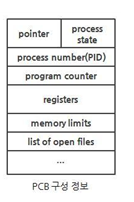

## Process & Thread

#### 💡 프로세스와 스레드에 차이는 무엇인가?

- 프로세스는 메모리에 올라와 실행되고 있는 프로그램의 인스턴스이고, 스레드는 프로세스 내에서 실행되는 여러 흐름의 단위입니다. 또한, 스레드는 프로세스의 특정한 수행 경로입니다.

 

#### 💡 멀티 스레드의 장점 및 단점은 무엇인가?

- 멀티 스레드의 장점은 시스템 처리량이 증가하고, 시스템 자원 소모가 감소됩니다. 프로세스를 생성하여 자원을 할당하는 시스템 콜이 줄어들기 때문에 자원을 효율적으로 관리할 수 있다는 장점이 있습니다.

  반면에, 자원 공유시 동기화 문제가 발생할 수 있다는 단점이 있습니다. 또, 하나의 스레드에 문제가 발생하면 전체 프로세스가 영향을 받는 단점이 있습니다.

 

#### 💡 멀티 프로세스 대신 멀티 스레드를 사용하는 이유

- 쉽게 생각하면, 프로그램을 여러 개 켜는 것보다 하나의 프로그램 안에서 여러 작업을 해결하는 방식이기 때문에, 프로세스를 생성하여 자원을 할당하는 시스템 콜이 줄어들어 자원을 효율적으로 관리할 수 있기 떄문에 멀티 스레드를 사용합니다.

 

#### 💡 자바 스레드란?

- 자바에서 스레드는 JVM에 의해 하나의 프로세스가 발생하고, main() 안의 실행문들이 하나의 스레드입니다.

  main() 이외의 또 다른 스레드를 만들려면 Thread 클래스를 상속하거나 Runnable 인터페이스를 구현하여 스레드를 생성할 수 있습니다.

 

#### 💡 Thread-safe가 뭐에요?

- Thread-safe는 멀티 스레드에서 어떤 함수나 변수, 혹은 객체가 여러 스레드로부터 동시에 접근이 이루어져도 프로그램의 실행에 문제가 없는 것입니다.

 

#### 💡 PCB(Process Control Block)의 역할

- PCB란 운영체제가 프로세스를 제어하기 위해 정보를 저장해놓는 곳으로, 프로세스의 상태 정보를 저장하는 구조체입니다.

 

 

## 🏃🏻‍♀️ 정리

### 프로세스와 스레드

#### 프로세스

- 메모리에 올라와 실행되고 있는 프로그램의 인스턴스 (독립적인 개체)

- 운영체제로부터 시스템 자원을 할당받는 작업의 단위. 즉, 실행된 프로그램

  

- 각 프로세스는 별도의 주소 공간에서 실행되며, 한 프로세스는 다른 프로세스의 변수나 자료구조에 접근할 수 엇ㅂ다.

 

#### 스레드

- 프로세스의 특정한 수행 경로. 즉, 프로세스가 할당받은 자원을 이용하는 실행의 단위이다.

  

- 스레드는 프로세스 내에서 각각 Stack만 따로 할당받고 Code, Data, Heap 영역은 공유한다.
- 스레드는 한 프로세스 내에서 동작되는 여러 실행의 흐름으로, 프로세스 내의 주소 공간이나 자원들(힙 공간 등)을 같은 프로세스 내에 스레드끼리 공유하면서 실행된다.
- 같은 프로세스 안에 있는 여러 스레드들은 같은 힙 공간을 공유한다. 반면에 프로세스는 다른 프로세스의 메모리에 직접 접근할 수 있다.

 

##### JAVA의 Thread

- JAVA는 JVM에 의해 하나의 프로세스가 발생하고, main() 안의 실행문들이 하나의 스레드이다.
- main() 이외의 다른 스레드를 만들려면 Thread 클래스를 상속하거나 Runnable 인터페이스를 구현하면 된다.

 

#### 멀티 프로세스

- 하나의 응용 프로그램을 여러 개의 프로세스로 구성하여 각 프로세스가 하나의 작업(태스크)을 처리하도록 하는 것

 

##### 장점

- 여러 개의 자식 프로세스 중 하나에 문제가 발생하면 그 자식 프로세스만 죽는 것 이상으로 다른 영향이 확산되지 않는다.

##### 단점

- Context Switching 과정에서 무거운 작업이 진행되고 많은 시간이 소모되는 등의 오버헤드가 발생하게 된다.

- Context Switching?

  CPU에서 여러 프로세스를 돌아가면서 작업을 처리하는 과정

 

#### 멀티 스레드

- 하나의 응용 프로그램을 여러 스레드로 구성하고, 각 스레드로 하여금 하나의 작업을 처리하도록 하는 것

 

##### 장점

- 시스템 자원 소모 감소 (자원의 효율성 증대)
  - 프로세스를 생성하여 자원을 할당하는 시스템 콜이 줄어들어 자원을 효율적으로 관리할 수 있다.
- 시스템 처리량 증가 (처리 비용 감소)
  - 스레드 사이의 작업량이 작아 Context Switching이 빠르다.
- 간단한 통신 방법으로 인한 프로그램 응답 시간 단축
  - 스레드는 프로세스 내의 Stack 영역을 제외한 모든 메모리를 공유하기 때문에 통신의 부담이 적다.

##### 단점

- 주의 깊은 설계가 필요하다.

- 디버깅이 까다롭다.

- 단일 프로세스 시스템의 경우, 효과를 기대하기 어렵다.

- 다른 프로세스에서 스레드를 제어할 수 없다.

- 멀티 스레드의 경우 자원 공유의 문제가 발생한다. (**동기화 문제**)

  스레드 간의 자원 공유는 전역 변수(데이터 세그먼트)를 이용하므로, 함께 사용할 때 충돌이 발생할 수 있다.

- 하나의 스레드에 문제가 발생하면 전체 프로세스가 영향을 받는다.

 

#### 멀티 프로세스 대신 멀티 스레드를 사용하는 이유

- 쉽게 설명하면, 프로그램을 여러 개 켜는 것보다 하나의 프로그램 안에서 여러 작업을 해결하는 것이다.

  

- 멀티 프로세스로 실행되는 작업을 멀티 스레드로 실행할 경우, 프로세스를 생성하여 자원을 할당하는 시스템 콜이 줄어들어 자원을 효율적으로 관리할 수 있다.
- 스레드는 프로세스 내의 메모리를 공유하기 때문에 독립적인 프로세스와 달리 스레드 간 데이터를 주고 받는 것이 간단해지고, 시스템 자원 소모가 줄어들게 된다.

 

#### Thread-Safe란?

- 멀티 스레드 프로그래밍에서 일반적으로 어떤 함수나 변수, 혹은 객체가 여러 스레드로부터 동시에 접근이 이루어져도 프로그램의 실행에 문제가 없음을 뜻한다.
- 하나의 함수가 한 스레드로부터 호출되어 실행 중일 때, 다른 스레드가 그 함수를 호출하여 동시에 함께 실행되더라도 각 스레드에서 함수의 수행 결과가 올바르게 나오는 것

 

#### PCB(Process Control Block)란?

- 운영체제가 프로세스를 제어하기 위해 정보를 저장해놓는 곳. 프로세스의 상태 정보를 저장하는 구조체

- 프로세스 상태 관리와 Context Switching을 위해 필요하다.

- PCB는 프로세스 생성시 만들어지며, 주기억장치에 유지된다.

  

---

**[참고]**

[프로세스와 스레드](https://gmlwjd9405.github.io/2018/09/14/process-vs-thread.html)

[JAVA의 Thread](https://coding-factory.tistory.com/279)

[Thread-safe](https://gompangs.tistory.com/entry/OS-Thread-Safe%EB%9E%80)

[PCB](https://jhnyang.tistory.com/33)