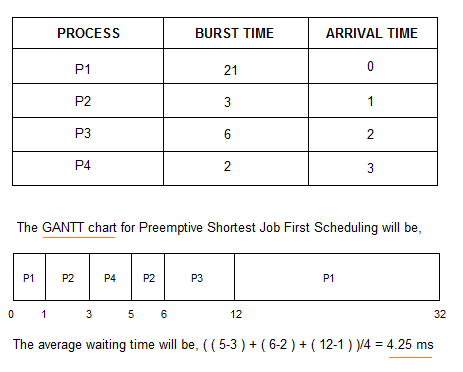

## Scheduling

### 💡 Context Switching이 뭐에요?

- 현재 진행하고 있는 Task(Process 또는 Thread)의 상태를 저장하고, 다음 진행할 Task의 상태값을 읽어 적용하는 과정입니다.

 

### 💡 비선점방식과 선점방식을 설명해주세요.

- 비선점 방식은 한 프로세스가 CPU를 할당받으면 작업 종료 후 CPU를 반환할 때까지 다른 프로세스는 CPU 점유가 불가능한 방식입니다.

  선점 방식은 하나의 프로세스가 CPU를 차지하고 있을 때, 우선순위가 높은 다른 프로세스가 현재 프로세스를 중단시키고 CPU를 점유하는 방식입니다.

 

### 💡 비선점 방식 FIFO, SJF, HRN의 차이

- FIFO는 준비상태 큐에 도착한 순서에 따라 차례로 CPU를 할당하는 방식입니다.

  SJF는 준비상태큐에 있는 프로세스들 중 실행시간이 가장 작은 프로세스에게 자원을 먼저 할당하는 방법입니다.

  HRN은 우선순위 계산식을 이용해 우선순위가 높은 프로세스부터 자원을 할당하는 방식입니다.

 

### 💡 선점 방식 SRT, RR 차이

- SRT는 진행 중인 프로세스가 있어도, 최단 잔여시간인 프로세스를 먼저 할당하는 방식입니다. 선점형 SJF 스케줄링이라고도 불립니다.

  RR 방식은 시분할 시스템에서 사용됩니다. 준비상태 큐에 먼저 들어온 프로세스가 CPU를 할당받는 것은 FIFO와 같지만, RR 방식은 각 프로세스를 할당된 시간동안 실행한 후, 실행이 완료되지 않으면 다음 프로세스에게 CPU를 넘겨주고, 큐의 가장 뒤로 배치됩니다.

 

 

## 🏃🏻‍♀️ 정리

### Context Switching

- 멀티 프로세스 환경에서 CPU가 어떤 하나의 프로세스를 실행하고 있는 상태에서, 인터럽트 요청에 의해 다음 우선 순위의 프로세스가 실행되어야 할 때, 기존의 프로세스의 상태 또는 레지스터 값(Context)를 저장하고 CPU가 다음 프로세스를 수행하도록 새로운 프로세스의 상태 또는 레지스터 값(Context)를 교체하는 작업
- Context는 CPU가 어떤 프로세스를 실행하기 위한 해당 프로세스의 정보들이다. 이 Context는 프로세스의 PCB(Process Control Block)에 저장된다. 그렇기 때문에, Context Swtiching 때 PCB의 정보를 읽어(적재) CPU가 전에 프로세스가 하던 일을 이어서 수행할 수 있는 것이다.
- Context Switching을 할 때 해당 CPU는 아무런 일을 하지 못하기 때문에, 컨텍스트 스위칭이 잦아지면 오히려 오버헤드가 발생하여 효율(성능)이 떨어지게 된다.

 

### 스케줄링 (Scheduling)

- CPU를 사용하려고 하는 프로세스들 사이의 우선순위를 관리하는 작업. 즉, 자원을 어떤 프로세스에게 얼마나 할당하는지 정책을 만드는 것

 

### 비선점 스케줄링

- 한 프로세스가 CPU를 할당받으면, 작업 종료 후 CPU를 반환할 때까지 다른 프로세스는 CPU 점유가 불가능한 스케줄링
- 처리시간의 편차가 적은 특정 프로세스 환경에 용이하다.

 

#### 장점

- 모든 프로세스에 대한 요구를 공정하게 처리할 수 있다.

#### 단점

- 짧은 작업을 수행하는 프로세스가 긴 작업 종료 시까지 대기해야 할 수 있다.

 

#### FIFO (First In First Out) = FCFS (First Come First Served)

- 프로세스가 대기 큐에 도착한 순서에 따라 CPU를 할당

  

 

#### SJF (Shortest Job First)

- 프로세스가 도착하는 시점에 따라 그 당시 가장 작은 서비스 기간을 갖는 프로세스가 종료 시까지 자원을 선점하는 방식
- 준비 큐 작업 중에 가장 짧은 작업부터 수행하므로, 평균 대기시간이 최소이다.
- CPU 요구시간이 긴 작업과 짧은 작업 간의 불평등이 심하고, CPU 요구시간이 긴 프로세스는 기아 현상이 발생한다.

- 기아 현상 (Starvation) : 시스템 부하가 많아서 낮은 등급에 있는 준비 큐의 프로세스가 무한정 기다리는 현상

- 에이징 기법 (Aging) : 기아 현상을 해결하기 위해 오래 기다린 프로세스의 우선순위를 높여주는 기법

  

 

#### HRN (Highest Response Ratio Next)

- 대기 중인 프로세스 중 현재 Response Ratio가 가장 높은 것을 선택한다.

- Response Ratio = (대기 시간 + 서비스 시간) / 서비스 시간

- SJF와 Aging 기법을 합쳐 SJF의 약점인 기아 현상을 보완한 기법이다. 긴 작업과 짧은 작업 간의 불평등을 완화한다.

  

  > P1과 P2가 들어오는 시점에는 대기 중인 프로세스가 없으므로 바로 실행한다.
  >
  > P2가 끝나는 9ms에는 P3, P4, P5가 모두 대기 중이다. 이 때, Reponse Ratio를 계산해보면 P3은 (5 + 4) / 4 = 2.25, P4는 (3 + 5) / 5 = 1.6, P5는 (1 + 2) / 2 = 1.5 이므로 P3이 먼저 실행된다.
  >
  > P3이 끝나는 13ms에서는 P4, P5가 대기하고 있다. Response Ratio가 P4sms 2.4, P5는 3.5로 P5가 먼저 실행되고, 마지막에 P4가 실행된다.

 

### 선점 스케줄링

- 하나의 프로세스가 CPU를 차지하고 있을 때, 우선순위가 높은 다른 프로세스가 현재 프로세스를 중단시키고 CPU를 점유하는 스케줄링 방식

 

#### 장점

- 비교적 응답이 빠르다.

#### 단점

- 처리 시간을 예측하기 힘들다.
- 높은 우선순위 프로세스들이 계속 들어올 경우, 오버헤드를 초래할 수 있다.

 

#### SRT(Shortest Remaining Time First)

- 가장 짧은 시간이 소요되는 프로세스를 먼저 수행한다. 이 때, 남은 시간이 더 짧다고 판단되는 프로세스가 준비 큐에 생기면 해당 프로세스가 선점된다.

  

#### RR(Round Robin)

- 프로세스마다 같은 크기의 CPU 시간을 할당한다. 프로세스가 할당된 시간 내에 처리 완료를 못하면, 준비 큐 리스트의 가장 뒤로 보내고, CPU는 대기 중인 다음 프로세스로 넘어간다.

- 균등한 CPU 점유 시간을 보장하고, **시분할 시스템**을 사용한다.

  

 

---

**[참고]**

[Context Switching](https://nesoy.github.io/articles/2018-11/Context-Switching)

[Context Switching 2](https://jeong-pro.tistory.com/93)

[비선점 & 선점 스케줄링](https://inuplace.tistory.com/318)

[비선점 & 선점 스케줄링 2](https://eun-jeong.tistory.com/17)

[비선점 & 선점 스케줄링 3](https://m.blog.naver.com/PostView.naver?isHttpsRedirect=true&blogId=rlaauddlf200&logNo=30141162460)