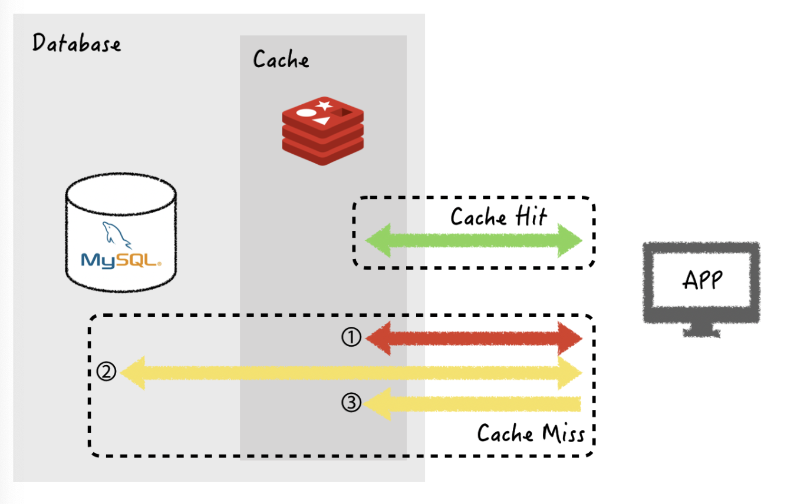
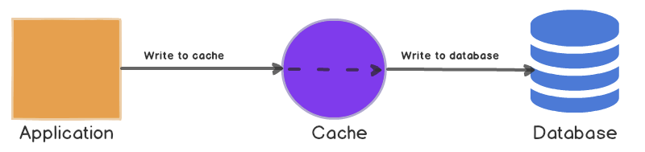
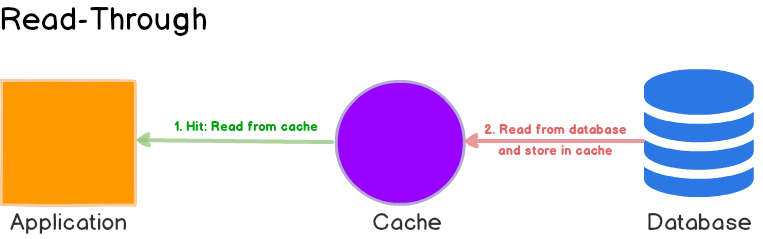
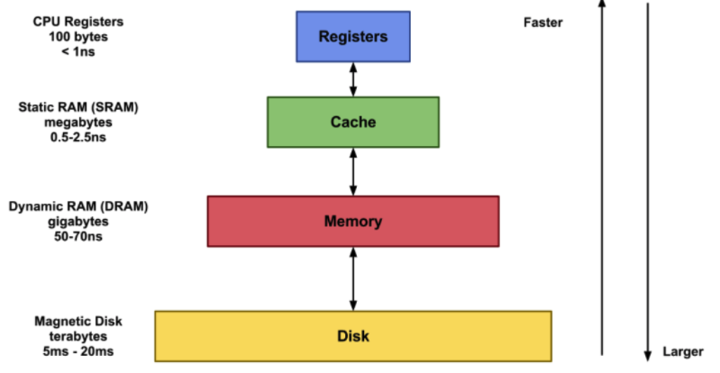

# Part 02. Operating System

[**Reference**](https://github.com/SSAFY-CS-STUDY/Tech_interview/tree/main/03.Operating_system)

 

## Process & Thread

#### 💡 프로세스와 스레드의 차이는 무엇인가?

프로세스는 현재 실행 중인 프로그램을 의미합니다. 스레드는 프로세스 내부에서 실행되는 CPU가 처리하는 하나의 작업 흐름 단위입니다.

#### 💡 멀티 스레드의 장점 및 단점은 무엇인가?

멀티 스레드의 장점은 프로세스를 생성하여 자원을 할당하는 시스템 콜이 줄어들기 때문에 자원을 효율적으로 관리할 수 있다는 장점이 있습니다.

+ **응답성** : 프로그램의 일부분(스레드)이 중단되거나 긴 작업을 수행하더라도 프로그램의 수행이 계속 되어 사용자에 대한 응답성이 증가한다.
  ex) 멀티 스레드가 적용된 웹 브라우저 프로그램에서 하나의 스레드가 이미지 파일을 로드하고 있는 동안, 다른 스레드에서 사용자와 상호작용 가능
+ **경제성** : 프로세스 내 자원들과 메모리를 공유하기 때문에 메모리 공간과 시스템 자원 소모가 줄어든다. 스레드 간 통신이 필요한 경우에도 쉽게 데이터를 주고 받을 수 있으며, 프로세스의 context switching과 달리 스레드 간의 context switching은 캐시 메모리를 비울 필요가 없기 때문에 더 빠르다.
+ **멀티프로세서 활용** : 다중 CPU 구조에서는 각각의 스레드가 다른 프로세서에서 병렬로 수행될 수 있으므로 병렬성이 증가한다.

멀티 스레드의 단점은 동기화 문제(과도한 lock으로 인한 병목 현상 -> 성능 저하)가 발생할 수 있습니다. 또한, 하나의 스레드에 문제가 발생하면 전체 프로세스가 영향을 받을 수 있습니다.

> 참고
>
> 둘 이상의 스레드가 동시에 실행하면 문제를 일으키는 코드 블록(임계 영역)에 동시 접근하는 경우 엉뚱한 값을 읽어오거나 수정할 수 있음 이 때문에 동기화가 필요!

#### 💡 멀티 프로세스 대신 멀티 스레드를 사용하는 이유

프로세스의 컨택스트 스위칭이 스레드 컨택스트 스위칭보다 비용이 많이 들기 때문입니다. 그 이유는 멀티 프로세스는 자신만의 메모리 영역을 가지고 있어 공유하는 자원이 없고, 스레드는 부모 프로세스의 코드, 데이터, 힙 영역을 공유하기 때문입니다. (stack영역은 공유하지 않음) 

#### 💡 자바 스레드란?

- 일반 스레드와 거의 차이가 없으며, JVM이 운영체제의 역할을 합니다.
- **자바는 프로세스가 존재하지 않고 스레드만 존재합니다.**
- 자바 스레드는 JVM에 의해 스케줄링되는 코드블록입니다.
- 개발자는 스레드 코드를 작성하고 JVM에 실행을 요청합니다.
- main()안의 실행문들이 하나의 스레드입니다. 이 외에 또 다른 스레드를 만드려면 Thread 클래스를 상속하거나 Runnable 인터페이스를 구현하여 스레드를 생성할 수 있다.

#### 💡 Thread-safe가 뭐에요?

멀티 스레드 프로그래밍에서 일반적으로 어떤 함수나 객체가 여러 스레드로부터 동시에 접근이 이루어져도 프로그램의 실행에 문제가 없는 것을 의미합니다.

#### 💡 PCB의 역할

PCB는 프로세스 제어 블록으로 운영체제가 프로세스를 제어하기 위해 정보를 저장해 놓는 곳입니다. 프로세스의 상태 관리와 컨택스트 스위칭을 위해 필요합니다. 프로세스 생성 시 만들어지며 주 기억 장치에 유지됩니다. 

#### 💡 PCB의 구성 

 

## Scheduling

#### 💡 Context Switching이 뭐에요?

CPU가 현재 진행하고 있는 Task(프로세스, 스레드)의 상태를 저장(예를 들어, PCB에 저장)하고 다음 진행할 Task의 상태 값을 읽어 적용하는 과정입니다. 컨택스트 스위칭은 발생하게 되면 많은 비용이 발생합니다. 캐시 초기화, 메모리 매핑 초기화 등의 과정을 거쳐야하기 때문입니다.

#### 💡 비선점방식과 선점방식을 설명해주세요.

선점 스케줄링은 프로세스가 CPU를 차지하고 있을 때 우선 순위가 높은 프로세스가 선점할 수 있는 스케줄링 방식입니다. 우선순위가 높은 프로세스를 빠르게 처리할 수 있는 장점이 있지만, 잦은 Context Switching으로 오버헤드가 증가할 수 있다는 단점이 있습니다. 

비선점 스케줄링이란 할당된 CPU를 다른 프로세스가 강제로 빼앗을 수 없는 스케줄링입니다. 응답시간 예측이 용이하다는 장점이 있지만, 우선 순위가 높으 작업이 오래 기다리는 경우가 발생할 수 있다는 단점이 있습니다.

#### 💡 선점 방식 SRT**(Shortest Remaining Time)**, RR(Round Robin) 차이

* SRT: 최단 잔여시간을 우선으로 하는 스케줄링 방법입니다. 진행 중인 프로세스가 있어도, 최단 잔여시간인 프로세스를 위해 중단시키고, 최단 잔여 시간 프로세스를 먼저 할당합니다. (선점 SJF라고도 불립니다.)
* RR: 시분할 시스템을 위해 고안된 선점 방식의 스케줄링 방법입니다. 각 프로세스는 같은 CPU 시간을 할당 받습니다. 할당 시간안에 작업이 끝나지 않으면 다시 ready queue에 들어가 선입선출 방식으로 수행됩니다.

#### 💡 비선점 방식 FIFO, SJF(Shortest Job First), HRN(Highest Response ratio Next)의 차이 (보충)

* FIFO(FCFS, first com first serve): 준비상태 큐에 들어오는 순서대로 프로세스를 수행하는 스케줄링입니다. 평균 응답시간이 길어 대화식 시스템에 부적합합니다.
* SJF: 최단 작업 우선 스케줄링으로, 프로세서가 사용 가능할 때 실행 시간이 가장 짧은 작업에 할당하는 방법입니다. 평균 대기 시간이 짧다는 장점이 있지만 실행 시간을 예측하기 어렵다는 단점이 있습니다.
  * 기아상태:
  * 에이징:
* HRN: 각 작업의 우선 순위로 작업을 할당하는 방법입니다. 오랫동안 대기하는 프로세스의 우선 순위를 증가시킴으로써 SJR의 단점인 기아상태를 해결할 수 있습니다.
  * 우선순위: (대기시간+서비스시간)/서비스시간

 

## 메모리 관리 전략

#### 💡 교착상태 vs 기아상태

- 교착상태는 둘 이상의 **프로세스**들이 자원을 점유한 상태에서 `서로 다른 프로세스가 점유`하고 있는 자원을 요구하며 무한정 기다리는 상황입니다.
- 기아상태는 병행 프로세스(운영체제가 프로세서를 빠르게 전환하여 프로세서 시간을 나눠서 마치 프로세스 여러 개를 동시에 실행하는 것처럼 보이게 하는 것)에서 프로세스가 실행되는 데에 필수적인 자원을 끊임없이 사용하지 못하는 상황입니다.

#### 💡 교착 상태의 필요 조건 4가지

1. 상호배제(Mutual exclusion) : 특정 프로세스가 공유 자원을 사용 중일 때 다른 프로세스가 이 자원에 접근하지 못하도록 막는 것입니다.
2. 점유대기(Hold and wait) : 프로세스가 할당된 자원을 가진 상태에서 다른 자원을 기다리는 것을 의미합니다.
3. 비선점(No preemption) : 프로세스가 어떤 자원의 사용을 끝낼 때까지 그 자원을 뺏을 수 없는 것입니다.
4. 순환대기(Circular wait) : 각 프로세스는 순환적으로 다음 프로세스가 요구하는 자원을 가지고 있습니다. (자원을 기다리는 프로세스간에 사이클이 형성되어야 합니다.)

#### 💡 외부 단편화와 내부 단편화란?

메모리 빈공간이 50일 때, 새로운 프로세스가 30의 크기인 경우 20이라는 공간이 남는다. 이때, 메모리가 낭비되는 것을 내부 단편화라고 합니다. (필요한 양보다 더 큰 메모리 공간에 할당되어 메모리가 낭비되는 것)

메모리 빈공간이 50, 50 일때, 새로운 프로세스가 70인 경우 메모리에는 (50+50) 100 공간이 남아있지만 프로세스가 적재되지 못합니다. 이를 외부 단편화라고 합니다.

#### 💡 페이지와 프레임

보조기억장치를 이용한 가상 메모리를 같은 크기의 블록으로 나눈 것을 페이지라고 하고, RAM을 페이지와 같은 크기로 나눈 것을 프레임이라고 합니다.

#### 💡 메모리 단편화 해결 기법에 대해 설명하시오.

- 가상메모리를 이용하여 내부 단편화 기법을 해결하는 `세그멘테이션`과 외부 단편화를 해결하는 `페이징` 기법이 있습니다.
  - Paging은 프로세스를 일정(동일한) 크기인 페이지로 잘라서 메모리에 적재하는 방식입니다. (사용하지 않는 프레임을 페이지에 옮기고, 필요한 메모리를 페이지 단위로 프레임에 옮기는 기법)
  - Segmentation은 메모리를 서로 크기가 다른 논리적인 블록 단위인 세그먼트로 분할하여 메모리를 할당하는 기법입니다. 페이징 기법에서는 가상 메모리를 같은 크기의 단위로 분할했지만 세그멘테이션기법에서는 가상 메모리를 크기가 다른 논리적 단위인 세그먼트로 분할해서 메모리를 할당합니다.
  - 메모리 풀은 필요한 메모리 공간을 필요한 크기, 개수만큼 사용자가 직접 지정하여 미리 할당받아 놓고, 필요할 때마다 사용하고 반납하는 기법입니다. 이 기법은 외부 단편화, 내부 단편화가 모두 발생하진 않지만 미리 할당해놓고 사용하지 않을 때에도 계속 할당해놓으므로 메모리 누수가 발생합니다.

#### 💡 페이징의 장점과 단점은?

- Paging은 프로세스를 일정 크기인 **페이지**로 잘라서 메모리에 불연속적으로 적재하는 방식입니다.
- 외부 단편화 문제를 해결할 수 있지만, 메모리를 적재할 때 Mapping 과정이 늘어나 속도가 저하될 수 있고, 내부 단편화 문제는 발생할 수 있습니다.

#### 💡페이지 교체 알고리즘 중 3가지를 선택해서 설명해주세요.

* FIFO(First In First Out): 가장 먼저 들어와서 가장 오래 있었던 페이지를 교체하는 기법입니다. 각 페이지가 주기억장치에 들어올 때마다 타임스탬프를 찍어 기억하는 방식입니다.
* LRU(Least Recently Used): 가장 오랫동안 사용하지 않은 페이지를 교체하는 기법입니다. 각 페이지마다 카운터나 스택을 두어 현 시점에서 가장 오랫동안 사용하지 않은 페이지를 기억합니다.
* LFU(Least Frequently Used): 가장 사용 빈도가 적은 페이지를 교체하는 기법입니다. 즉, 호출된 횟수가 가장 적은 페이지를 교체합니다. 바로 불러온 페이지가 교체될 수 있다는 단점이 존재합니다.

 

## 캐시

#### 💡 Cache Miss 종류

> CPU가 참조하고자 하는 메모리가 캐시에 존재하지 않을 때 *Cache Miss*라고 한다. 

* Compulsory Miss: 최초에 캐시가 비어있을 때 메모리 주소를 부르면 발생하는 Miss
* Capacity Miss: 캐시의 용량이 부족하여 발생하는 Miss
* Conflict Miss: 다른 데이터가 같은 캐시 메모리 주소에 할당 되었을 때 발생하는 Miss

#### 💡 Cache 저장 방법

### 캐싱 전략

> 캐싱 전략은 최근 웹서비스 환경에서 시스템 성능 향상을 위해 가장 중요한 기술입니다. 캐시는 메모리를 사용하므로 디스크 기반 데이터베이스보다 훨씬 빠르게 데이터를 반환할 수 있고, 사용자에게 더 빠르게 서비스를 제공할 수 있습니다.

#### 💡 Cache-Aside 는?

* DB에 들리기 전에 먼저 캐시에 데이터가 있는지 확인하고, 있으면 캐시에서 ! 없으면 DB에서 데이터를 가지고 옵니다.
* DB에서 가지고 올때 데이터를 캐시에 저장해주는 전략입니다.

ex) redis

Cache-Aside는 **Look Aside(=Lazy Loading)**라고도 한다.

1. 캐시에 데이터가 있는지 먼저 확인합니다.

2. (1) 캐시에 데이터가 있는 경우(cache hit) 해당 데이터를 사용합니다.

2. (2) 캐시에 데이터가 없는 경우(cache miss) 데이터베이스에서 데이터를 가져옵니다.

3. 2-(2)에서 가져온 데이터를 캐시에 저장합니다.

* 장점: 읽기가 많은 워크로드에 적합합니다. 캐시 분리를 사용하였기 때문에 캐시 오류에 대해 탄력적입니다.
* 단점: 캐시에 없는 데이터인 경우 더 오랜 시간이 걸립니다. 캐시가 최신 데이터를 가지고 있는가? (동기화 문제가 중요하게 됩니다.) 실시간으로 최신일 필요가 없는 데이터(유튜브 조회수)에 쓰일 수 있습니다.

#### 💡 Write-through란?

* 읽을 때는 캐시에서 바로 읽어오고, 쓸 때는 캐시를 거쳐서 캐시에 먼저 추가하거나 업데이트 한 후, DB에 저장해주는 전략입니다. 
* 장점: 캐시에 들어있는 데이터가 항상 최신의 데이터를 유지합니다.
* 단점: 값을 쓸 때마다 캐시와 데이터베이스에 모두 쓰기 때문에 업데이트와 생성은 항상 2번의 패널티를 가집니다. 이는 쓰기 작업이 많은 시스템이라면 눈에 띄는 딜레이를 유발할 수 있습니다.

#### 💡 Read-Through는?

* 캐시 미스가 발생하면 데이터베이스에서 누락된 데이터를 로드하고 캐시를 채우고, 이를 어플리케이션에 반환하는 전략입니다.

* 장점: 읽기가 많은 워크로드에 적합합니다.

* 단점: 데이터베이스의 모델과 다를 수 없습니다. 데이터를 처음 요청할 시에 항상 캐시 누락이 발생합니다. 이에 대해 패널티가 발생합니다. 해결 방법으로는 개발자가 쿼리를 직접 실행하여 첫 요청 캐시 미스를 나지 않게 하는 방법이 있습니다.

  

 

## 심화

#### 💡 파일 시스템이란

* 컴퓨터에서 파일이나 자료를 쉽게 발견하고 접근할 수 있도록 유지, 관리하는 체제 (커널 영역에서 동작)

#### 💡 캐시와 레지스터의 차이점은 무엇인가요?

* 캐시는 메인 메모리와 CPU 간의 속도 차이를 극복하기 위해 사용하는 메모리이며, 레지스터는 CPU 안에서 연산을 처리하기 위해 데이터를 저장하는 공간입니다. (데이터와 명령어를 저장합니다.)

  * 캐시: 메인 메모리에 있는 데이터를 캐시 메모리에 불러와두고, CPU가 필요한 데이터를 캐시에서 먼저 찾도록 하면 시스템 성능을 향상시킬 수 있다.
  * 레지스터: 데이터와 명령어를 저장하는 역할을 한다.

  **메모리 계층 구조**

  

  

## 참고

* (멀티 스레딩)  https://eun-jeong.tistory.com/20

* (PCB) https://dev-mystory.tistory.com/119

* (SFJ 스케줄링) https://wonit.tistory.com/104

* (HRN) https://chobodogfootruler.tistory.com/17

* (교착상태, 기아상태)

  * https://coding-start.tistory.com/200
  * https://blog.lael.be/post/1304
  * https://developyo.tistory.com/209

* (단편화)

  * https://m.blog.naver.com/rbdi3222/220623825770
  * https://junghyun100.github.io/%EB%A9%94%EB%AA%A8%EB%A6%AC%EB%8B%A8%ED%8E%B8%ED%99%94/
  * https://junghyun100.github.io/%EB%A9%94%EB%AA%A8%EB%A6%AC%EB%8B%A8%ED%8E%B8%ED%99%94/

* (페이징)

  * https://liveyourit.tistory.com/235

* (캐시, 레지스터)

  * 차이점: http://melonicedlatte.com/computer/2018/11/07/190754.html

  * 캐시

    * https://12bme.tistory.com/402
    * https://wnsgml972.github.io/database/2020/12/13/Caching/
    
    

