## [OSI 7 layers와 TCP/IP 4 layer](#osi-7-layers와-tcpip-4-layer-답변)

#### 💡 [OSI 7 Layer 또는 TCP/IP Layer와 각 계층에 대한 설명을 해주세요.](#-osi-7-layer-또는-tcpip-layer와-각-계층에-대한-설명을-해주세요-1)

#### 💡[ OSI 7 Layer 또는 TCP/IP Layer에서 계층화하는 이유가 무엇인가요?](#-osi-7-layer-또는-tcpip-layer에서-계층화하는-이유가-무엇인가요-1)

#### 💡 [Encapsulation과 Decapsulation을 서로 비교하며 설명해주세요](#-encapsulation과-decapsulation을-서로-비교하며-설명해주세요-1)

#### 💡 [IP 주소 및 MAC 주소는?](#-ip-주소-및-mac-주소는-1)

#### 💡 [IP 주소와 MAC 주소의 차이점](#-ip-주소와-mac-주소의-차이점)

#### 💡[ IPV4 vs IPV6 을 설명해주세요.](#-ipv4-vs-ipv6-을-설명해주세요-1)

#### 💡 [IPv4의 주소 부족현상을 해결하기 위해 현재 어떤 방법을 사용하고 있나요? - 심화](#-ipv4의-주소-부족현상을-해결하기-위해-현재-어떤-방법을-사용하고-있나요---심화-1)

<br>

## [TCP와 UDP](#tcp와-udp-답변)

#### 💡[ TCP와 UDP의 특징과 차이점을 설명해주세요.](#-tcp와-udp의-특징과-차이점을-설명해주세요-1)

#### 💡[ TCP를 사용하는 대표적인 프로토콜은 무엇인가요?](#-tcp를-사용하는-대표적인-프로토콜은-무엇인가요-1)

#### 💡 [3-Handshaking과 4-Handshaking의 과정을 설명해주세요.](#-3-handshaking과-4-handshaking의-과정을-설명해주세요-1)

#### 💡 [4-Handshaking에서 TIME_WAIT은 ??](#-4-handshaking에서-time_wait은-)

#### 💡 [3-way handshaking 과정에서 클라이언트가 서버가 보낸 ACK+SYN을 받지 못하면? - 서버 심화](#-3-way-handshaking-과정에서-클라이언트가-서버가-보낸-acksyn을-받지-못하면---서버-심화-1)

#### 💡 [UDP에서 신뢰도를 보장하는 방법을 설명해주세요.](#-udp에서-신뢰도를-보장하는-방법을-설명해주세요-1)

<br>

## [HTTP와 HTTPS](#http와-https-답변)

#### 💡 [HTTP와 HTTPS를 설명해주세요](#-http와-https를-설명해주세요-1)

#### 💡 [HTTP의 단점을 설명해주세요](#-http의-단점을-설명해주세요-1)

#### 💡 [HTTP 1.0+와 HTTP1.1와 HTTP2.0 차이점은 무엇인가요?](#-http-10와-http11와-http20-차이점은-무엇인가요-1)

#### 💡 [HTTP는 왜 비연결성인가? - 서버 심화](#-http는-왜-비연결성connectionless인가---서버-심화)

#### 💡 [모든 웹 페이지에서 HTTPS 를 사용하지 않는 이유를 설명해주세요.](#-모든-웹-페이지에서-https-를-사용하지-않는-이유를-설명해주세요-1)

#### 💡 [비대칭키 또는 공개키 암호화 방식은 무엇인가요?](#-비대칭키-또는-공개키-암호화-방식은-무엇인가요-1)

#### 💡 [HTTP REQUEST 방식 중 GET과 POST의 차이을 설명해주세요.](#-http-request-방식-중-get과-post의-차이을-설명해주세요-1)

#### 💡 [GET, POST를 제외하고 다른 방식들을 설명해주세요.](#-get-post를-제외하고-다른-방식들을-설명해주세요-1)

#### 💡 [조회하기 위한 용도 POST가 아닌 GET 방식을 사용하는 이유?](#-조회하기-위한-용도-post가-아닌-get-방식을-사용하는-이유-1)

#### 💡 [현대 웹 에서는 비연결성을 해결방법을 설명해주세요. - 서버 심화](#-현대-웹-에서는-비연결성을-해결방법을-설명해주세요---서버-심화-1)

## [로드밸런서](#로드밸런서-답변) - 서버 개발자만 답변할 것

#### 💡 로드 밸런싱을 설명해주세요.  
#### 💡 L4 로드 밸런싱과 L7 로드 밸런싱에 대해 설명하고, 차이를 말해보세요  
#### 💡 게이트웨이란?  
#### 💡 서버에 트래픽이 주어졌을 때 어떻게 응답속도를 개선할 수 있는가?  
#### 💡 프라이빗 서브넷과 퍼블릭 서브넷의 차이

## 01-2. Web of Network Overview
## [WEB](#web-답변)

#### 💡 url과 uri에 대해 각각 설명해주세요  
#### 💡 브라우저에 "www.google.com" 입력하면 어떤일이 일어날까요?  
#### 💡 RESTful API란 무엇인가요?  
#### 💡 Ajax는 무엇인가요?  
#### 💡 Ajax의 장점과 단점은 무엇인가요? - 웹 심화  
#### 💡 CORS는 무엇인가요?  
#### 💡 CORS preflight는 무엇인가요? - 웹 심화 
#### 💡 소켓이란 무엇인가요?  
#### 💡 DOM과 가상DOM - 웹 심화  
#### 💡 OAuth란 무엇인가요?  
#### 💡 SPA   

## [cookie와 session](#cookie와-session-답변)
#### 💡 cookie와 session에 대해 설명해주세요  
#### 💡 Session 동작 순서를 설명해주세요.  
#### 💡 cookie를 쓰는 이유를 설명해주세요  
#### 💡 세션 인증방식 단점  
#### 💡 토큰 인증방식
#### 💡 JWT   
#### 💡 토큰 인증방식 단점  
#### 💡 쿠키 인증방식 해결방안


<br>

## OSI 7 layers와 TCP/IP 4 layer 답변

#### 💡 OSI 7 Layer 또는 TCP/IP Layer와 각 계층에 대한 설명을 해주세요. 

(보충)

> 참고: 현대의 웹 모델은 TCP/IP로 넘어오게 되었습니다.

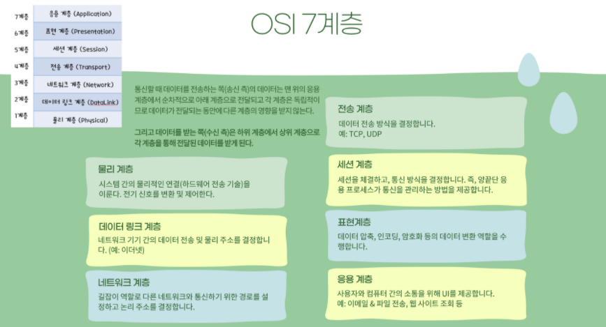

TCP/IP 4계층은 아래와 같습니다.

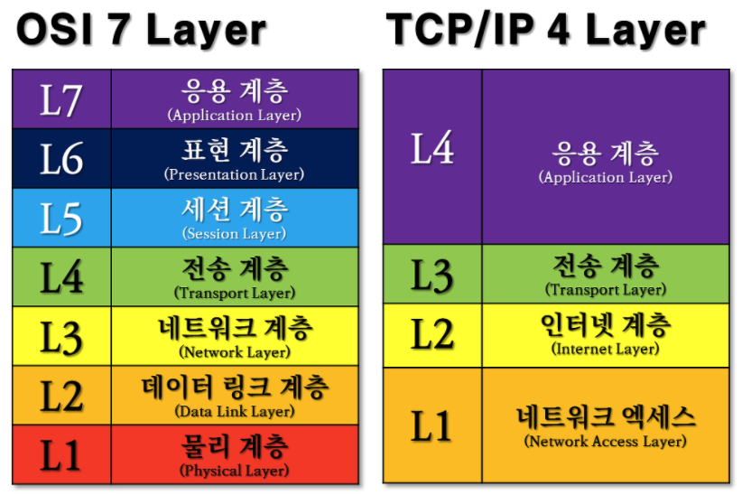

대표 프로토콜 !!!

<br>

#### 💡 OSI 7 Layer 또는 TCP/IP Layer에서 계층화하는 이유가 무엇인가요?

계층을 분리함으로써 각 계층은 독립적인 역할 수행

통신 과정을 각 단계마다 볼 수 있고, 해당 계층에서 문제가 생기면 그 계층만 수정한다는 유지보수 측면에서 이점을 볼 수가 있습니다.

<br>

#### 💡 Encapsulation과 Decapsulation을 서로 비교하며 설명해주세요

먼저 캡슐화(Encapsulation)는 송신 데이터에 필요한 정보(헤더)를 붙여서 다음 계층에 보내는 기술을 의미합니다.

역캡슐화(Decapsulation)는 캡슐화의 반대개념으로, 헤더를 제거하는 것을 의미합니다.

* 참고

  캡슐화: 상위 -> 통신 프로토콜 정보 추가 -> 하위

  역캡슐화: 하위 -> 헤더 제거 -> 상위

  헤더에는 각 계층에서 수행한 정보들이 담겨있습니다. (데이터를 받을 상대계층에 대한 정보도 포함되어 있습니다.) 데이터의 내용이나 성격을 식별 및 제어하는 데에 사용됩니다.

<br>

#### 💡 IP 주소 및 MAC 주소는?

IP주소는 인터넷에 연결된 장치를 식별하는 고유한 식별 번호입니다. IPv4와 IPv6가 있습니다.

* 참고: 각 네트워크를 인터넷 서비스 공급자(ISP)라고 하며 ISP에서 서비스를 구입하면 해당 ISP의 네트워크에 연결할 수 있습니다. 그런 다음 ISP에 연결된 다른 네트워크에 엑세스할 수 있습니다. 모든 ISP에는 IP 주소 풀이 있으며 서비스를 구매하면 IP주소가 할당됩니다.

MAC 주소는 장치에서 고유한 "네트워크 인터페이스"를 식별하는 주소입니다. IP주소는 ISP에 의해 할당되고 장치가 연결 및 해제될 때까지 재할당 될 수 있지만, MAC 주소는 물리적 어댑터에 연결되고, 제조업체에서 할당합니다.

MAC 주소는 12자리 문자열로서 0-9, A-F 까지의 문자로 이루어져 있습니다.

ex) `61:4A:34:1F:43:70`

처음 6자리는 어댑터 제조 업체를 나타내고, 마지막 6자리는 해당 특정 어댑터의 고유 식별 번호를 나타냅니다. MAC주소에는 장치가 연결된 네트워크에 대한 정보가 없습니다.

<br>

#### 💡 IP 주소와 MAC 주소의 차이점

! 위치가 바뀌었을 때 IP 주소는 바뀌지만 MAC 주소는 바뀌지 않는다.

IP 주소는 논리적인 주소 (LAN Card에 연결되어 있는 회선의 주소) - 네트워크 계층 

MAC 주소는 물리적인 주소 (장치의 네트워크 인터페이스 컨트롤러 (NIC)에 있는 주소) - 데이터 링크 계층

<br>

#### 💡 IPV4 vs IPV6 을 설명해주세요.

* IPv4는 3자 4개로 이루어져 있고, 각 3자는 0부터 255까지의 범위를 갖습니다.

  *  [0-255].[0-255].[0-255].[0-255] 

* IPv4의 확장성과 용량 면에서 한계가 생겼는데 이를 대체하기위해 등장한 것이 IPv6입니다.

  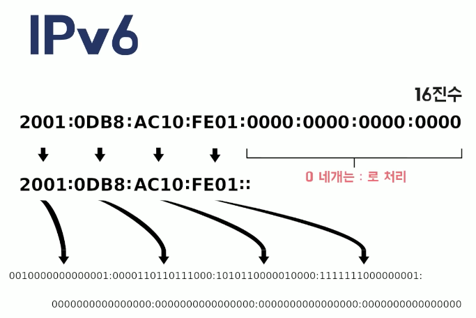

  콜론으로 구분된 8개의 4자 문자열 세트처럼 보이며, 각 문자열에는 숫자와 소문자가 포함됩니다.

* IPv6는 효율적인 라우팅, 더 넓은 주소공간, 보안 내장, 처리 오버헤드가 줄어든 개선된 헤더 구조 등의 개선점을 가지고 있습니다.

  <br>

#### 💡 IPv4의 주소 부족현상을 해결하기 위해 현재 어떤 방법을 사용하고 있나요? - 심화

IPv4 시스템에서 IPv6 시스템으로 전환하고 있습니다.

<br>

## TCP와 UDP 답변

#### 💡 TCP와 UDP의 특징과 차이점을 설명해주세요.

**TCP**

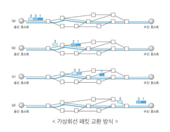

* 전송 계층에 해당하는 프로토콜입니다. 인터넷 상에 데이터를 세그먼트로 보내기 위해 IP 프로토콜 위에서 연결형 서비스를 지원합니다. (연결형 서비스는 신뢰성을 보장하는 전송 방식입니다.)
* 흐름제어와 혼잡제어를 지원합니다.
  * 흐름제어: 데이터를 송신하는 곳과 수신하는 곳의 **데이터 처리 속도**를 조절해 수신자의 버퍼오버플로우를 방지합니다.
  * 혼잡제어: 데이터를 송신하는 곳의 **전송 속도를 낮춰** 네트워크 혼잡을 방지합니다.
* 특징
  * 데이터가 손실된 경우 재전송 요청을 하기 때문에 Streaming 서비스에 불리합니다. 
  * 서버와 클라이언트 1대1로 연결됩니다. (HTTP 통신에서 주로 사용된다.)
  * 전송 데이터의 크기가 무제한입니다.

**UDP**

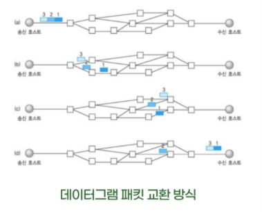

* UDP도 전송 계층에 해당하는 프로토콜입니다. 데이터를 데이터그램 단위로 처리합니다. 데이터그램은 UDP가 논리적인 경로가 없기 때문에 독립적인 관계를 지닙니다. 이렇듯, 데이터를 서로 다른 경로로 독립적으로 처리하는 프로토콜을 UDP라고 합니다.
* 비연결형 서비스입니다.
* 특징
  * 비연결형이기 때문에 짧은 요청과 짧은 응답을 합니다. 연결형보다 속도가 빠르지만 패킷 손실 등의 신뢰성을 보장하지는 않습니다.
  * 연속성이 중요한 서비스(Streaming)에 이용됩니다.
  * 크기에 제한이 있습니다. 크기가 초과하면 잘라서 보냅니다.
  * 서버와 클라이언트가 1:1 , 1:N, N:M 등으로 연결될 수 있습니다.

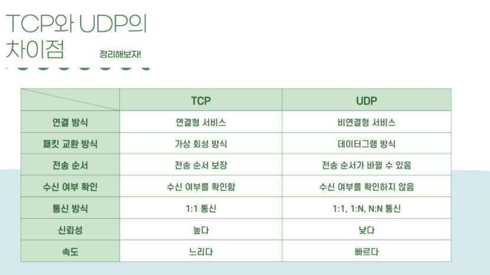

<br>

#### 💡 TCP를 사용하는 대표적인 프로토콜은 무엇인가요?

네트워크 계층에 해당하는 IP 프로토콜과 함께 사용됩니다. TCP는 패킷을 추적 및 관리하는 역할을 수행하고, IP는 배달 역할을 수행합니다.

<br>

#### 💡 3-Handshaking과 4-Handshaking의 과정을 설명해주세요.

* 3-way handshake는 정확한 전송을 보장하기 위해 상대 컴퓨터와 사전에 세션을 수립하는 과정입니다. 클라이언트가 서버에 syn (synchronize sequence numbers)패킷 보내면 서버는 syn과 ack(acknowledgment) (syn+1 100이 넘어왔다면 101을 보낸다.)를 보내고 클라이언트가 다시 ack를 보내면 성공! (양쪽 모두 데이터를 전송할 준비가 되었다는 것을 의미합니다)
  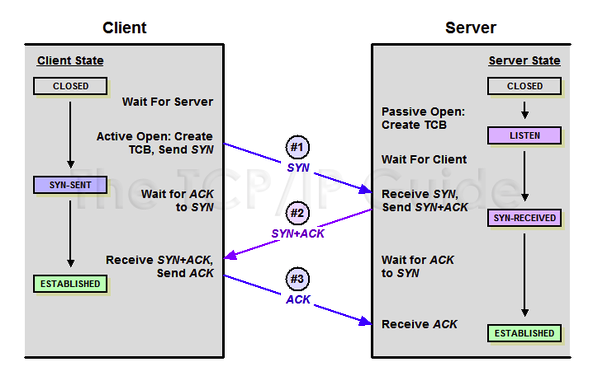

* 4-way handshake는 세션을 종료하기 위해 수행되는 절차로 클라이언트가 FIN플래그를 전송하면 서버가 확인했다는 의미로 ACK를 보내고, 서버가 통신이 끝나면 FIN 플래그를 전송합니다. 클라이언트가 ACK를 보내면 세션이 종료됩니다.
  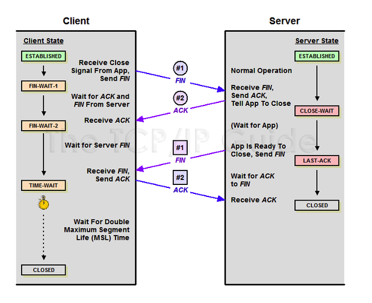

#### 💡 4-Handshaking에서 TIME_WAIT은 ?? 

잉여 패킷의 손실을 방지하기위해 FIN 플래그를 받아도 세션을 남겨두는 것(240초)을 의미합니다. 

서버에서 FIN을 전송하기 전에 클라이언트가 전송한 패킷이 라우팅 지연이나 패킷 유실로 인한 재전송 등으로 인해 해당 ACK 패킷이 FIN 패킷보다 늦게 도착하는 상황을 대비해야하기 때문입니다.

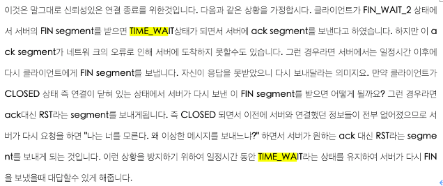


#### 💡 3-way handshaking 과정에서 클라이언트가 서버가 보낸 ACK+SYN을 받지 못하면? - 서버 심화

클라이언트는 서버에게 SYN 세그먼트를 보내고 시간을 잽니다. Timeout이 되기 전까지 서버에게 ACK, SYN 세그먼트가 오지 않으면 클라이언트는 다시 SYN 세그먼트를 보내고 수신을 대기합니다.

#### 💡 UDP에서 신뢰도를 보장하는 방법을 설명해주세요.

발신 수신 IP 및 프로토콜에서 체크섬을 계산 ! (1의 보수를 이용)

최소한의 오류 검출을 위해 UDP헤더의 CheckSum을 사용합니다.

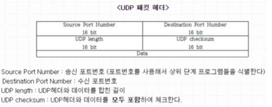

<br>

## HTTP와 HTTPS 답변

#### 💡 HTTP와 HTTPS를 설명해주세요

HTTP에 암호화와 인증, 그리고 완전성 보호를 더한것이 HTTPS 입니다.

HTTP는 TCP에 직접 통신하는 방식이고 HTTPS는 HTTP와 TCP 사이에서 SSL이 통신하는 방식입니다. SSL은 Secure Socket Layer로써 정보를 암호화하고 이때 공통키 암호화 방식과 비대칭키 암호화 방식을 혼합한 하이브리드 암호 시스템을 사용합니다. (공통키를 비대칭키 암호화 방식으로 교환한 다음에 다음부터의 통신은 공통키 암호를 사용하는 방식) 

<br>

#### 💡 HTTP의 단점을 설명해주세요

- 보안이 취약합니다.
  - 평문 통신(암호화 되지 않은 통신)이기 때문에 도청이 가능합니다.
  - 통신 상대를 확인하지 않아 위장이 가능합니다.
  - 완전성을 증명할 수 없기 때문에 변조가 가능합니다.

<br>

#### 💡 HTTP 1.0+와 HTTP1.1와 HTTP2.0 차이점은 무엇인가요?

먼저, HTTP 프로토콜은 클라이언트-서버 간 데이터를 주고 받는 응용계층의 프로토콜입니다. HTTP 를 이용한 데이터 전달은 TCP세션 기반에서 이루어집니다.
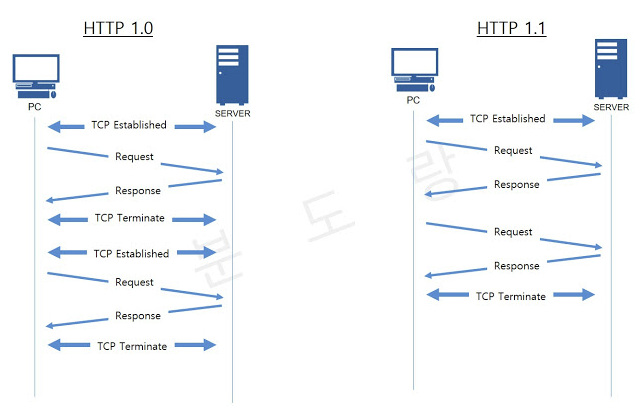

* HTTP 1.0은 TCP connection당 하나의 URL만 fetch하며 매번의 request/response가 끝나면 연결이 끊기므로 매 번 필요할 때마다 다시 연결을 해야 하고 이로 인해 속도가 떨어집니다. 단순하게 open/operation/close의 방식을 취하고 있습니다. 또한, 한번에 얻어서 가져올 수 있는 데이터의 양이 제한되어 있습니다. 나아가 URL의 크기도 작습니다. handshake를 매번함 

- HTTP 1.1은 하나의 연결에 하나의 요청을 처리하도록 설계되어 있습니다.

  - 연결을 끊어야하는 경우에만 Connection 헤더를 사용한다. (default가 연결!)

  - Persistent 기능을 이용하여 한개의 TCP 세션을 통해 여러개의 컨텐츠 요청이 가능합니다. (여러번의 request/ response를 주고 받을 수 있습니다.)

  - pipelining 기능을 가지고 있습니다. (응답 속도를 높임)

    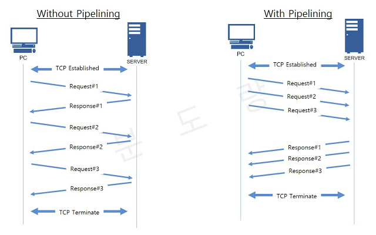

  - 한 인터넷 주소로 여러 web site의 연결이 가능합니다. 이때 client와 server는 Host request-header를 반드시 포함하고 있어야 하며 이 header를 주고 받아야 합니다. cache를 두어 성능을 향상합니다.

    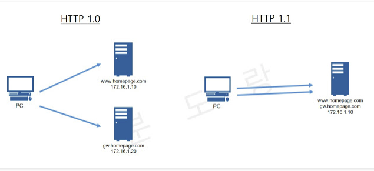

- HTTP 2.0은 하나의 연결에 여러개의 메시지를 동시에 주고 받을 수 있습니다. 요청 리소스간의 의존관계(우선순위)를 설정할 수 있습니다. 이 외에도 Server Push(여러개의 리소스를 포함하는 HTML문서 해석시에 필요한 리소르를 재요청하지 않고, Server Push 기법을 활용하여 해석), Header Compression(헤더 압축: 중복 헤더를 검출해 중복 헤더는 index값만 전송, 중복되지 않는 헤더는 인코딩하여 전송한다.) 기능을 가지고 있습니다.

  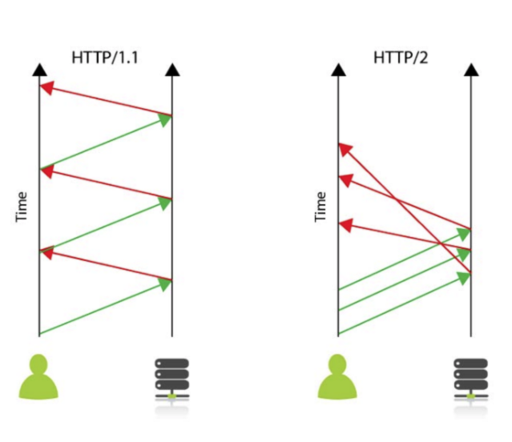

  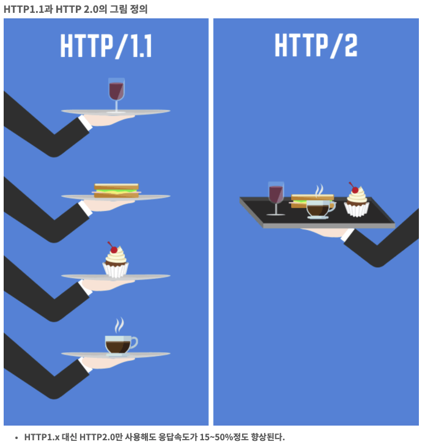

<br>

#### 💡 HTTP는 왜 비연결성(Connectionless)인가? - 서버 심화

* 비연결성: **클라이언트와 서버가 한 번 연결을 맺은 후, 클 라이언트 요청에 대해 서버가 응답을 마치면 맺었던 연결을 끊어 버리는 성질**을 말합니다.
* HTTP는 인터넷 상에서 불특정 다수의 통신 환경을 기반으로 설계되었습니다. 만약 서버에서 다수의 클라이언트와 연결을 계속 유지해야 한다면, 이에 따른 많은 리소스가 발생할 수 있습니다. 더 많은 연결을 위해 리소스를 줄이고자 비연결적인 특징을 갖습니다.
  * 물론 이로 인한 단점도 존재합니다. 서버는 클라이언트를 기억하고 있지 않으므로 동일한 클라이언트의 모든 요청에 대해, 매번 새로운 연결을 시도/해제의 과정을 거쳐야하므로 **연결/해제에 대한 오버헤드가 발생**한다는 단점이 있습니다.

<br>

#### 💡 HTTP의 무상태(Stateless)

Connectionless로 인해 **서버는 클라이언트를 식별할 수가 없는데**, 이를 Stateless라고 합니다. 이를 개선하기 위한 방법으로 쿠키와 세션이 있습니다.

<br>

#### 💡 모든 웹 페이지에서 HTTPS 를 사용하지 않는 이유를 설명해주세요.

- **HTTPS**는 설치 및 인증서를 유지하는 데 추가 비용이 발생
- 암호화하는 과정이 웹 서버에 부하를 줌
- **HTTP**에 비해 속도가 느림
- 인터넷의 연결이 끊긴 경우 재인증 시간이 소요

위와 같은 단점을 가지고 있기 때문!

<br>

#### 💡 비대칭키 또는 공개키 암호화 방식은 무엇인가요?

* **비대칭키**는 암호화, 복호화에 사용하는 암호키를 분리한 알고리즘 입니다. 자신이 가지고 있는 고유한 암호키로만 복호화할 수 있는 암호키를 대중에 공개하는 방식입니다.

* **대칭키**는 암호화, 복호화에 같은 암호키를 사용하는 알고리즘 입니다. 동일한 키를 주고받기 때문에 매우 빠르지만, 전달 과정에서 해킹 위험에 노출될 수 있습니다. 

<br>

#### 💡 HTTP REQUEST 방식 중 GET과 POST의 차이을 설명해주세요.

* GET: 클라이언트에서 서버로 정보를 요청할 때 사용되는 메서드이며, 예시로는 게시물 조회가 있습니다. GET 요청은 URL 주소 끝에 파라미터로 포함되어 전송되며 길이의 제한이 있습니다. 이 부분을 쿼리스트링이라고 합니다. 요청을 보낼때 결과가 달라지지 않는 멱등한 성질을 가지고 있습니다. 
  * 캐싱된 데이터를 응답할 수 있습니다.
  * 다른 사람에게 url을 복사해서 전달할 때 페이지 정보를 함께 전송해야하는 경우 GET을 사용해야합니다. POST의 경우 바디에 정보가 담기기 때문에 페이지 정보를 같이 전달할 수 없기 때문입니다.
* POST: 클라이언트에서 서버로 리소스를 생성하기 위해 데이터를 보낼 때 사용되는 메서드 입니다. 예시로는 게시물 작성이 있습니다. 전송할 데이터를 HTTP 메시지 바디 부분에 담아 서버로 전송합니다. 데이터 길이 제한이 없습니다. 요청을 할때마다 데이터베이스의 결과값이 달라지기 때문에 멱등하지 않습니다.
  * 객체(텍스트 박스 안에 있는 데이터, 라디오버튼에서 선택된 데이터)를 전달할 수 있다는 장점이 있습니다.
  * url에 데이터를 명시하지 않기 때문에 보안적으로 get보다 안전합니다.

<br>

#### 💡 GET, POST를 제외하고 다른 방식들을 설명해주세요.

* PUT: 포스트와 유사한 전송 구조를 가집니다. 서버에 지정한 콘테츠를 저장하기 위해 사용되고 CRUD에서는 update 요청에 많이 쓰이는 메소드입니다. (멱등)
* PATCH: 리소스의 부분만을 수정하는 데 쓰입니다.
* DELETE: 특정 리소스를 삭제합니다. (멱등)
* HEAD: GET 메서드 요청과 동일한 응답을 요구하지만, 서버 응답에서 헤더 정보이외에는 아무것도 보내지 않습니다. (웹서버 다운 여부 점검 등에 쓰입니다)
* OPTIONS: 시스템에서 지원되는 메소드 종류를 확인할 수 있습니다.
* TRACE: 최종 destination까지의 Loopback을 테스트하기 위함 (네트워크 통신이 잘되는지 확인하기 위함.) 클라이언트에게 자신의 요청이 서버에 도달했을 때 어떻게 보이게 되는지 알려준다.

<br>

#### 💡 조회하기 위한 용도 POST가 아닌 GET 방식을 사용하는 이유?

GET은 요청을 보낼때 결과가 달라지지 않는 멱등한 성질을 가지고 있기 때문에 조회에 용이합니다.

<br>

#### 💡 응답상태 코드에 대해 설명해주세요.

* 1xx: 진행중이라는 의미입니다.

* 2xx: 클라이언트 요청이 성공적으로 수행됨을 의미합니다.

  200 코드는 OK 즉, 요청이 성공적으로 수행함을 의미하고, 202는 Accepted를 204는 No content 사용자 요구를 처리했지만 전송할 데이터가 없음을 의미합니다.

* 3xx는 리다이렉트를 의미합니다. 

* 4로 시작하는 응답상태 코드는: 클라이언트의 잘못된 요청을 의미합니다.

  대표적으로 400과 404가 있습니다. 400은 배드리퀘스트이고, 404는 요청한 페이지가 없음을 의미합니다.

*  5로 시작하는 응답상태 코드는 서버쪽 오류로 인해 발생하는 상태코드입니다.

  500은 내부서버오류, 504는 게이트웨이 시간초과를 의미합니다.

  <br>

#### 💡 현대 웹 에서는 비연결성을 해결방법을 설명해주세요. - 서버 심화

세션, 쿠키, 토큰을 사용합니다.

<br>

## 로드밸런서 답변

#### 💡 로드 밸런싱을 설명해주세요.

* 서버를 여러대 사용할 때 트래픽이 몰리면 여러 서버에 균등하게 트래픽을 분산 처리하는 기술입니다.

#### 💡 L4 로드 밸런싱(NLB)과 L7 로드 밸런싱(ALB)에 대해 설명하고, 차이를 말해보세요

- L4는 4계층인 전송 계층에서 사용됩니다. 패킷 레벨에서만 트래픽을 분산하기 때문에 속도가 빠르고 효율성이 높습니다. L7 로드 밸런싱보다 저렴합니다.
- L7는 7계층인 애플리케이션 계층에서 사용됩니다. HTTP Header, Cookie 등과 같이 사용자가 요청한 정보들을 바탕으로 트래픽을 분산하기 때문에 섬세한 라우팅이 가능하고 비정상적인 트래픽을 판별할 수 있습니다. L4 로드 밸런싱보다 가격이 비쌉니다.

#### 💡 게이트웨이란?

* 한 네트워크에서 다른 네트워크로 이동하기 위하여 거쳐야 하는 지점입니다.

#### 💡 서버에 트래픽이 주어졌을 때 어떻게 응답 속도를 개선할 수 있는가?

1. nginx reverse proxy 서버를 만들어 네트워크 속도를 개선합니다.

   또는

2. 조회가 많은 경우 DB에 인덱스를 만든다.

3. DB 최적화

#### 💡 프라이빗 서브넷과 퍼블릭 서브넷의 차이

ex> 아마존 VPC

* **서브넷**(**Subnet**)이라는 것은 하나의 네트워크가 분할되어 나눠진 작은 네트워크입니다. 네트워크를 분할하는 것을 서브네팅(Subnetting)이라고 합니다. **퍼블릭 서브넷**은 외부에서 직접 IP를 찍어서 들어올 수 있는 **서브넷**이고, **프라이빗 서브넷**은 다른 자원(Load balancer,Proxy 등)을 통하지 않으면 들어올 수 없습니다.

<br>

## 01-2. Web of Network Overview

## WEB 답변

#### 💡 url과 uri에 대해 각각 설명해주세요

uri는 인터넷 자원을 나타내는 고유 식별자 입니다. URI 에 I 가 Identifier 입니다. 인터넷에 있는 자료의 id 이다 , 라고 생각하면 좋을 것 같습니다. uri는 url을 포함합니다. 해당 자원의 경로(자원의 위치)까지를 의미합니다. urn은 프로토콜을 포함하지 않고 해당 자원의 이름을 의미한다고 이해할 수 있습니다.

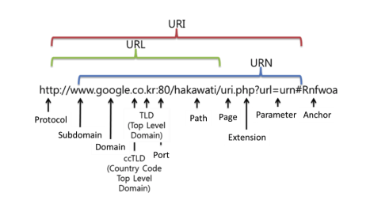


#### 💡 브라우저에 "www.google.com" 입력하면 어떤일이 일어날까요? ⭐️⭐️⭐️⭐️

1. https://www.naver.com
2. 웹 브라우저가 URL을 해석
3. URL이 문법에 맞으면 Punycode encoding을 URL의 Host부분에 적용
4. HSTS (HTTP Strict Transport Security)목록을 로드해서 확인
5. DNS(Domain Name Server) 조회 (TCP, UDP 둘 다 되는데 보통 UDP 사용)
   a. DNS에 요청을 보내기 전에 먼저 Browser에 해당 Domain이 cache돼 있는지 확인한다. (Chrome의 경우 chrome://net-internals/#dns 에서 확인 가능)
   b. 없을 경우 로컬에 저장돼 있는 hosts파일에서 참조할 수 있는 Domain이 있는지 확인한다.
   c. a, b가 모두 실패 했을 경우 Network stack에 구성돼 있는 DNS로 요청을 보낸다. (DNS는 일반적으로 Local router, ISP의 캐싱 DNS)
6. ARP(Address Resolution Protocol)와 알아낸 IP로 대상의 MAC address를 알아낸다
7. HTTPS인 경우 TLS(Transport Layer Security) handshake가 추가된다
8. HTTP(또는 HTTPS) 프로토콜로 요청한다
9. 3-way handshaking을 통해 연결을 한 후
10. naver.com의 index.html 요청
11. index.html 응답받음웹브라우저가 해당 html을 렌더링
12. 4-way handshaking

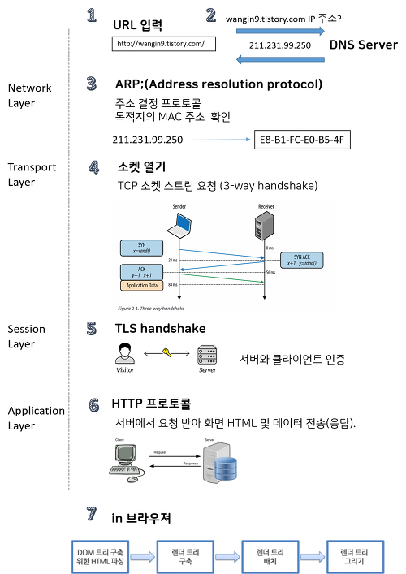


#### 💡 RESTful API란 무엇인가요?

Rest api를 제공하는 서비스를 restful하다고 합니다.

rest는 클라이언트와 서버 사이의 통신 방식을 의미합니다. http uri를 통해 자원을 명시하고, http method를 통해 crud 오퍼레이션을 구현하는 것을 의미합니다. rest api는 rest 기반으로 서비스 API를 구현한 것입니다.

HTTP 프로토콜의 인프라를 그대로 사용하므로 REST API 사용을 위한 별도의 인프라를 구축하지 않아도 된다는 장점이 있습니다. 멀티플랫폼 지원이 가능합니다.

**rest의 구성요소**

* 자원: 자원을 구별하는 식별자, uri를 의미합니다.
* 행위: HTTP Method, get/ post/ put / delete
* 표현: 서버가 보내는 응답으로 대표적인 예로는 JSON, XML이 있습니다.

#### 💡 Ajax는 무엇인가요?

웹에서 화면을 갱신하지 않고 데이터를 서버로부터 가져와 처리하는 방법을 의미합니다. 언어나 프레임워크가 아닌 구현하는 방식입니다. (비동기적인 웹 어플리케이션 제작을 위한 웹 개발 기법입니다.)

jQuery를 이용하여 사용하게 되면 코드 몇 줄 만으로 간단하게 Server와 Data를 주고 받을 수 있습니다.

```javascript
$.ajax({ key:value  });
```

**Ajax의 동작방식**

1. 요청 : 브라우저는 서버에 정보를 요청한다. (브라우저는 Ajax요청을 담당하는 **XMLHttpRequest** 라는 객체를 구현하고 있다.)
   [ 서버의 동작 : 서버는 응답으로 데이터를 전달한다. (XML, JSON) ]*
2. 응답 : 브라우저는 콘텐츠를 처리하여 페이지에 추가한다.

#### 💡 Ajax의 장점과 단점은 무엇인가요? - 웹 심화

장점

* 웹페이지의 속도를 향상시킬 수 있습니다. 
* 서버의 처리가 완료될 때까지 기다리지 않고 처리가 가능합니다. 
* 서버에서 Data만 전송하면 되므로 전체적인 코딩의 양이 줄어듭니다. 
* 기존 웹에서는 불가능했던 다양한 UI를 가능하게 해줍니다. ( Flickr의 경우, 사진의 제목이나 태그를 페이지의 리로드 없이 수정할 수 있다.)

단점

* 히스토리 관리가 되지 않습니다.
* XMLHttpRequest를 통해 통신하는 경우, 사용자에게 아무런 진행 정보가 주어지지 않습니다. (요청이 완료되지 않았는데 사용자가 페이지를 떠나거나 오작동할 우려가 발생하게 된다.)
* Script로 작성되므로 디버깅이 용이하지 않습니다.
* 동일-출처 정책으로 인하여 다른 도메인과는 통신이 불가능합니다. (Cross-Domain문제)

#### 💡 CORS는 무엇인가요?

다른 도메인의 서버에 url을 호출할 경우 XMLHttpRequest의 보안상 이유로 자신과 동일한 도메인으로만 HTTP요청을 보내도록 제한하고 있습니다. 이때, 동일한 도메인이 아니어도 자원에 접근할 수 있도록 권한을 부여하는 것을 의미합니다. 

#### 💡 CORS preflight는 무엇인가요? - 웹 심화 

#### 💡 소켓이란 무엇인가요?

\- Server와 Client가 계속 연결을 유지하는 양방향 **통신** 입니다. Server와 Client가 실시간으로 데이터를 주고받는 상황이 필요한 경우에 사용됩니다. 실시간 동영상 Streaming이나 온라인 게임 등과 같은 경우에 자주 사용됩니다.

1. 소켓 생성(클라- 서버)

2. 서버가 바인드 (주소와 연결) , 리슨 (클라이언트 대기)

3. 클라이언트 커넥트 요청

4. 서버가 받아들임.

5. 데이타를 주고받음

6. 둘다 클로즈

이 소켓통신의 종류에 TCP와 UDP가 있음

#### 💡 DOM과 가상DOM - 웹 심화

DOM 이란 Document Object Model 로서 다큐먼트를 객체로 표현하는 모델을 의미합니다. 

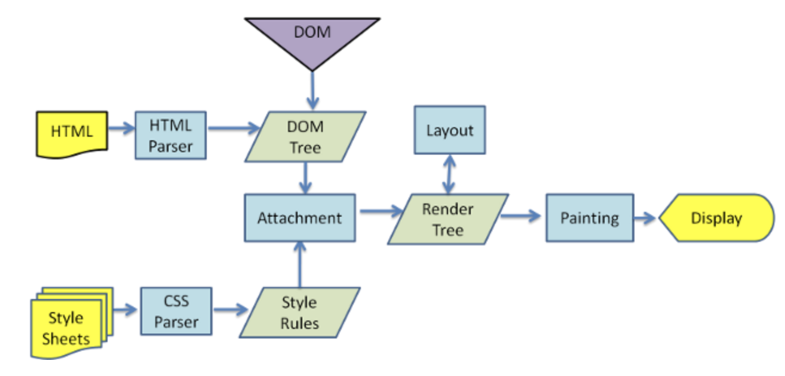

DOM을 이용한 화면 렌더링 과정

1. 브라우저는 html 태그를 파싱하여 DOM 트리를 구성합니다. 동시에 스타일 시트에서 css를 파싱하여 스타일 규칙을 만들어냅니다.
2. DOM 트리와 스타일 규칙을 합쳐 렌더 트리를 만들어냅니다.


가상 DOM 은 DOM 의 DOM 트리가 수정될때마다 렌더 트리가 실시간으로 갱신되어 불필요한 렌더링 횟수가 발생하는 것을 줄일 수 있습니다. 이를 활용하는 대표적인 프론트앤드 프레임워크로는 리액트, 뷰, 앵귤러가 있습니다. 실시간으로 DOM 트리를 수정하지 않고, 변경사항이 모두 반영된 가상 돔을 만들어냅니다. 그 후 가상 돔을 이용해 한 번만 돔 수정을 하고, 한번의 렌더 트리만을 만들어냅니다.

#### 💡 OAuth란 무엇인가요?

**OAuth**는 인터넷 사용자들이 비밀번호를 제공하지 않고 다른 웹사이트 상의 자신들의 정보에 대해 웹사이트나 애플리케이션의 접근 권한을 부여할 수 있는 공통적인 수단으로서 사용되는, 접근 위임을 위한 개방형 표준이다.

> ex) OAuth는 인증을 위한 오픈 스탠더드 프로토콜로, 사용자가 Facebook이나 트위터 같은 인터넷 서비스의 기능을 다른 애플리케이션(데스크톱, 웹, 모바일 등)에서도 사용할 수 있게 한 것입니다.

> 참고)  외부 서비스와 연동되는 Facebook이나 트위터의 기능을 이용하기 위해 사용자가 반드시 Facebook이나 트위터에 로그인해야 하는 것이 아니라, 별도의 인증 절차를 거치면 다른 서비스에서 Facebook과 트위터의 기능을 이용할 수 있게 되는 것입니다. 이런 방식은 Facebook이나 트위터 같은 서비스 제공자뿐만 아니라 사용자와 여러 인터넷 서비스 업체 모두에 이익이 되는 생태계를 구축하는데 기여하게 될 것입니다.

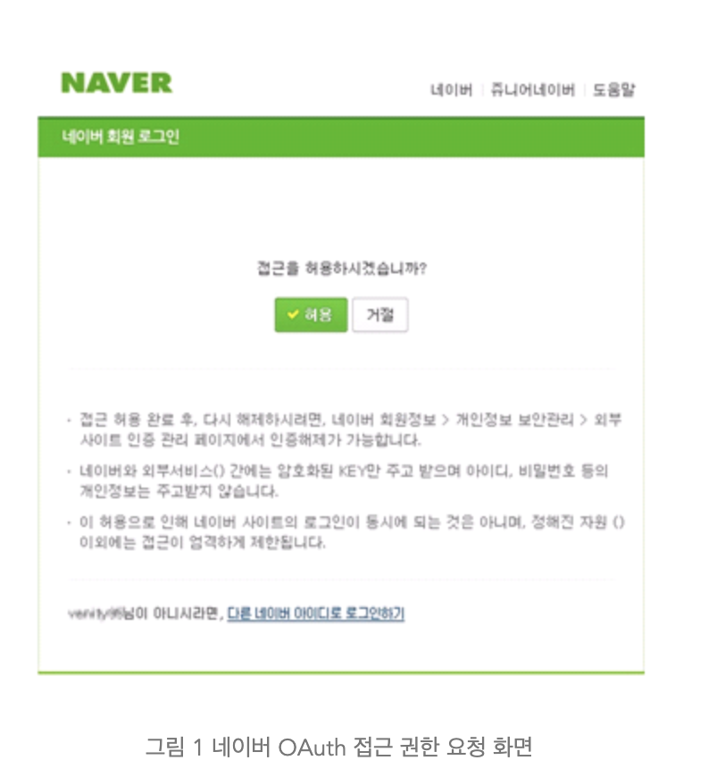

#### 💡 SPA

Single Page Application의 약자입니다. 기존 웹 서비스는 요청시마다 서버로부터 리소스들과 데이터를 해석하고 화면에 렌더링하는 방식이지만, SPA형태는 브라우저에 최초에 한번 페이지 전체를 로드하고, 이후부터는 특정 부분만 Ajax를 통해 데이터를 바인딩하는 방식입니다.

**장점**

1. 하나하나 화면 전체를 렌더링할 필요가 없기 때문에 화면이동이 빠르다.
2. 화면에 필요한 부분의 데이터만 받아서 렌더링 하기 때문에 처리과정이 효율적이다.
3. 유저에 입장해서 사용하기 편리하다.

**단점**

1. 처음 화면을 로딩할 때, 모든 화면이 미리 준비되어 있어야 하기 때문에 로딩에 시간이 걸린다.
2. 어플리케이션을 구현하는데 보다 시간이 걸리며 복잡하다.

<br>

## cookie와 session 답변

#### 💡 cookie와 session에 대해 설명해주세요

* 쿠키: key value 형태로 저장되고, String 값이 저장됩니다.

쿠키와 세션 모두 클라이언트 단위로 상태 정보를 유지해야하는 경우 사용됩니다. 쿠키와 같은 경우에는 클라이언트 로컬에 저장이 되고 세션같은 경우에는 서버에 저장이 되며 일정 시간동안만 유지됩니다. 브라우저 종료시 함께 종료됩니다. 자동로그인의 경우 세션, 인터넷 쇼핑몰 장바구니와 같은경우 쿠키를 이용합니다.

#### 💡 Session 동작 순서를 설명해주세요.

1. 클라이언트가 서버에 처음으로 Request를 보냄 (첫 요청이기 때문에 session id가 존재하지 않음)
2. 서버에서는 session id 쿠키 값이 없는 것을 확인하고 새로 발급해서 응답
3. 이후 클라이언트는 전달받은 session id 값을 매 요청마다 헤더 쿠키에 넣어서 요청
4. 서버는 session id를 확인하여 사용자를 식별
5. 클라이언트가 로그인을 요청하면 서버는 session을 로그인한 사용자 정보로 갱신하고 새로운 session id를 발급하여 응답
6. 이후 클라이언트는 로그인 사용자의 session id 쿠키를 요청과 함께 전달하고 서버에서도 로그인된 사용자로 식별 가능
7. 클라이언트 종료 (브라우저 종료) 시 session id 제거, 서버에서도 세션 제거

#### 💡 세션 인증방식 단점

1. 서버에서 클라이언트의 상태를 모두 유지하고 있어야 하므로, 클라이언트 수에 따른 메모리나 디스트 또는 DB에 부하가 심합니다.
2. 사용자가 많아지는 경우 로드 밸런싱을 사용한 서버 확장을 이용해야 하는 데 이 때 세션의 관리가 어려워집니다.

#### 💡 cookie를 쓰는 이유를 설명해주세요

쿠키는 주로 세 가지 목적을 위해 사용됩니다

- 세션 관리(Session management)

  서버에 저장해야 할 로그인, 장바구니, 게임 스코어 등의 정보 관리

- 개인화(Personalization)

  사용자 선호, 테마 등의 세팅

- 트래킹(Tracking)

  사용자 행동을 기록하고 분석하는 용도

#### 💡 쿠키 인증방식 단점

1. 보안 취약 : 요청 시 쿠키 값을 그대로 보냄
2. 작은 허용 용량 : 사이트 당 20개, 모두 합쳐 300개가 최대. 각 쿠키는 4Byte를 넘을 수 없음.
3. 웹 브라우저마다 지원 형태가 다름
4. 웹 브라우저를 변경할 경우 다른 웹브라우저에서 저장한 쿠키값을 사용할 수 없음
5. 사용자가 보안상의 문제로 거부할 경우 사용 불가능
6. 네트워크 부하 : 쿠키의 크기가 클 경우 네트워크 부하가 커짐
7. 한번에 하나의 정보만 저장할 수 있음

#### 💡 쿠키 인증방식 해결방안

쿠키 설정 시 사용자 아이디, 주민번호와 같이 중요한 정보는 평문으로 사용하지 않아야합니다. 서버 측 인증 기술을 사용하여 사용자가 쿠키 값의 조작을 쉽게 하지못하도록 해아합니다. 

#### 💡 토큰 인증방식

기존의 시스템에서는 서버 기반의 인증방식을 사용하였습니다. 하지만 시스템의 규모가 커짐에 따라 서버 기반의 인증 방식은 한계점을 보이기 시작하였고, 토큰 기반의 인증 방식이 등장하게 되었습니다.

토큰 기반의 인증 시스템은 인증받은 사용자들에게 토큰을 발급하고, 서버에 요청을 할 때 헤더에 토큰을 함께 보내도록 하여 유효성 검사를 합니다. 이러한 시스템에서는 더이상 사용자의 인증 정보를 서버나 세션에 유지하지 않고 클라이언트 측에서 들어오는 요청만으로 작업을 처리합니다. 즉, 서버 기반의 인증 시스템과 달리 상태를 유지하지 않으므로 Stateless한 구조를 갖습니다. 이러한 토큰 기반의 인증 방식을 통해 수많은 문제점들을 해결할 수 있는데, 대표적으로 사용자가 로그인이 되어있는지 안되어있는지 신경쓰지 않고 손쉽게 시스템을 확장할 수 있습니다.

주로 JSON 포맷을 이용하는 JWT를 주로 사용합니다.

#### 💡 토큰 인증방식 단점

- 토큰은 클라이언트에 저장되어 데이터베이스에서 사용자 정보를 조작하더라도 토큰에 직접 적용할 수 없습니다.
- 더 많은 필드가 추가되면 토큰이 커질 수 있습니다.
- 비상태 애플리케이션에서 토큰은 거의 모든 요청에 대해 전송되므로 데이터 트래픽 크기에 영향을 미칠 수 있습니다.

#### 💡 JWT

JSON WEB TOKEN으로, JWT는 일반적으로 클라이언트와 서버 사이 통신 시 권한 인가(Authorization)를 위해 사용하는 토큰입니다. URL에대해 안전한 문자열로 구성되어 있기 때문에 HTTP 어디든(URL, Header, ...) 위치할 수 있습니다.

```
HEADER.PAYLOAD.SIGNATURE
```

헤더(Header), 페이로드(Payload), 서명(Signature) 세 부분을 점(.)으로 구분하는 구조다.

* 헤더: json 객체, 어떻게 검증하는가에 대한 내용을 담고 있습니다.
* 페이로드: json 객체, JWT의 내용입니다.
* 서명: 헤더와 페이로드를 합친 문자열을 서명한 값입니다.

공개 키를 통해 검증 할 수 있습니다.

<br>

## 세부 정리

* IP 주소

  * 인터넷 신분증이라고 생각할 수 있다. 인터넷에 접속하기 위해 필요한 주소

  * IP 주소를 발급 받는 과정
    **ICANN (전국) -> APNIC (아시아) -> KISA (한국) -> 통신사 -> 가정**

    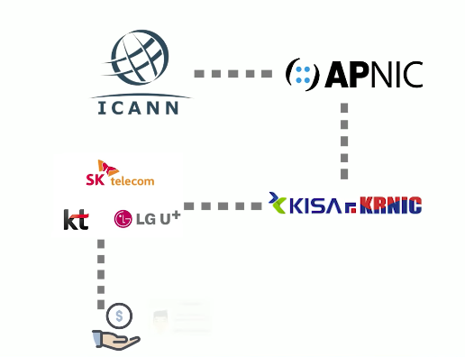

    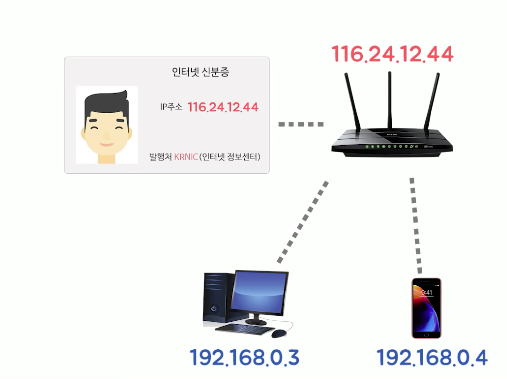


* ARP (Address Resolution Protocol)

  IP 주소를 MAC 주소로 변환해주는 프로토콜 (네트워크 계층 주소 -> 링크 계층 주소로 변환)

  반대로는 RARP가 있다.

* TCP 

  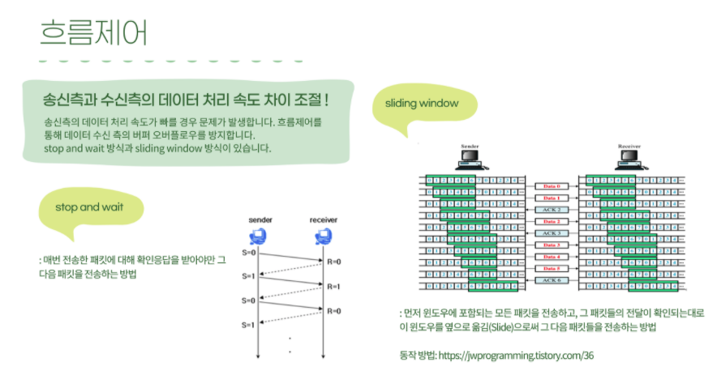

  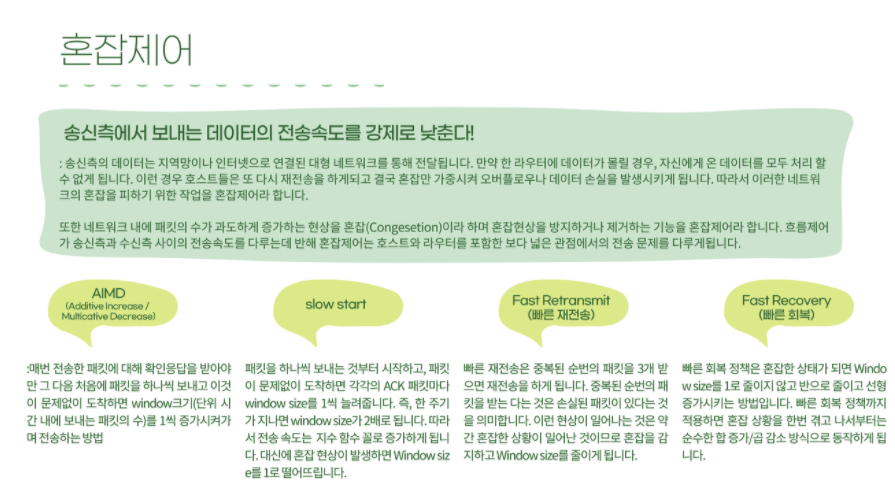

refered by https://github.com/SSAFY-CS-STUDY/

## 참고

* 캡슐화 (https://ychae-leah.tistory.com/20)

* IP주소 
  * https://www.youtube.com/watch?v=IAS3U5ZiI8c&t=1s
  * https://www.ikpil.com/36
  * https://www.juniper.net/kr/ko/research-topics/what-is-ipv4-vs-ipv6.html
  
* HTTP1.0 vs HTTP 1.1 vs HTTP2.0
  * https://blog.daum.net/creazier/15310290
  * https://withbundo.blogspot.com/2021/02/http-http-10-http-11.html
  * https://it-mesung.tistory.com/159

* HTTPS (https://velog.io/@inyong_pang/HTTP-HTTPS)

* HTTP (https://victorydntmd.tistory.com/286)

* Ajax (https://velog.io/@surim014/AJAX%EB%9E%80-%EB%AC%B4%EC%97%87%EC%9D%B8%EA%B0%80)

* OAuth(https://d2.naver.com/helloworld/24942)

* SPA 

  * https://velog.io/@josworks27/SPA-%EA%B0%9C%EB%85%90
  * https://linked2ev.github.io/devlog/2018/08/01/WEB-What-is-SPA/

* Session / Cookie / 토큰

  * https://cjh5414.github.io/cookie-and-session/ 

  * https://developer.mozilla.org/ko/docs/Web/HTTP/Cookies

  * https://velog.io/@jsj3282/%EC%BF%A0%ED%82%A4%EC%99%80-%EC%84%B8%EC%85%98%EC%9D%98-%EC%9E%A5%EB%8B%A8%EC%A0%90

  * https://mangkyu.tistory.com/55 (토큰)

  * http://www.opennaru.com/opennaru-blog/jwt-json-web-token/ (jwt)

    
