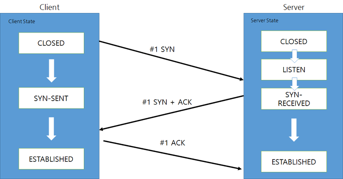
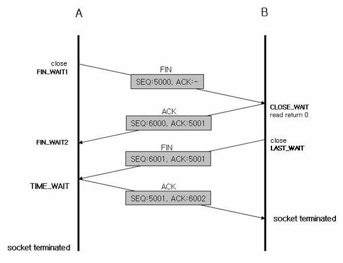
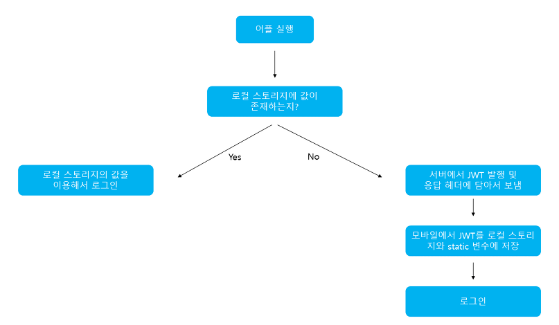

## [OSI 7 layers와 TCP/IP 4 layer](#osi-7-layers와-tcpip-4-layers-답변)
#### 💡 OSI 7 Layer 또는 TCP/IP Layer와 각 계층에 대한 설명을 해주세요.

현대의 웹 모델은 TCP/IP로 넘어오게 되었음
```
Application Layer : TCP/IP 소켓 프로그래밍에서 제공하는 API를 하여 통신가능한 프로그램을 활용할 수 있는 계층

프로토콜 – FTP, HTTP, SSH

Transport Layer : 통신 노드 간의 연결을 제어하고, 신뢰성 있는 데이터 전송을 담당한다.

프로토콜 – TCP, UDP

Internet Layer : 통신 노드 간의 IP패킷을 전송하는 기능과 라우팅 기능을 담당한다.

프로토콜 – IP, ARP, RARP

Network Access Layer : 

OSI 7계층의 물리계층과 데이터 링크 계층에 해당한다.

물리적인 주소로 MAC을 사용한다.

```

#### 💡 OSI 7 Layer 또는 TCP/IP Layer에서 계층화하는 이유가 무엇인가요?

```
1.계층을 분리함으로서 각 계층은 독립적인 역할 수행
2.역할이 분리되면서 문제 발생시 문제의 현상을 보았을 때 어떤 계층인지 파악 가능
```

<del>#### 💡 Encapsulation과 Decapsulation을 서로 비교하며 설명해주세요 </del>

#### 💡 IP 주소 및 MAC 주소는?
```
IP 주소는 네트워크 통신에 있어서 각각의 통신기기(컴퓨터, 노트북, 스마트폰 등)에 할당된 식별번호
MAC 주소는 통신기기의 하드웨어 자체에 부여된 고유한 식별번호
```

#### 💡 IPV4 vs IPV6 을 설명해주세요.

```
- 지연에 민감한 패킷을 구분하는 기본적인 QoS(Quality of Service)
- NAT를 없앰으로써 주소 공간을 32비트에서 128비트로 확장
- 네트워크 레이어 보안 내장(IPsec)
- 손쉬운 네트워크 관리를 위한 무상태 주소 자동 구성
- 처리 오버헤드가 줄어든 개선된 헤더 구조
```

#### 💡 IPv4의 주소 부족현상을 해결하기 위해 현재 어떤 방법을 사용하고 있나요? - 심화

## [TCP와 UDP](#tcp와-udp-답변)
#### 💡 TCP와 UDP의 특징과 차이점을 설명해주세요.

```
TCP
- 연결형 서비스로 가상 회선 방식을 제공한다.
- 3-way handshaking과정을 통해 연결을 설정하고 4-way handshaking을 통해 해제한다.
- 흐름 제어 및 혼잡 제어.
- 높은 신뢰성을 보장한다.
- UDP보다 속도가 느리다.

특징
- 서버소켓은 연결만을 담당한다.
- 연결과정에서 반환된 클라이언트 소켓은 데이터의 송수신에 사용된다형 서비스로 가상 회선 방식을 제공한다.
- 서버와 클라이언트는 1대1로 연결된다.
- 스트림 전송으로 전송 데이터의 크기가 무제한이다.
- 패킷에 대한 응답을 해야하기 때문에(시간 지연, CPU 소모) 성능이 낮다.
- Streaming 서비스에 불리하다.(손실된 경우 재전송 요청을 하므로)

UDP
- 비연결형 서비스로 데이터그램 방식을 제공한다
- 정보를 주고 받을 때 정보를 보내거나 받는다는 신호절차를 거치지 않는다.
- UDP헤더의 CheckSum 필드를 통해 최소한의 오류만 검출한다.
- 신뢰성이 낮다
- TCP보다 속도가 빠르다

특징
- UDP에는 연결 자체가 없어서(connect 함수 불필요) 서버 소켓과 클라이언트 소켓의 구분이 없다.
- 소켓 대신 IP를 기반으로 데이터를 전송한다.
- 서버와 클라이언트는 1대1, 1대N, N대M 등으로 연결될 수 있다.
- 데이터그램(메세지) 단위로 전송되며 그 크기는 65535바이트로, 크기가 초과하면 잘라서 보낸다.
- 흐름제어(flow control)가 없어서 패킷이 제대로 전송되었는지, 오류가 없는지 확인할 수 없다.
- 파일 전송과 같은 신뢰성이 필요한 서비스보다 성능이 중요시 되는 경우에 사용된다.

```


#### 💡 TCP를 사용하는 대표적인 프로토콜은 무엇인가요?

```
HTTP 통신
```

#### 💡 3-Handshaking과 4-Handshaking의 과정을 설명해주세요. 

```
3-Handshaking
- CLIENT에서 웹 서버로 연결을 최초시도시 먼저 SYN 패킷을 보냅니다.
- SYN 패킷을 보낸 CLIENT는 SYN-SENT 상태가 됩니다.
- SERVER에서 CLOSED는 PORT가 닫혀있는 상태를 뜻하고, 포트가 서비스 가능한 상태인 LISTEN상태로 만들어주어야 합니다.
- LISTEN상태에서 CLIENT부터 SYN패킷을 받으면 이에 대한 응답으로 SYN + ACK 패킷을 CLIENT로 보냅니다.
- SERVER는 CLIENT IP에 대해 포트 SYN-RECEIVED 상태로 전환됩니다.
- SERVER로부터 SYN+ACK 패킷을 받으면, CLIENT는 ESTABLISHED상태로 변하게 되면서 연결을 확인합니다.
- CLIENT는 SERVER로 SYN에 대한 응답으로 ACK패킷을 보냅니다.
- SERVER는 이 ACK 패킷을 받고 해당 CLIENT IP에 대한 포트 ESTABLISHED상태로 전환됩니다.
```


```
4-Handshaking
1) 클라이언트에서 서버와의 연결 종료를 위해 서버에 FIN 패킷을 보내고 FIN_WAIT1 상태가 됩니다.
2) 서버는 클라이언트로부터 FIN을 받고 응답 패킷 ACK을 보냅니다. 
상태는 CLOSE_WAIT가 됩니다
3) 서버가 통신이 끝나면, 즉 연결을 종료할 준비가 되면 클라이언트에게 FIN패킷을 보내고 LAST_WAIT 상태가 됩니다  
4) 클라이언트는 확인 패킷 ACK을 보내고 TIME_WAIT 상태가 됩니다.

```



#### 💡 3-way handshaking 과정에서 클라이언트가 서버가 보낸 ACK+SYN을 받지 못하면? - 서버 심화
```
클라이언트에서 특정 시간을 대기해도 전송이 안되는 경우 요청 SYN을 재전송
```

#### 💡 UDP에서 신뢰도를 보장하는 방법을 설명해주세요.
```
발신 수신 IP 및 프로토콜에서 체크섬을 계산
```

## [HTTP와 HTTPS](#http와-https-답변)
#### 💡 HTTP와 HTTPS를 설명해주세요
```
HTTP
HTTP(Hyper Text Transfer Protocol)란 서버/클라이언트 모델을 따라 데이터를 주고 받기 위한 프로토콜이다.

HTTPS
HyperText Transfer Protocol over Secure Socket Layer, HTTP over TLS, HTTP over SSL, HTTP Secure 등으로 불리는 HTTPS는 HTTP에 데이터 암호화가 추가된 프로토콜이다. HTTPS는 HTTP와 다르게 433번 포트를 사용하며, 네트워크 상에서 중간에 제3자가 정보를 볼 수 없도록 공개키 암호화를 지원
```
#### 💡 HTTP의 단점을 설명해주세요
```
HTTP는 암호화가 추가되지 않았기 때문에 보안에 취약한 반면, HTTPS는 안전하게 데이터를 주고받을 수 있다. 하지만 HTTPS를 이용하면 암호화/복호화의 과정이 필요하기 때문에 HTTP보다 속도가 느리다.(오늘날에는 거의 차이를 못느낄 정도이다.) 또한 HTTPS는 인증서를 발급하고 유지하기 위한 추가 비용이 발생하다.

그렇다면 언제 HTTP를 쓰고, 언제 HTTPS를 쓰는 것이 좋겠는가?

개인 정보와 같은 민감한 데이터를 주고 받아야 한다면 HTTPS를 이용해야 하지만, 단순한 정보 조회 등만을 처리하고 있다면 HTTP를 이용하면 된다.
```

#### 💡 HTTP 1.0+와 HTTP1.1와 HTTP2.0 차이점은 무엇인가요?
```
HTTP 1.0
- TCP Connection당 하나의 URL만 fetch하며, 매번 request/response가 끝나면 연결이 끊기므로 필요할 때마다 다시 연결해야하는 단점이 있어 속도가 현저히 느리다.
URL의 크기가 작고 한번에 가져올 수 있는 데이터의 양이 제한되어 있다.


HTTP 1.1
- HTTP의 인터넷에서 impact를 줄이고 cache를 두어 인터넷 프로토콜 수행이 빠르게 될 수 있도록 성능을 향상하고 있다.
- multiple request에 대한 처리가 가능하고 request/response가 파이프라인 방식으로 진행이 가능하다.
- HTTP 1.1의 모든 요청과 응답은 기본적으로 Persistent Connection을 지원
- 필요 없을 경우에만(HTTP 응답 완료 후 TCP 연결을 끊어야하는 경우) Connection 헤더를 사용했다.

- HTTP 1.1에서는 클라이언트와 서버간의 요청과 응답 효율성을 개선하기 위해 HTTP Pipelining이 등장하였다.
```
#### 💡 비대칭키 또는 공개키 암호화 방식은 무엇인가요?
```
A는 공개키(Public key)와 개인키(Private key)를 생성한다.
공개키 암호화: A의 공개키를 이용하여 암호화된 데이터는 A의 개인키로만 복호화가 가능하다.
개인키 암호화: A의 개인키를 이용하여 암호화된 데이터는 A의 공개키로만 복호화가 가능하다.
B는 A의 공개키를 조회하고, A의 공개키를 이용하여 데이터를 암호화한 후 전송한다.
A는 개인키로 암호화된 데이터를 복호화한다.
```

#### 💡 HTTP REQUEST 방식 중 GET과 POST의 차이을 설명해주세요.
```
사용목적 : GET은 서버의 리소스에서 데이터를 요청할 때, POST는 서버의 리소스를 새로 생성하거나 업데이트할 때 사용한다. 

요청에 body 유무 : GET 은 URL 파라미터에 요청하는 데이터를 담아 보내기 때문에 HTTP 메시지에 body가 없다. POST 는 body 에 데이터를 담아 보내기 때문에 당연히 HTTP 메시지에 body가 존재한다.

멱등성 (idempotent) : GET 요청은 멱등이며, POST는 멱등이 아니다.
```

#### 💡 GET, POST를 제외하고 다른 방식들을 설명해주세요.
```
OPTION : 통신과 관련된 선택사항들에 대한 정보를 요구하는 경우
PUT : Request 메시지에 포함되어 있는 data를 지정한 Request-URI로 저장하기 위함
DELETE : 특정 resource를 지우기 위함
TRACE : 최종 destination까지의 Loopback을 테스트하기 위함
```
#### 💡 조회하기 위한 용도 POST가 아닌 GET 방식을 사용하는 이유?  
```
멱등성 때문에
```
#### 💡 현대 웹 에서는 비연결성을 해결방법을 설명해주세요. - 서버 심화
```
쿠키, 세션, 토큰을 사용
```

## [로드밸런서](#로드밸런서-답변) - 서버 개발자만 답변할 것
#### 💡 로드 밸런싱을 설명해주세요.  
<<<<<<< HEAD
```
하나의 인터넷 서비스가 발생하는 트래픽이 많을 때 여러 대의 서버가 분산처리하여 서버의 로드율 증가, 부하량, 속도저하 등을 고려하여 적절히 분산처리하여 해결해주는 서비스입니다.
```
#### 💡 L4 로드 밸런싱과 L7 로드 밸런싱에 대해 설명하고, 차이를 말해보세요
```
L4 로드 밸런싱 - 네트워크 계층에서 동작 - NLB

휘발성 처리 초당 수백만개 처리 가능
로드 밸런서에 대한 고정 IP 주소 지원

L7 로드 밸런싱 - 어플리케이션 계층에서 동작 - ALB 
 
path-based(경로 기반) 라우팅이 지원된다
HTTP 헤더의 호스트 필드를 기반으로 라우팅을 지원
``` 
#### 💡 게이트웨이란?  
```
한 네트워크(segment)에서 다른 네트워크로 이동하기 위하여 거쳐야 하는 지점입니다.

게이트웨이(Gateway)는 서로 다른 네트워크를 연결해줍니다. 서로 다른 네트워크의 프로토콜이 다를 경우에 중재 역할을 해준다고 보면 된다.
```
#### 💡 서버에 트래픽이 주어졌을 때 어떻게 응답속도를 개선할 수 있는가?  
```
1. 캐시 프록시 서버를 구성하여 자주 요청하는 데이터에 대해서 구축 (Nginx Reverse Proxy Server)
2. 어플리케이션 개선 속도 확산을 위해서 DB 접속 속도 개선(Redis 사용 등)
```
#### 💡 프라이빗 서브넷과 퍼블릭 서브넷의 차이
```
VPC보다 작은 단위위가 서브넷이고 우선순위를 높게 가지게 된다

인터넷과 연결되어 있는 서브넷은 퍼블릭 서브넷이고 인터넷과 연결되어 있지 않은 서브넷은 프라이빗 서브넷이라고 한다
```

## 01-2. Web of Network Overview
## [WEB](#web-답변)
#### 💡 url과 uri에 대해 각각 설명해주세요
```
URI는 특정 리소스를 식별하는 통합 자원 식별자(Uniform Resource Identifier)를 의미한다. 웹 기술에서 사용하는 논리적 또는 물리적 리소스를 식별하는 고유한 문자열 시퀀스다.

URL은 흔히 웹 주소라고도 하며, 컴퓨터 네트워크 상에서 리소스가 어디 있는지 알려주기 위한 규약이다. URI의 서브셋이다.

현대적 관점에서는 둘은 크게 차이 점이 없다고 보면 된다.
```

#### 💡 브라우저에 "www.google.com" 입력하면 어떤일이 일어날까요?  
```
1. 일단, 웹 브라우저에 URL을 입력하고 Enter를 클릭합니다.
2. 그럼 바로 URL의 주소로 이동 웹 브라우저가 입력한 URL을 분석하며 일을 하기 시작합니다.
3. URL을 분석한 다음,
4. DNS( Domain Name Server )에 내가 접근하려는 name 주소의 IP 주소를 요청한다.
5. IP주소를 받은 다음, ARP를 통해 실질적으로 내가 접근해야할 IP주소를 할당받은 녀석의 MAC 주소를 추적한다.
6. 대상과 TCP 통신을 통해 Socket을 연다.
7. HTTPS => TLS(Seucure Sockets Layer)과정 추가
8. HTTP 프로토콜 요청
9. HTTP의 응답
10. 웹 브라우저의 그림 그리기
```
#### 💡 RESTful API란 무엇인가요? 
```
1.자원 : URI
2.행위 : Method
3.표현 : Client에 대한 적절한 JSON, XL, TEXT, RSS 등의 여러 Representation
으로 구성된 API 형태
``` 
#### 💡 Ajax는 무엇인가요?  
```
JavaScript를 사용한 비동기 통신, 클라이언트와 서버간에 XML 데이터를 주고받는 기술
```
#### 💡 Ajax의 장점과 단점은 무엇인가요? - 웹 심화  
```
1. AJAX의 장점
- 웹페이지의 속도향상
- 서버의 처리가 완료될 때까지 기다리지 않고 처리가 가능하다.
- 서버에서 Data만 전송하면 되므로 전체적인 코딩의 양이 줄어든다.
- 기존 웹에서는 불가능했던 다양한 UI를 가능하게 해준다.

2. AJAX의 단점
- 히스토리 관리가 되지 않는다.
- 페이지 이동없는 통신으로 인한 보안상의 문제가 있다.
- 연속으로 데이터를 요청하면 서버 부하가 증가할 수 있다.
- XMLHttpRequest를 통해 통신하는 경우, 사용자에게 아무런 진행 정보가 주어지지 않는다. 
- AJAX를 쓸 수 없는 브라우저에 대한 문제 이슈가 있다.
- HTTP 클라이언트의 기능이 한정되어 있다.
- 지원하는 Charset이 한정되어 있다.
- Script로 작성되므로 디버깅이 용이하지 않다.
- 동일-출처 정책으로 인하여 다른 도메인과는 통신이 불가능하다. 
```

#### 💡 CORS는 무엇인가요?  
```
교차 출처 리소스 공유(Cross-Origin Resource Sharing, CORS)는 추가 HTTP 헤더를 사용하여, 한 출처에서 실행 중인 웹 애플리케이션이 다른 출처의 선택한 자원에 접근할 수 있는 권한을 부여하도록 브라우저에 알려주는 체제
```
#### 💡 CORS preflight는 무엇인가요? - 웹 심화 
```
기본적으로 브라우저는 cross-origin 요청을 전송하기 전에 OPTIONS 메소드로 preflight를 전송한다.

이때 Response로 Access-Control-Allow-Origin과 Access-Control-Allow-Methods가 넘어오는데 이는 서버에서 어떤 origin과 어떤 method를 허용하는지 브라우저에게 알려주는 역할을 한다.

브라우저가 결과를 성공적으로 확인하고 나면 cross-origin 요청을 보내서 그 이후 과정을 진행
```
#### 💡 소켓이란 무엇인가요?  
```
두 호스트를 연결해주는 도구로서 인터페이스 역할을 함

Socket 통신

서버와 클라이언트가 특정 포트를 통해 양방향 통신을 하는 방식
Server와 Client를 통해서 계속 연결을 유지하는 양방향 통신
실시간 Streaming / 온라인 게임

```
#### 💡 DOM과 가상DOM - 웹 심화
```
DOM

첫째, 브라우저는 html태그를 파싱 하여 돔 트리를 구성한다.

동시에 브라우저는 스타일시트에서 css를 파싱 하여 스타일 규칙들을 만들어낸다.

둘째, 위에서 언급한 돔 트리와 스타일 규칙 두 가지가 합쳐져서 렌더 트리를 만들어낸다.

가상 돔(Vitual DOM)

화면에 변화가 있을 때마다 실시간으로 돔 트리를 수정하지 않고 변경사항이 모두 반영된 가상 돔을 만들어낸다. 그 후 가상 돔을 이용해 한 번만 돔수정을 하게 되고 이는 한 번만 렌더 트리를 만들어내게 된다. 브라우저는 한번만 렌더링을 하게 됨으로써 불필요한 렌더링 횟수를 줄일 수 있게 되는 것

```  
#### 💡 OAuth란 무엇인가요?  
```
OAuth는 인증을 위한 오픈 스탠더드 프로토콜로, 사용자가 Facebook이나 트위터 같은 인터넷 서비스의 기능을 다른 애플리케이션(데스크톱, 웹, 모바일 등)에서도 사용 가능하게 한 것

API 접근 위임(API Access Delegation)을 통해 인증을 진행
```
#### 💡 SPA   
```
- 웹 사이트의 전체 페이지를 하나의 페이지에 담아 동적으로 화면을 바꿔가며 표현하는 것이 SPA
- 뭔가를 클릭하거나 스크롤하면, 상호작용하기 위한 최소한의 요소만 변경이 발생
- 페이지 변경이 일어난다고 보여지는 것 또한 최초 로드된 자바스크립트를 통해 미리 브라우저에 올라간 템플릿만 교체되는 것
```

## [cookie와 session](#cookie와-session-답변)
#### 💡 cookie와 session에 대해 설명해주세요  
```
쿠키

- 웹 서버가 브라우저에게 지시하여 사용자의 로컬 컴퓨터에 
 파일 또는 메모리에 저장하는 작은 기록 정보 파일
- 파일에 담긴 정보는 인터넷 사용자가 같은 웹사이트를 방문할 때마다 읽히고 수시로 새로운 정보로 바뀜

세션

- HTTP Session id를 식별자로 구별하여 데이터를 사용자의 브라우저에 쿠키형태가 아닌 접속한 서버 DB에 정보를 저장
- 클라이언트는 HTTP Session id를 쿠키로 메모리 저장된 형태 소지
- 메모리에 저장하기 때문에 브라우저가 종료되면 사라짐.

```
#### 💡 Session 동작 순서를 설명해주세요.  
```
- 클라이언트가 서버에 Resource를 요청

- 서버에서는 HTTP Request를 통해 쿠키에서 Session id를 확인을 한 후에 없으면 Set-Cookie를 통해 새로 발행한 Session-id 전송

- 클라이언트는 HTTP Request 헤더에 Session id를 포함하여 원하는 Resource를 요청

- 서버는 Session id를 통해 해당 세션을 찾아 클라이언트 상태 정보를 유지하며 적절한 응답
```

#### 💡 cookie를 쓰는 이유를 설명해주세요  
```
정보를 유지할 수 없는 Connectionless, Stateless의 성격을 가진 HTTP의 단점을 해결하기 위해 쿠키라는 개념이 도입
```

#### 💡 세션 인증방식 단점  
```
load-balancing/시스템 효율성에서 handling하기 어려움
세션 저장 장치가 부족한 시스템에는 적합하지 않음
```
#### 💡 토큰 인증방식
```
1. 인증받은 사용자들에게 토큰을 발급하고, 서버에 요청을 할 때 헤더에 토큰을 함께 보내도록 하여 유효성 검사 진행
2. 시스템에서는 더이상 사용자의 인증 정보를 서버나 세션에 유지하지 않고 클라이언트 측에서 들어오는 요청만으로 작업을 처리 
서버 기반의 인증 시스템과 달리 상태를 유지하지 않으므로 Stateless한 구조를 유지
```

#### 💡 JWT   
```
Json 포맷을 이용하여 사용자에 대한 속성을 저장하는 Claim 기반의 Web Token이다. JWT는 토큰 자체를 정보로 사용하는 Self-Contained 방식으로 정보를 안전하게 전달

JWT는 Header, Payload, Signature의 3 부분으로 이루어지며, Json 형태인 각 부분은 Base64로 인코딩 되어 표현된다. 또한 각각의 부분을 이어 주기 위해 . 구분자를 사용하여 구분한다. 추가로 Base64는 암호화된 문자열이 아니고, 같은 문자열에 대해 항상 같은 인코딩 문자열을 반환

```



#### 💡 토큰 인증방식 단점  
```
Self-contained: 토큰 자체에 정보를 담고 있으므로 양날의 검이 될 수 있다.

토큰 길이: 토큰의 페이로드(Payload)에 3종류의 클레임을 저장하기 때문에, 정보가 많아질수록 토큰의 길이가 늘어나 네트워크에 부하를 줄 수 있다.

Payload 인코딩: 페이로드(Payload) 자체는 암호화 된 것이 아니라, BASE64로 인코딩 된 것이다. 중간에 Payload를 탈취하여 디코딩하면 데이터를 볼 수 있으므로, JWE로 암호화하거나 Payload에 중요 데이터를 넣지 않아야 한다.

Stateless: JWT는 상태를 저장하지 않기 때문에 한번 만들어지면 제어가 불가능하다. 즉, 토큰을 임의로 삭제하는 것이 불가능하므로 토큰 만료 시간을 꼭 넣어주어야 한다.

Tore Token: 토큰은 클라이언트 측에서 관리해야 하기 때문에, 토큰을 저장해야 한다.

```
#### 💡 쿠키 인증방식 해결방안  
```
JWT를 사용해서 인증
```
=======
#### 💡 L4 로드 밸런싱과 L7 로드 밸런싱에 대해 설명하고, 차이를 말해보세요  
#### 💡 게이트웨이란?  
#### 💡 서버에 트래픽이 주어졌을 때 어떻게 응답속도를 개선할 수 있는가?  
#### 💡 프라이빗 서브넷과 퍼블릭 서브넷의 차이

## 01-2. Web of Network Overview
## [WEB](#web-답변)
#### 💡 url과 uri에 대해 각각 설명해주세요  
#### 💡 브라우저에 "www.google.com" 입력하면 어떤일이 일어날까요?  
#### 💡 RESTful API란 무엇인가요?  
#### 💡 Ajax는 무엇인가요?  
#### 💡 Ajax의 장점과 단점은 무엇인가요? - 웹 심화  
#### 💡 CORS는 무엇인가요?  
#### 💡 CORS preflight는 무엇인가요? - 웹 심화 
#### 💡 소켓이란 무엇인가요?  
#### 💡 DOM과 가상DOM - 웹 심화  
#### 💡 OAuth란 무엇인가요?  
#### 💡 SPA   

## [cookie와 session](#cookie와-session-답변)
#### 💡 cookie와 session에 대해 설명해주세요  
#### 💡 Session 동작 순서를 설명해주세요.  
#### 💡 cookie를 쓰는 이유를 설명해주세요  
#### 💡 세션 인증방식 단점  
#### 💡 토큰 인증방식
#### 💡 JWT   
#### 💡 토큰 인증방식 단점  
#### 💡 쿠키 인증방식 해결방안  

refered by https://github.com/SSAFY-CS-STUDY/
>>>>>>> 9e5c616fd0fc2dd197862be9378a9717e4d3ae03
