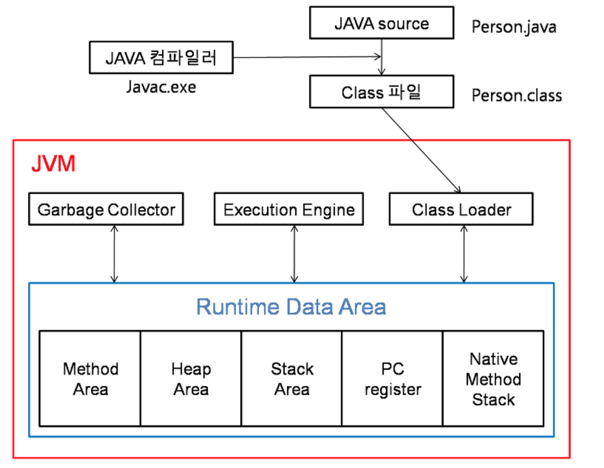
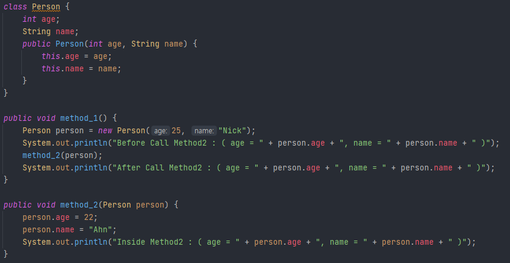

## JAVA

#### 💡 JVM 구조는?

- JVM은 JAVA 가상 머신으로, JAVA 바이트 코드를 실행할 수 있는 주체이며,

  크게 (1) Class Loader, (2) GC(Garbage Collector), (3) Execute Engine, (4) Runtime Data Area 네 가지로 나뉩니다.

  먼저, 자바 컴파일러가 .java 파일을 컴파일하면 바이트코드로 이루어진 .class 파일이 생성됩니다.

  <b>Class Loader</b>는 이렇게 생성된 <u>클래스 파일들을 엮어</u> Runtime Data Area 형태로 <u>메모리에 적재</u>하는 역할을 합니다.

  <b>Execution Engine</b>은 <u>메모리에 적재된 클래스들을 기계어로 변경</u>해 <u>명령어 단위로 실행</u>하는 역할을 합니다.

  <b>Garbage Collector</b>는 <u>Heap 메모리 영역</u>에 생성된 객체들 중, <u>참조되지 않은 객체를 탐색하고 제거</u>하는 역할을 합니다.

  <b>Runtime Data Area</b>는 <u>JVM의 메모리 영역</u>으로 자바 어플리케이션 실행시 사용되는 데이터를 적재하는 영역입니다.

  

 

#### 💡 Java의 GC 콜렉터의 작동 방식은 무엇인가요?

- <b>'stop-the-world'</b>가 발생하면 GC를 실행하는 쓰레드를 제외한 나머지 쓰레드는 모두 작업을 멈춥니다.

  stop-the-world는 <u>GC를 실행하기 위해 JVM이 어플리케이션 실행을 멈추는 것</u>이고, 작업들은 GC 작업을 완료한 이후에야 중단했던 작업을 다시 시작합니다.

- GC의 과정을 <b>Mark and Sweep</b>라고도 하는데, <u>GC가 스택의 모든 변수 또는 Reachable 객체를 스캔하면서 각각 어떤 객체를 참조하고 있는지 찾는 과정</u>이 <b>Mark</b>입니다. 이 과정에서 <u>stop-the-world</u>가 발생합니다.

  이후 <u>Mark 되어있지 않은 객체들을 힙에서 제거하는 과정</u>이 <b>Sweep</b>입니다.

- GC는 가비지 객체를 판별하기 위해 reachability라는 개념을 사용합니다.

  어떤 객체에 유효한 참조가 있으면 'reachable', 없으면 'unreachable'로 구별하고, 'unreachable' 객체를 가비지로 간주합니다.

 

#### 💡 Java SE와 EE의 차이점은 무엇인가요?

- Java SE는 표준 에디션의 자바 플랫폼으로, 가장 대중적인 자바 플랫폼입니다. 흔히 자바언어라고 하는 대부분의 패키지가 포함된 에디션입니다.

  Java SE의 API는 자바 프로그래밍 언어의 핵심 기능들을 제공합니다. (기초적인 타입, 네트워킹, 보안, 데이터베이스 처리, 그래픽 사용자 인터페이스 개발, XML 파싱 등..)

- Java EE는 엔터프라이즈 에디션의 자바 플랫폼으로, Java SE 플랫폼을 기반으로 그 위에 탑재됩니다.

  웹 프로그래밍에 필요한 기능을 다수 포함합니다. (JSP, Servlet, JDBC 등..)

 

#### 💡 참조형 변수와 기본형 변수의 차이점을 설명해주세요.

- <b>기본형 변수</b>는 boolean, char, byte, short 등과 같은 타입으로, <u>저장 공간에 값 자체를 저장</u>합니다.

- <b>참조형 변수</b>는 기본형을 제외한 나머지 타입으로, String, StringBuffer, List 등이나 개인이 만든 클래스도 참조형 타입이 가능합니다. 참조형 변수는 <u>참조 값(주소)를 갖는 자료형</u>으로, 자바 API에서 제공되거나 프로그래머에 의해서 만들어진 클래스를 자료형으로 선언하는 경우입니다.

- 즉, <b>기본형 변수</b>는 리터럴 (실제 값)이 저장하는 공간으로 <u>스택(Stack) 메모리</u>에 저장된다면,

  <b>참조형 변수</b>는 값이 저장되어 있는 곳의 주소 값을 저장하는 공간으로 <u>힙(Heap) 메모리</u>에 저장됩니다.

 

#### 💡 public 접근 제어자와 private 접근 제어자의 차이

- <b>public 접근 제어자</b>를 사용하여 선언된 클래스 멤버는 외부로 공개되며, <u>해당 객체를 사용하는 프로그램 어디에서나 직접 접근할 수 있습니다.</u>

  

- <b>private 접근 제어자</b>를 사용하여 선언된 클래스 멤버는 외부에 공개되지 않으며, <u>외부에서는 직접 접근할 수 없습니다.</u>

  즉, 자바 프로그램은 private 멤버에 직접 접근할 수 없으며, <u>해당 객체의 public 메소드를 통해서만 접근할 수 있습니다.</u>

  

 

#### 💡 non-static 멤버와 static 멤버의 차이에 대해 설명하시오.

- static 멤버는 프로그램 시작시 최초에 단 한 번만 생성되고 초기화되며, 인스턴스를 생성하지 않고도 바로 사용할 수 있습니다. 또한, 해당 클래스의 모든 인스턴스가 공유합니다.

- 코드를 실행하면 먼저 static 멤버들이 메서드 영역에 저장되게 됩니다. static 메서드의 멤버 변수와 관련 정보들은 스택(Stack) 영역에 저장됩니다. 하지만, non-static 멤버는 메모리에 올라가지 않습니다.

- <b>static 멤</b>/는 클래스 내에 static 키워드로 선언된 변수로, 처음 <u>JVM이 실행되어 클래스가 메모리에 올라갈 때부터 프로그램이 종료될 때까지 유지</u>됩니다.

  클래스가 여러번 생성되어도 static 변수는 <u>처음 딱 한 번만 생성</u>되고, <u>동일한 클래스의 모든 객체들에 의해서 공유</u>됩니다.

- <b>non-static 멤버</b>는 클래스 내에 선언된 변수로, <u>객체 생성 시마다 매번 새로운 변수가 생성</u>됩니다. 또한, 클래스 변수와 달리 공유되지 않습니다.

 

#### 💡 main 메소드가 public static인 이유는?

- 먼저, <b>public</b>은 접근 제어자로, <u>JVM이 접근하기 위해서 public을 사용</u>해야만 합니다. 다른 접근 제어자를 사용하면 프로그램이 실행되지 않습니다. (클래스가 어느 위치에 있건 JVM이 접근 가능하도록 하기 위해)
- main 메서드는 <u>프로그램이 실행되면 제일 먼저 호출되는 메서드</u>이기 때문에 <u>객체를 생성하지 않은 채로 바로 작업을 수행해야 하기 때문에</u> <b>static</b> 이어야 합니다.

 

#### 💡 Final 키워드의 용도에 대해 설명하시오.

- final은 '최종적'이라는 의미로 멤버 변수와 클래스, 메소드 그리고 메소드 인자에 붙일 수 있습니다.

  <b>final 멤버 변수</b>는 <u>변수에 값 할당을 딱 한 번</u> 할 수 있습니다. 만약 멤버 변수를 final로 선언하고, 선언부와 생성자에서 초기화하지 않으면 컴파일 에러가 발생합니다. <u>객체가 생성되고 난 이후에는 상수처럼 작용해야 하는 특성의 멤버 변수 앞에 사용</u>합니다.

  ~~~java
  private final int number = 0;
  ~~~

  <b>final 변수</b>는 final 멤버 변수와 마찬가지로 최초 한 번만 할당할 수 있고, 이후 다시 할당할 수 없습니다. 변수가 객체에 대한 참조인 경우에도 최초 참조하는 객체 이외의 다른 객체를 참조할 수 없습니다. 

  변수가 다른 객체를 참조하도록 바꿀 수는 없지만, 참조된 객체의 메소드를 통한 객체 자체의 값은 바꿀 수 있습니다.

  ~~~java
  final Person person = new Person("Eric");
  person = new Person("Tom"); // Compile Error
  ~~~

  <b>final 클래스</b>는 다른 클래스가 상속할 수 없습니다. 특정 클래스를 상속하면서 메소드들을 오버라이드해서 사용하는 경우를 막고 싶은 경우, final 키워드를 클래스 앞에 붙여주면 됩니다.

  ~~~java
  final class Person {
    String name;
  }
  
  // 상속 불가능
  class Doctor extends Person {
    
  }
  ~~~

  <b>final 메소드</b>를 사용하는 경우, 즉 클래스 정의시 final 키워드를 메소드 앞에 붙이면, <u>해당 메소드를 오버라이드 할 수 없습니다.</u> 클래스를 정의하면서 상속은 허용하되, 코어 로직은 오버라이드 할 수 없도록 만들고 싶다면 메소드에 fiinal 키워드를 붙이면 됩니다.

  ~~~java
  public class Person {
    String name = "";
    public final void setName(String name) {
      this.name = name;
    }
  }
  
  public class Doctor extends Person {
    // 오버라이드 불가능
    public void setName(String name) {
      this.name = "Doctor " + name;
    }
  }
  ~~~

  

 

#### 💡 Generic에 대해 설명하시오.

- <b>Generic(제네릭)</b>이란 <u>데이터의 타입을 일반화한다</u>는 것을 의미합니다. 제네릭은 <u>클래스나 메소드에서 사용할 내부 데이터 타입을 컴파일 시에 미리 지정하는 방법</u>입니다.

  이렇게 컴파일 시에 미리 타입 검사(type check)를 수행하면 다음과 같은 장점을 가집니다.

  1. 클래스나 메소드 내부에서 사용되는 객체의 타입 안정성을 높일 수 있습니다.
  2. 반환값에 대한 타입 변환 및 타입 검사에 들어가는 노력을 줄일 수 있습니다.

  ~~~java
  class MyArray<T> {
    T element;
    void setElement(T element) { this.element = element }
    T getElement() { return element; }
  }
  ~~~

  

 

#### 💡 ==과 equals()의 차이에 대해 설명하세요.

- equals()는 메소드로, 객체끼리 내용을 비교할 수 있다. 즉, 대상의 내용 자체를 비교한다.

- == 는 비교를 위한 연산자로, 비교하고자 하는 대상의 주소값을 비교한다.

- <b>== 연산자</b>는 <u>Call By Reference</u> (대상을 선언했을 때, 주소값 부여)에 따라서 해당 객체나 변수의 <u>주소값</u>을 통한 비교이고,

  <b>equals() 메소드</b>는 <u>Call By Value</u> (기본적으로 대상에 주소값을 가지지 않는 것으로 값을 할당받는 형태)에 따라 해당 변수에 <u>value 값 자체를 비교</u>하여 boolean 값을 반환한다.

~~~java
String a = "bbb";
String b = a;
String c = new String("bbb");

// Call By Reference
System.out.println(a == b); // true
System.out.println(a == c); // false
System.out.println(b == c); // false

// Call By Value
System.out.println(a.equals(b)); // true
System.out.println(a.equals(c)); // true
System.out.println(b.equals(c)); // true
~~~

 

#### 💡 Call by Reference와 Call by Value의 차이에 대해 설명하시오.

- <b>Call By Value</b> (값에 의한 호출)은 함수의 인자를 전달할 때 <u>'값을 전달하는 방식'</u>이고,

  <b>Call By Reference</b> (주소에 의한 호출)은 <u>'주소를 전달하는 방식'</u>입니다.

  Java는 Call By Value 방식을 사용합니다.

- Call By Value는 '값만 전달하는 방식'입니다. 만약 함수 A에서 B로 int 변수를 전달한다고 했을 때, 넘겨받은 B에서 어떤 행동을 하던지 변수에는 변함이 없습니다.

  

  

- 

  

  위와 같은 결과가 나오는 이유는, 참조형 변수는 주소를 갖고 있기 때문에, Heap Memeory의 주소값을 넘겨준다! 해당 주소값의 age와 name을 바꾸는 것이므로 바뀐 결과가 나오는 것이다.

 

#### 💡 추상 클래스와 인터페이스의 차이에 대해 설명하시오.

- <b>추상 클래스</b>는 <u>한 개 이상의 추상 메서드를 갖는 클래스</u>로, 추상 메서드란 내용이 없는 메서드이다. 즉, 구현은 하지 않고 선언만 한 메서드이다.

  ~~~java
  public abstract class AbstractTest {
    // 추상 메서드
    public abstract void dogName(String name);
    
    // 일반 메서드
    public void dog() {
  		System.out.println("왈왈");
    }
  }
  ~~~

  

- <b>인터페이스</b>는 <u>추상메서드와 상수로만 이루어져 있는 것</u>으로, 로직을 작성할 수 없다.

  인터페이스는 <u>다중 상속이 가능</u>하다.

  ~~~java
  // 인터페이스 형식
  public interface DogTest {
    void LargeDog();
    void SmallDog();
  }
  
  // 인터페이스 다중 상속 가능
  public interface 인터페이스명 extends 상속받을 인터페이스명1, 상속받을 인터페이스명2, ... {
    void 추상메서드1();
    ...
  }
  ~~~

  

 

#### 💡 Java reflection에 대해 설명하시오.

- <b>Java Reflection</b>이란 <u>구체적인 클래스 타입을 알지 못해도 그 클래스의 메소드, 타입, 변수들에 접근할 수 있도록 해주는 자바 API</u>입니다.

  코드를 작성할 시점에는 어떤 타입의 클래스를 사용할지 모르지만, 런타임 시점에 지금 실행되고 있는 클래스를 가져와서 실행해야 하는 경우에 사용됩니다.

- 즉, 이미 로딩이 완료된 클래스에서 또 다른 클래스를 동적으로 로딩(Dynamic Loading)하여 생성자, 멤버 필드 그리고 멤버 메서드 등을 사용할 수 있도록 합니다.

  컴파일 시간(Compile Time)이 아니라 실행 시간(Run Time)에 동적으로 특정 클래스의 정보를 객체화를 통해 분석 및 추출해낼 수 있는 프로그래밍 기법이라고 표현할 수 있습니다.

 

#### 💡 String과 StringBuilder와 StringBuffer의 차이점을 설명해주세요.

- <b>String</b>은 불변으로, 한 번 생성되면 문자열이 할당된 메모리 공간이 변하지 않습니다. 즉, <u>문자열에 + 연산자 등을 이용해 다른 문자열을 추가할 때,</u> 기존 문자열에 새로운 문자열이 추가되는 게 아니라 <u>새로운 문자열 객체를 만들고 그 객체를 참조</u>하게 합니다.

- <b>StringBuilder</b>와 <b>StringBuffer</b>는 모두 문자열을 한 번 만들고, <u>연산이 필요할 때마다 크기를 변경해가며 문자열을 변경</u>한다는 공통점이 있습니다. 두 가지의 가장 큰 차이점은 동기화입니다.

- <b>StringBuilder</b>는 <u>동기화를 보장하지 않지만</u>, <b>StringBuffer</b>는 <u>동기화를 보장</u>합니다.

  

 

#### 💡 Java 8에 추가된 기능은 무엇이 있나요?

- Lambda 표현식, Optional, 인터페이스의 default method, Stream 등이 있습니다.

- <b>Lambda 표현식</b>은 익명 클래스를 사용할 경우, 가독성이 떨어지는 불편함을 보완합니다.

  대신, 이 표현식은 인터페이스에 메소드가 하나인 것들만 적용 가능합니다.

  ~~~java
  매개변수 목록 (int x, int y)
  화살표 토큰(Arrow Token) ->
  처리 식 x + y (한 줄 이상일 때에는 중괄호로 묶을 수 있다)
  좌측에는 넘겨지는 매개 변수들의 타입이 선언되고, 중간에는 화살표 연산자, 가장 우측에는 리턴되는 값을 표시한다.
  ~~~

- <b>Optional</b>은 <u>null 처리를 보다 간편하게</u> 하기 위해 만들어졌습니다. 데이터가 없을 경우, null을 리턴하고, 값이 없을 경우에는 기본값을 지정할 수 있습니다.

- <b>인터페이스의 default method</b>는 <u>인터페이스 안에 구현된 메소드를 추가해야 할 때 default 키워드</u>를 붙여 사용합니다.

  default method를 만든 이유는 <u>'하위 호환성'</u> 때문입니다. 많은 사람이 사용하고 있는 인터페이스에 새로운 메소드를 추가해야 할 때, 기존 방식대로 추가하면 이미 사용하고 있는 사람들은 전부 오류가 발생하고 수정해야 하는 일이 발생합니다. 이럴 때 사용하는 것이 default 메소드입니다.

- <b>Stream</b>은 뭔가 <u>연속된 정보를 처리</u>하는 데 사용합니다. Stream()은 순차적으로 데이터를 처리합니다. (index순)

 

#### 💡 Lambda란 무엇이고 어떠한 장점이 있는가?

- <b>람다 표현식</b>은 메서드로 전달할 수 있는 익명 함수(anonymous function)을 생성하기 위한 식입니다.

  <u>매개 변수를 가진 코드 블럭이지만, 런타임시에는 익명 구현 객체를 생성</u>합니다.

  익명 클래스는 생성할 때 많은 코드를 작성해야 하지만, 람다는 불필요한 코드를 작성하지 않아도 된다는 장점이 있습니다.

  ~~~java
  // 인터페이스의 익명 구현 객체
  Runnable runnable = new Runnable() {
    public void run() { ... }
  }
  
  // 람다식
  Runnable runnable = () -> { ... };
  인터페이스 변수명 = 람다식;
  ~~~

 

#### 💡 예외처리 방법을 설명해주세요.

- 예외 처리 방법에는 세 가지가 있습니다.

- <b>예의 복구</b>는 <u>예외 상황을 파악하고, 문제를 해결해서 정상 상태로 돌려놓는 것</u>입니다.

  만약 예외로 어떤 작업의 처리가 불가능하다면 다르게 작업을 처리하도록 유도함으로써 예외를 처리하는 방법입니다.

- <b>예외 처리 회피</b>는 <u>예외 처리를 직접 처리하지 않고, 자신을 호출한 곳으로 던져버리는 것</u>입니다.

  만약 해당 예외를 처리하는 것이 자신이 해야될 일이 아니라고 느껴진다면 다른 메소드에서 처리하도록 넘겨줄 때 사용합니다. 하지만 무작정 예외를 넘겨주는 것은 무책임한 회피가 될 수 있으므로 상황에 따라 적절하게 사용해야 합니다.

- <b>예외 전환</b>은 예외 회피와 마찬가지로 <u>예외를 복구할 수 없는 상황에 사용</u>되며, 예외처리 회피와 다르게 <u>적절한 예외로 변환하여 던진다는 특징</u>이 있습니다.

 

#### 💡 Collection 정의와 종류를 말씀해주세요

- 자바에서 <b>컬렉션 프레임워크</b>란, 다수의 데이터를 쉽고 효과적으로 처리할 수 있는 표준화된 방법을 제공하는 클래스의 집합을 의미합니다.

  즉, <u>데이터를 저장하는 자료구조와 데이터를 처리하는 알고리즘을 구조화하여 클래스로 구현해놓은 것</u>입니다.

- 크게 List 인터페이스, Set 인터페이스, Map 인터페이스가 있습니다.

- <b>List 인터페이스</b>는 순서가 있는 목록으로, Collection의 다른 인터페이스들과 가장 큰 차이는 배열처럼 순서가 있다는 것입니다.

  List 컬렉션은 객체 자체를 저장하는 것이 아니라 <u>객체의 번지를 참조</u>합니다. 즉, 인덱스마다 객체의 번지주소가 들어있습니다. 동일한 객체를 <u>중복 저장할 수 있는데</u>, 이 경우 동일한 번지가 참조되고 null이 저장될 경우에는 해당 인덱스는 객체를 참조하지 않습니다.

- <b>Set 인터페이스</b>는 <u>순서가 없는 데이터 집합</u>이고, <u>데이터 중복을 허용하지 않습니다.</u>

- <b>Map 인터페이스</b>는 <u>키(key)와 값(value) 쌍(pair)</u>로 구성된 Entry 객체를 저장하는 구조를 가지고 있습니다.

  키(key)는 중복 저장될 수 없지만, 값은 중복 저장될 수 있습니다. 만약 기존에 저장된 키와 동일한 키로 값을 저장하면 기존의 값은 없어지고, 새로운 값으로 대치됩니다.

 

#### 💡 ArrayList와 LinkedList의 차이는 무엇인가요

- 둘 다 List 인터페이스의 구현체입니다.

- <b>ArrayList</b>는 <u>중복을 허용하고 순서를 유지하며 인덱스로 원소들을 관리</u>한다는 점에서 배열과 상당히 유사합니다.

  추가했을 때, 배열이 동적으로 늘어나는 것이 아니라 용량이 꽉 찼을 경우, 더 큰 용량의 배열을 만들어 옮기는 작업을 합니다.

- <b>LinkedList</b>는 <u>내부적으로 양방향의 연결 리스트로 구성</u>되어 있어서 참조하려는 원소에 따라 처음부터 순방향으로 또는 역순으로 순회할 수 있습니다.

- <u>순차적으로 추가/삭제하</u>는 경우에는 <u>ArrayList가 LinkedList보다 빠릅니다.</u>

  순차적으로 삭제한다는 것은 마지막 데이터부터 삭제할 경우 각 요소들의 재배치가 필요하지 않기 떄문에 상당히 빠릅니다.

- <u>중간 데이터를 추가/삭제</u>하는 경우에는 <u>LinkedList가 ArrayList보다 빠릅니다.</u>

  중간 요소를 추가, 삭제하는 경우, LinkedList는 각 요소간의 연결만 변경해주면 되기 때문에 처리 속도가 상당히 빠릅니다. 반면에 ArrayList는 각 요소들을 재배치해 추가 공간을 확보하거나 빈 공간을 채워야 하기 때문에 처리 속도가 느립니다.

 

#### 💡 this 키워드는 언제 사용되나요?

- <b>this</b>는 <u>자기 자신의 속성을 가리키는 것</u>으로,

  주로 생성자와 메소드의 매개변수 이름이 필드와 비슷하거나 같은 경우, 인스턴스 멤버인 필드임을 명시하고자 할 때 사용됩니다.

- this는 메소드 내에서 사용하거나, 객체 생성자 내에서 다른 생성자를 호출할 떄 사용합니다.

 

 

---

**[참고]**

[JVM 구조](https://velog.io/@litien/JVM-%EA%B5%AC%EC%A1%B0)

[JVM 구조](https://velog.io/@hono2030/JVM%EC%9D%98-%EA%B5%AC%EC%A1%B0)

[가비지 콜렉터](https://velog.io/@litien/%EA%B0%80%EB%B9%84%EC%A7%80-%EC%BB%AC%EB%A0%89%ED%84%B0GC)

[Garbage Collection](https://mangkyu.tistory.com/118)

[JAVA Garbage Collection](https://d2.naver.com/helloworld/1329)

[JAVA SE와 EE의 차이](https://doozi316.github.io/java/2020/07/01/WEB20/)

[기본형과 참조형 & ==와 Equals()의 차이](https://shyvana.tistory.com/12)

[참조형 변수](https://colossus-java-practice.tistory.com/7)

[접근 제어자](http://tcpschool.com/java/java_modifier_accessModifier)

[static과 non-static의 차이](https://lifejusik1004.tistory.com/entry/JAVA-static-%EA%B3%BC-non-static-%EC%9D%98-%EC%B0%A8%EC%9D%B4)

[클래스(static) 변수와 인스턴스(non-static) 변수](https://sujinhope.github.io/2021/03/03/Java-%ED%81%B4%EB%9E%98%EC%8A%A4%EB%B3%80%EC%88%98,-%EC%9D%B8%EC%8A%A4%ED%84%B4%EC%8A%A4-%EB%B3%80%EC%88%98-%EC%B0%A8%EC%9D%B4(Static%EB%B3%80%EC%88%98%EC%99%80-Non-Static%EB%B3%80%EC%88%98).html)

[메인 메서드가 public static void인 이유](https://jaehoney.tistory.com/37)

[final 키워드](https://hbase.tistory.com/151)

[제네릭](http://tcpschool.com/java/java_generic_concept)

[Call By Value와 Call By Reference](https://devlog-wjdrbs96.tistory.com/44)

[Call By Value, Call By Reference](https://velog.io/@ahnick/Java-Call-by-Value-Call-by-Reference)

[추상 클래스와 인터페이스의 차이](https://velog.io/@new_wisdom/Java-%EC%B6%94%EC%83%81-%ED%81%B4%EB%9E%98%EC%8A%A4%EC%99%80-%EC%9D%B8%ED%84%B0%ED%8E%98%EC%9D%B4%EC%8A%A4%EC%9D%98-%EC%B0%A8%EC%9D%B4)

[추상 클래스와 인터페이스의 차이](https://haenny.tistory.com/162)

[Reflection이란?](https://velog.io/@yeon/Reflection%EC%9D%B4%EB%9E%80)

[StringBuffer vs String Builder vs String](https://madplay.github.io/post/difference-between-string-stringbuilder-and-stringbuffer-in-java)

[Java 8](https://medium.com/@inhyuck/java-8%EC%97%90-%EC%B6%94%EA%B0%80%EB%90%9C-%EA%B2%83%EB%93%A4-8c66023cbbae)

[Java 람다(lambda)](https://girawhale.tistory.com/124)

[예외 처리](https://mangkyu.tistory.com/152)

[Collection](https://hoon26.tistory.com/25)

[ArrayList와 LinkedList의 차이](https://devlog-wjdrbs96.tistory.com/64)

[this](https://fora.tistory.com/16)
