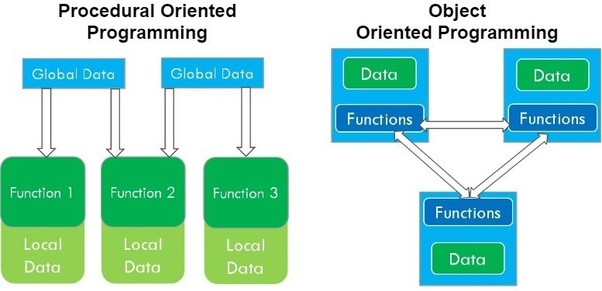

## 객체지향

#### 💡 객체지향 프로그래밍과 절차지향 프로그래밍의 차이에 대해 설명하시오.

- 절차지향은 순차적(Top-Down 접근방식)으로 진행되고, 객체지향은 세부모델부터 디자인되어 조립되는 BOTTOM UP 방식입니다. 절차지향은 함수로부터 데이터를 받아서 기능을 구현하는 방식으로 진행되며, 객체지향은 객체에 데이터와 기능이 존재하고, 객체들이 서로 유기적으로 동작하는 방식입니다.

  

 

#### 💡 객체지향 프로그래밍의 4가지 특징은?

- 객체지향 프로그래밍의 4가지 특징은 추상화, 캡슐화, 상속, 다형성입니다.

  추상화는 필요한 정보를 중심으로 간소화하는 것을 의미합니다.

  캡슐화는 객체에 필요한 데이터나 기능을 책임이 있는 객체에게 그룹화시켜주는 것을 의미합니다.

  상속은 상위 클래스의 기능을 하위 클래스가 사용할 수 있는 것을 의미합니다. 중복되는 코드의 재사용성을 위해 사용됩니다.

  다형성은 하나의 메소드나 클래스가 다양한 방법으로 동작하는 것으로, 일반적으로 오버로딩과 오버라이딩을 의미합니다.

 

#### 💡 오버로딩과 오버라이딩에 대해 설명하시오.

- 오버로딩은 같은 이름의 메소드가 파라미터의 개수나 타입에 따라 다른 기능을 하는 것이고,

  오버라이딩은 같은 이름의 메소드가 여러 클래스에서 다른 기능을 하는 것입니다.

  이들은 상속과 연계되는데,

  부모 클래스를 extends 할 때, 부모의 메서드를 오버로딩하여 다르게 사용하고,

  인터페이스를 implements 할 때, 인터페이스에서 헤더만 존재했던 메서드를 오버라이딩해 다르게 사용합니다.

 

#### 💡 객체지향 설계 5원칙(중요도 낮음)

- SRP (단일책임의 원칙), OCP (개방폐쇄의 원칙), LSP (리스코브 치환의 원칙), ISP (인터페이스 분리의 원칙), DIP (의존성역전의 원칙)입니다.

  **SRP (단일책임의 원칙**)은 작성된 클래스는 하나의 기능만 가지며, 클래스가 제공하는 모든 서비스는 그 하나의 책임을 수행하는 데 집중되어 있어야 한다는 원칙입니다.

  **OCP (개방폐쇄의 원칙)**은 소프트웨어의 구성요소(컴포넌트, 클래스, 모듈, 함수)는 확장에는 열려있고, 변경에는 닫혀있어야 한다는 원리입니다.

  **LSP (리스코브 치환의 원칙)**은 서브 타입은 언제나 기반 타입으로 교체할 수 있어야 한다는 원칙으로, 서브 타입은 기반 타입이 약속한 규약을 지켜야 한다는 원리입니다.

  **ISP (인터페이스 분리의 원칙)**은 한 클래스는 자신이 사용하지 않는 인터페이스는 구현하지 말아야 한다는 원리입니다.

  **DIP (의존성역전의 원칙)**에서 의존 관계의 역전 (Dependency Inversion)이란 구조적 디자인에서 발생하던 하위 레벨 모듈의 변경이 상위 레벨 모듈의 변경을 요구하는 위계관계를 끊는 의미의 역전입니다.

  실제 사용 관계는 바뀌지 않으며, 추상을 매개로 메세지를 주고 받음으로써 관계를 최대한 느슨하게 만드는 원칙입니다.

 

---

[참고]

[객체지향과 절차지향](https://jhnyang.tistory.com/322)

[객체지향의 주요특징 4가지](https://youngjinmo.github.io/2021/04/features-of-oop/)

[객체지향 프로그래밍의 4가지 특징](https://kkambi.tistory.com/4)

[객체지향 설계 5원칙](https://www.nextree.co.kr/p6960/)