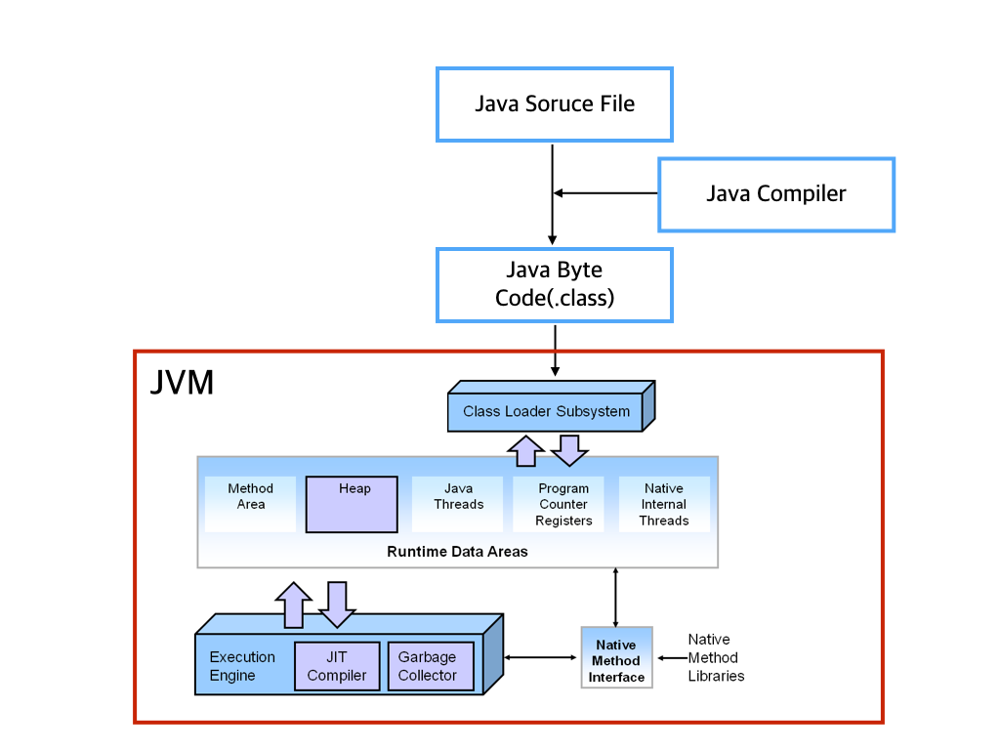
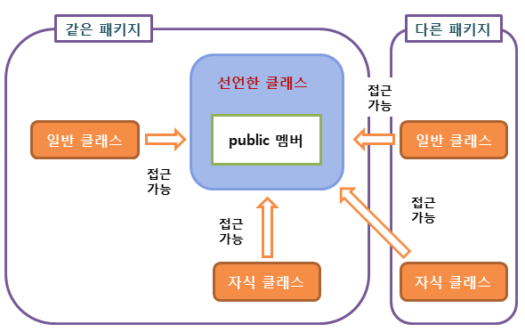
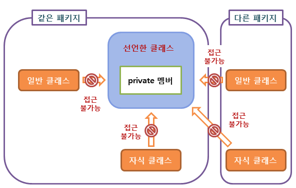
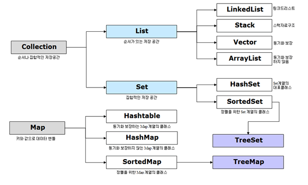

# Part 04.Java

## [객체지향](#OOP)

#### 💡 객체지향 프로그래밍과 절차지향 프로그래밍의 차이에 대해 설명하시오.

> 캡슐화, 다형성, 클래스 상속을 지원하는가?
>
> 데이터 접근 제한을 걸 수 있는가?

- 절차지향 프로그래밍(절차적 프로그래밍,PP)
  - 데이터 중심으로 함수를 만들고 순서에 따라 순차적으로 진행
  - 순차적인 처리가 중요
  - C언어
- 객체지향 프로그래밍(OPP)
  - 절차지향 프로그래밍과 같이 절차적으로 실행되나 객체간의 관계에 초점을 두고 코드를 작성
  - 함수보다는 데이터를 표현하는 객체 중심으로 구현
  - Java, Python 등

#### 💡 객제지향 프로그래밍의 4가지 특징은?

1. 추상화(Abstraction)
   - 구체적인 사물들의 공통적인 특징을 파악해서 이를 하나의 개념(집합)으로 다루는 것
2. 캡슐화(Encapsulation)
   - 정보 은닉(information hiding): 필요가 없는 정보는 외부에서 접근하지 못하도록 제한하는 것
   - 높은 응집도, 낮은 결합도를 유지하여 유연함과 유지보수성 증가
3. 일반화 관계(Inheritance, 상속)
   - 여러 개체들이 가진 공통된 특성을 부각시켜 하나의 개념이나 법칙으로 성립시키는 과정
4. 다형성(Polymorphism)
   - 서로 다른 클래스의 객체가 같은 메시지를 받았을 때 각자의 방식으로 동작하는 능력
   - 오버라이딩(Overriding), 오버로딩(Overloading)

#### 💡 오버로딩과 오버라이딩에 대해 설명하시오.

1. **공통점**

   - 같은 이름의 다른 함수를 호출

2. **차이점**

   - 오버로딩(Overloading)

     - 메소드의 이름과  return 타입은 동일하지만, 매개변수의 인자의 수나 자료형이 다른 메소드를 만드는 것을 의미

   - 오버라이딩(Overriding)

     - 상위 클래스 혹은 인터페이스에 존재하는 메소드를 하위 클래스에서 필요에 맞게 재정의하는 것을 의미

     - 상속 관계에 있는 클래스 간에 같은 이름의 메서드 정의

       

#### 💡 객체지향 설계 5원칙(중요도 낮음)

> SOILD 원칙, 디자인패턴과 연관된 원칙들

1. SRP(단일 책임 원칙)
   - 모든 클래스는 각각 하나의 책임만 가져야 한다. 클래스는 그 책임을 완전히 캡슐화해야 함
2. OCP(개방-폐쇄 원칙)
   - 확장에는 열려있고 수정에는 닫혀있는. 기존의 코드를 변경하지 않으면서( Closed), 기능을 추가할 수 있도록(Open) 설계가 되어야 한다는 원칙
3. LSP(리스코프 치환 원칙)
   - 자식 클래스는 언제나 자신의 부모 클래스를 대체할 수 있다는 원칙
4. ISP(인터페이스 분리 원칙)
   - 한 클래스는 자신이 사용하지않는 인터페이스는 구현하지 말아야 한다. 여러개의 구체적인 인터페이스로 구현
5. DIP(의존 역전 원칙)
   - 구체적인 클래스보다 인터페이스나 추상 클래스와 관계를 맺으라는 것

## [Java](#Java)

#### 💡 JVM의 JVM 구조는?

> JVM이란 JAVA Virtual Machine, 자바 가상 머신



1. 클래스로더, Class Loader

   - RunTime 시점에 클래스를 로딩하게 해주며 클래스의 인스턴스를 생성하면 클래스 로더를 통해 메모리에 로드하게 됩니다.

2. Runtime Data Area

   - JVM이 프로그램을 수행하기 위해 OS로 부터 별도로 할당 받은 메모리 공간

   -  5가지 영역

     - PC Register

       Stack Base로 동작, 각 Thread 별로 하나씩 존재하며 현재 수행중인 JVM Instruction의 주소를 가짐 

     - JVM Stack

       Thread의 수행정보를 Frame을 통해서 저장

       Thread가 시작될 때 생성되며 각각 별개로 생성되어 다른 Thread 접근 불가

     - Native Method Stack

       Java외의 언어로 작성된 네이티브 코드를 위한 Stack

     - Method Area

       모든 Thread가 공유하는 메모리 영역

       클래스, 인터페이스 ,메소드, 필드, Static변수 등의 바이트 코드 등 보관

     - Heap 

       프로그램 상에서 RunTime시, 동적으로 할당하여 사용하는 영역

3. Excuse engine

   - Load된 Class의 ByteCode를 실행하는 Runtime Module
   - Class Loader를 통해 JVM 내의 Runtime Data Areas 에 배치된 바이트 코드는 Execution Engine에 의해 실행되며, 실행 엔진은 자바 바이트 코드를 명령어 단위로 읽어서 실행합니다.

#### 💡 Java의 GC, 가비지 콜렉터의 작동 방식은 무엇인가요?

> 역할 : JVM의 Heap영역에서 *더이상 사용하지 않는 객체 등을 메모리에서 해제(삭제)하는 JVM의 작업*
>
> 1. 메모리 할당
> 2. 사용중인 메모리 인식
> 3. 사용하지 않는 메모리 인식

참조 : https://mangkyu.tistory.com/118


#### 💡 Java SE와 EE의 차이점은 무엇인가요?

> 공통점: Java 프로그래밍 언어로 애플리케이션 서버를 프로그래밍하기 위해 폭넓게 사용되는 플랫폼

**Java SE**, Java Platform, Standard Edition

- 추상 Java 플랫폼을 기술하는 스펙
- PC 데스크탑 컴퓨터에서 작업 그룹 서버까지 네트워크 중심 엔터프라이즈 애플리케이션을 빌드하고 배치하기 위한 기반을 제공
- Java Software Development Kit(SDK)으로 구현


**Java EE**, Java Platform, Enterprise Edition

- Java SE 스펙을 기반
- 다수 벤더와 선두 업체 사이의 협업을 나타내며 애플리케이션을 위한 인프라스트럭처 지원을 제공


#### 💡 참조형 변수와 기본형 변수의 차이점을 설명해주세요.

> 기본형: 실제 값을 저장(Pass by Value)
>
> 참조형: 인스턴스의 주소값(참조값) 저장

**변수의 값을 복사할 때**

1. 기본형 변수: 복사본과 원본은 아무 관계가 없으므로 복사본의 값을 변경해도 원본이 변경되지 않음
2. 참조형 변수: 복사본과 원본은 같은 주소값을 가지므로 같은 인스턴스를 가리킴


#### @참고

- Call by Value (값에 의한 호출)
  - 함수가 호출될 때, 메모리 공간 안에서는 함수를 위한 별도의 임시 공간이 생성된다.
  - 함수 호출시 인자로 전달되는 변수의 값을 복사하여 함수의 인자로 전달한다.
  - 복사된 인자는 함수 안에서 지역적으로 사용되는 local value의 특성을 가진다.
  - 따라서 함수 안에서 인자의 값이 변경되어도, 외부의 변수의 값은 변경되지 않는다.
- Java는 Call by Value 일까? Call by Reference 일까?

**Java는 항상 Call by Value 이다.**

- 여기서 value 란?

  - 기본자료형의 값 또는 객체에 대한 레퍼런스

- 기본자료형의 경우 해당하는 변수의 값을 복사해서 전달한다.

- 참조자료형의 경우 해당하는 변수가 가지는 값이 레퍼런스이므로 인자로 넘길 때 Call by Value에 의해 변수가 가지고 있는 레퍼런스가 복사되어 전달된다.

  

#### 💡 public 접근 제어자와 private 접근 제어자의 차이

##### - 접근 제어자(access modifier)

- 객체 지향에서 정보 은닉(data hiding)이란 사용자가 굳이 알 필요가 없는 정보는 사용자로부터 숨겨야 한다는 개념

- 사용자는 언제나 최소한의 정보만으로 프로그램을 손쉽게 사용할 수 있게 됩니다. (정보 은닉 구체화)

##### 1. public 접근 제어자



- public 접근 제어자를 사용하여 선언된 클래스 멤버는 외부로 공개되며, 해당 객체를 사용하는 프로그램 어디에서나 직접 접근 가능

- 자바 프로그램은 public 메소드를 통해서만 해당 객체의 private 멤버에 접근 가능

  따라서 public 메소드는 private 멤버와 프로그램 사이의 인터페이스(interface) 역할을 수행

##### 2. private 접근 제어자



- private 접근 제어자를 사용하여 선언된 클래스 멤버는 외부에 공개되지 않으며, 외부에서는 직접 접근할 수 없음

- 자바 프로그램은 private 멤버에 직접 접근할 수 없으며, 해당 객체의 public 메소드를 통해서만 접근.

  따라서 private 멤버는 public 인터페이스를 직접 구성하지 않고, 클래스 내부의 세부적인 동작을 구현하는 데 사용

  

#### 💡 non-static 멤버와 static 멤버의 차이에 대해 설명하시오.

>  **static 멤버**는 클래스당 하나씩 생긴다고 해서 클래스 **멤버**라고도 부르며, **non**-**static멤버**는 각 객체마다 하나식 생긴다고 해서 인스턴스 **멤버**라고 부른다.

1. non-static 멤버

   - 멤버는 객체마다 별도로 존재(인스턴스 멤버)
   - 객체 생성 시에 멤버 생성
   - 공유되지 않음

2. static 멤버

   - 멤버는 클래스당 하나가 생성(클래스 멤버)

   - 클래스 로딩 시에 멤버 생성

   - 동일한 클래스의 모든 객체들에 의해 공유됨

     

#### 💡 main 메소드가 public static인 이유는?

```java
public static void main(String[] args)
```

**1. main 메소드가 static 접근 지정자인 이유**

- **main 메서드**는 프로그램의 시작점. 
- **프로그램이 실행되면 제일 먼저 호출되는 메서드이기 때문**에 **객체를 생성하지 않은 채로 바로 작업을 수행해야 하기 때문에 static이어야** 합니다

**2. public 인 이유**

- 비슷한 개념으로 클래스가 어느 위치에 있건 **JVM이 접근 가능**하도록 하기 위해서 pulic 접근지정자로 해야함.

**3. void인 이유**

- 타입이 void라는 것은 반환할 것이 없다는 의미입니다. 
- 메인 메서드를 호출하는 JVM(Java Virtual Machine)에서 반환값을 요구하지 않으니 void타입을 사용(멀티스레드 염두)


#### 💡 Final 키워드의 용도에 대해 설명하시오.

> 자바에서 클래스나 변수를 정의할 때 `final` 키워드를 사용
>
> 클래스나 변수에 final을 붙이면 시간이 지나도 처음 정의된 상태가 변하지 않는 것을 보장한다는 의미

1. 변수

   - **변수에 final을 붙이면 이 변수는 수정할 수 없다는 의미**
   - **수정 할 수 없다는 범위는 그 변수의 값에 한정**
   - 수정될 수 없기 때문에 초기화 값은 필수적

2. 메서드

   - **메서드에 final을 붙이면 override를 제한**
   - **상속 받은 클래스에서 해당 메서드를 수정해서 사용하지 못하도록 할 수 있는것이 메서드에 final을 붙이는 것**

3. 클래스

   - **final 키워드를 클래스에 붙이면 상속 불가능 클래스**
   - 다른 클래스에서 상속하여 재정의를 할 수 없는 것

   

#### 💡 Generic에 대해 설명하시오.

#### 💡 ==과 equals()의 차이에 대해 설명하세요.

1. ==

   - **항등 연산자**
   - 참조비교, 주소비교

2. equals()

   - 객체 비교 **메서드(Method)**

   - 내용비교

     

#### 💡 Call by Reference와 Call by Value의 차이에 대해 설명하시오.

- **Call by Value (값에 의한 호출)**

  - 함수가 호출될 때, 메모리 공간 안에서는 함수를 위한 별도의 임시 공간이 생성된다.
  - 함수 호출시 인자로 전달되는 **변수의 값을 복사**하여 함수의 인자로 전달한다.
  - 복사된 인자는 함수 안에서 지역적으로 사용되는 local value의 특성을 가진다.
  - 따라서 함수 안에서 인자의 값이 변경되어도, 외부의 변수의 값은 변경되지 않는다.

- Call by Reference (참조에 의한 호출)

  - 함수가 호출될 때, 메모리 공간 안에서는 함수를 위한 별도의 임시 공간이 생성된다.
  - 함수 호출시 인자로 전달되는 **변수의 레퍼런스(주소)**를 전달한다. (해당 변수를 가리킨다.)
  - 따라서 함수 안에서 인자의 값이 변경되면, 인자로 전달된 변수의 값도 함께 변경된다.

  

#### 💡 추상 클래스와 인터페이스의 차이에 대해 설명하시오.

> 추상 클래스는 클래스 내 '추상 클래스'가 하나 이상 포함되거나 abstract로 정의된 경우
>
> 인터페이스느 모든 메소드가 추상 메소드인 경우

- 추상 클래스

  - 추상 메서드를 선언하여 **상속을 통해서 자손 클래스에서 완성하도록 유도**하는 클래스, **미완성 설계도**라고도 표현

  -  상속을 위한 클래스이기 때문에 따로 객체를 생성할 수 없음

    class 앞에 "abstract" 예약어를 사용하여 상속을 통해서 구현해야한다는 것을 알려주고 선언부만 작성하는 추상메서드를 선언할 수 있음

- 인터페이스

  - 추상클래스가 미완성 설계도라면 인터페이스는 **기본 설계도** 
  - 인터페이스도 추상클래스처럼 다른 클래스를 작성하는데 도움을 주는 목적으로 작성하고 클래스와 다르게 **다중상속(구현)**이 가능


**추상클래스 사용 시기** 

​	- 상속 관계를 쭉 타고 올라갔을때 같은 조상클래스를 상속하는데 기능까지 완변히 똑같은 기능이 필요한 경우

**인터페이스 사용 시기** 

​	- 상속 관계를 쭉 타고 올라갔을때 다른 조상클래스를 상속하는데 같은 기능이 필요할 경우 인터페이스 사용


#### 💡 java reflection에 대해 설명하시오.

> 리플렉션이란 객체를 통해 클래스의 정보를 분석해 내는 프로그램 기법
>
> 구체적인 클래스 타입을 알지 못해도 해당 클래스의 객체 생성, 메소드, 타입, 변수들에 접근할수 있도록 도와주는 Java API

#### - 언제 필요한가

**동적으로 클래스를 사용해야 할때 필요하다.** 즉, 작성 시점에는 어떤 클래스를 사용해야 할지 모르는 경우, 런타임 시점에서 클래스를 가져와서 실행해야 하는 경우에 사용된다. 대표적으로 IntelliJ의 자동완성이나 Spring 프레임워크의 어노테이션 같은 기능들이 리플렉션을 이용해서 프로그램 실행 중 동적으로 클래스 정보를 가져와서 사용하는 예이다.

####- 어떻게 가능한가

자바 클래스 파일은 프로그램 생성시에 힙영역에 저장된다. 그래서 클래스 이름만 알고 있다면 언제든 이 영역에 들어가서 클래스의 정보를 가져올수 있다.


#### 💡 String과 StringBuilder와 StringBuffer의 차이점을 설명해주세요.

> Java 에서 문자열을 다루를 대표적인 클래스로 **String ,** **StringBuffer**, **StringBuilder**가 있다.

- String과 StringBuilder, StringBuffer의 차이점

  - String 객체는 한번 생성되면 할당된 공간이 변하지 않지만 StringBuffer나 StringBuilder의 경우 객체의 공간이 부족해지는 경우 버퍼의 크기를 유연하게 늘려준다. String은 불변(immutable)하고 StringBuffer와 StringBuilder는 가변(mutable)한 특징을 가진다.

- StringBuilder, StringBuffer 클래스 사용의 장점

  - String은 **크기가 고정**되어 있기 때문에 **내부의 문자열을 수정할 수 없다**. 그렇기에 문자열을 수정할 때마다 새로운 문자열을 리턴한다.
  - 두 클래스는 내부 Buffer에 문자열을 저장해두고 그 안에서 추가, 수정, 삭제 작업을 할 수 있도록 설계되어 있다. 그렇기에 String처럼 새로운 객체를 만들지 않고도 문자열을 수정할 수 있다.
    - 문자열을 변경하는 작업이 많을 경우에는 String을 사용하는 것보다 StringBuffer나 StringBuilder를 사용하는 것이 좋다.

  > StringBuffer는 **멀티스레드 환경**에서 Synchronized 키워드가 가능하기 때문에 동기화가 가능해 스레드 세이프 함.
  >
  > StringBuilder는 스레드 세이프하지 않음. 동기화를 신경쓰지 않기 때문에 단일 스레드 환경에서 더 빠른 연산처리를 원하는 경우 사용하는 것이 좋음
  >
  > > **Synchronized**
  > >
  > > 자바에서 동기화 구현을 위해 사용하는 키워드입니다. 이 키워드를 사용했을 때, 해당 객체에 lock이 걸리면 다른 스레드들이 현재 작업중인 스레드의 작업이 종료될 때까지 대기상태가 됩니다. 여러스레드에서 한 객체에 접근하는 것을 막기 위해 사용합니다.

- String 클래스 장점

  - StringBuilder, StringBuffer 클래스보다 속도가 빠르다.


#### 💡 Java 8에 추가된 기능은 무엇이 있나요?

1. Lambda 표현식

2. Default Method.

3. 함수형 인터페이스

4. Stream.

5. Optional.

6. 날짜 관련 클래스 

7. 병렬 배열 정렬

8. String Joiner


#### 💡 Lambda란 무엇이고 어떠한 장점이 있는가?

>  Lambda, 함수형 프로그래밍, 함수형 패러다임의 등장에 따라 등장

#### Lambda

- 메소드를 하나의 식으로 표현
- 매개변수, ->(화살표), {몸통} 구조
- 메소드의 매개변수로 전달할 수 있고, 메소드 결과로 반환 가능
- 람다는 함수형 인터페이스를 통해서만 사용 가능
  - 함수형 인터페이스
  - 인터페이스 내에 한 개의 추상 메소드만 정의
  - 외부에서 메소드 호출 시 람다식이나 메소드 참조 가능
  - 자바에서 함수를 일급 객체로 사용할 수 없는 단점 보완
  - 함수형 인터페이스임을 명확히 하기 위해 `@FunctionalInterface` 사용
  - ex. Comparator, Runnuble

#### Lambda 장점

- 기존에 익명함수로 작성하던 코드를 줄여 간단하게 작성 가능
- 가독성 증가
- 병렬 프로그래밍에 용이


#### 💡 예외처리 방법을 설명해주세요.

#### @참고

https://velog.io/@ednadev/3.-%EC%9E%90%EB%B0%94-%EC%98%88%EC%99%B8-%EC%B2%98%EB%A6%AC-exception-handling

https://sjh836.tistory.com/122


#### 💡 Collection 정의와 종류를 말씀해주세요

**JAVA Collection Framework**

- JAVA에서 기본적인 자료구조를 제공하기 위한 환경



| 인터페이스 | 구현 클래스                                         | 특징                                                         |
| ---------- | --------------------------------------------------- | ------------------------------------------------------------ |
| List       | LinkedList<br />Stack<br />Vector<br />ArrayList    | 순서가 있는 데이터의 집합, 데이터의 중복을 허용함            |
| Set        | HashSet<br />TreeSet                                | 순서를 유지하지 않는 데이터의 집합, 데이터의 중복을 허용하지 않음 |
| Map        | HashMap<br />TreeMap<br />HashTable<br />Properties | 키(key)와 값(value)의 쌍으로 이루어진 데이터의 집합<br />순서는 유지되지 않고, 키는 중복을 허용하지 않으며 값의 중복을 허용함 |


#### 💡 ArrayList와 LinkedList의 차이는 무엇인가요

> LinkedList와 ArrayList는 모두 Java에서 제공하는 List 인터페이스를 구현한 Collection 구현체

#### # ArrayList

ArrayList는 내부적으로 데이터를 배열에서 관리하며 데이터의 추가, 삭제를 위해 아래와 같이 임시 배열을 생성해 데이터를 복사 하는 방법을 사용 하고 있다.


대량의 자료를 추가/삭제 하는 경우에는 그만큼 데이터의 복사가 많이 일어나게 되어 성능 저하를 일으킬 수 있다. 반면 각 데이터는 인덱스를 가지고 있기 때문에 한번에 참조가 가능해 데이터의 검색에는 유리한 구현체이다.


#### # LinkedList

LinkedList는 데이터를 저장하는 각 노드가 이전 노드와 다음 노드의 상태만 알고 있다고 보면 된다.


ArrayList와 같이 데이터의 추가, 삭제시 불필요한 데이터의 복사가 없어 데이터의 추가, 삭제시에 유리한 반면 데이터의 검색시에는 처음부터 노드를 순회해야 하기 때문에 성능상 불리하다. 

> Vector 동기화 가능, 속도가 느리다. 멀티스레딩할때만 사용


#### 💡 this 키워드는 언제 사용되나요?

**1) 개념**

this는 인스턴스의 자기 자신을 의미

**2) this 키워드의 역할**

① 자기 자신의 메모리를 가르킨다.

② 생성자에서 다른 생성자를 호출할 경우 사용한다.

③ 인스턴스 자신의 주소를 반환할 때 사용한다.
