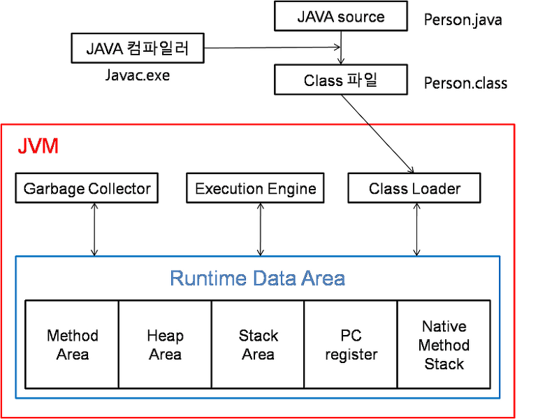
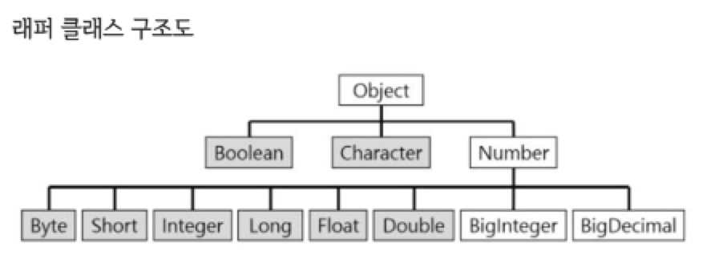
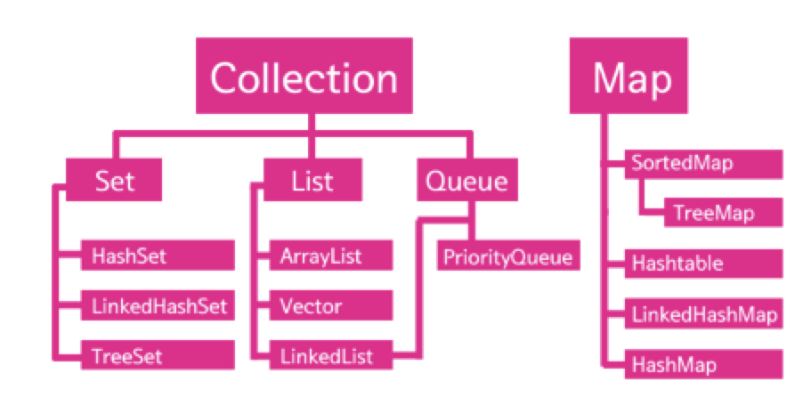

{:toc}

## Java

### I/O

Byte Stream을 통해 데이터를 주고 받는 것입니다.

### String과 StringBuffer/ StringBuilder 차이

String은 불변의 속성을 갖습니다. 문자열을 수정하는 시점에 새로운 String 인스턴스가 생성됩니다. 

반면 StringBuffer와 StringBuilder는 가변적인 속성을 갖습니다. 따라서, 문자열의 추가,수정,삭제가 빈번하게 발생하는 경우라면 이 객체를 사용하는 것이 좋습니다. (같은 메모리를 가리키고 인스턴스를 새로 생성하지 않는다.)

### StringBuffer/ StringBuilder 차이

StringBuffer와 같은 경우 멀티스레드 환경에서 Synchronized 키워드가 가능하기 때문에 동기화가 가능해 스레드 세이프 합니다. 반대로 StringBuilder는 스레드 세이프하지 않습니다. 멀티 스레드 환경에서는 StringBuffer를 사용하는 것이 좋고, StringBuilder는 동기화를 신경쓰지 않기 때문에 단일 스레드 환경에서 더 빠른 연산처리를 원하는 경우 사용하는 것이 좋습니다.

### Synchronized

자바에서 동기화 구현을 위해 사용하는 키워드입니다. 이 키워드를 사용했을 때, 해당 객체에 lock이 걸리면 다른 스레드들이 현재 작업중인 스레드의 작업이 종료될 때까지 대기상태가 됩니다. 여러스레드에서 한 객체에 접근하는 것을 막기 위해 사용합니다. 

### Volatile(발라틸)

volatile은 해당 객체를 메인 메모리에 올리겠다고 명시하는 것을 의미합니다. 멀티 스레드 환경에서 각각의 스레드는 메인 메모리에서 읽은 값을 cpu 캐시에 쓰고, 값을 읽어들입니다. 이때 두 스레드의 cpu 캐시 값이 다르면 변수 값 불일치 문제가 발생합니다. 발라틸 객체를 생성해 메인 메모리에 쓰고, 읽도록하여 문제를 해결할 수 있습니다. 한 스레드가 메모리에 값을 쓰기 전에 메인 메모리에서 값을 읽어가는 문제를 해결하기 위해 synchronized 키워드를 작성해 해결합니다.

### 데드락(dead-lock) : 교착상태 / JAVA

두 스레드가 모두 대기 상태에 계속 머무르게 되는 현상을 말합니다.

예를 들어, A 스레드가 foo라는 공유 변수에 Lock을 걸어두고, B 스레드가 bar라는 공유 변수에 lock을 걸어둔 상태에서 A가 bar 변수를 만나면 B스레드가 선점하고 잇으므로 대기 상태로 전환, 동시에, B의 경우엔 foo 변수를 만나면 A스레드가 선점하고 있으므로 대기 상태로 전환되어 무한정으로 대기하게 되는 것을 의미합니다.

### 싱글톤

내가 사용했던 방식: **lazy initialization**

인스턴스 사용 전까지 초기화를 미루는 방식, 스레드 세이프티 하지 않다. 인스턴스를 private로 선언하고 인스턴스를 반환하는 함수를 public으로 선언한다. 인스턴스가 null인 경우에만 초기화하고, 그렇지 않다면 바로 리턴하는 방식이다.

 또 다른 싱글톤 패턴 알아요? **lazy holder**

클래스 내부의 클래스는 초기화될 때 초기화 되지 않는 점과 static변수는 클래스가 로딩 될 때 초기화된다는 점을 이용한 패턴으로, JVM에게 객체 초기화를 미룸으로써 멀티스레드 환경에서도 객체 내용의 단일성을 보장할 수 있습니다.

### BufferedWriter

출력시에 buffer를 활용하는 것입니다. 많은 양의 출력에서 효율성이 좋습니다. 

**버퍼가 대체 뭔데..? !**

버퍼는 데이터를 한 곳에서 다른 한 곳으로 전송하는 동안 일시적으로 그 데이터를 보관하는 메모리의 영역

예를 들어 내가 오늘 기억할 수 있는 일과가  5개 있다고 가정할 때, 내 버퍼가 5개가 최대치인데, 2개가 추가로 들어오면 1,2부터 얼른 처리하고 6,7은 대기하는 방식입니다. (선입 선출)

### Scanner 와 BufferedReader

Scanner와 같은 경우 space를 경계로 인식하기 때문에 입력받은 데이터를 가공하기 간편합니다. 그러나 bufferedReader는 버퍼를 활용하기 때문에 많은 양의 데이터를 입력받는 경우 효율적입니다. 

### Exception

checkedException과 uncheckedException, error가 존재합니다. 

에러는 자바 프로그램 밖에서 발생한 예외를 말합니다. 가장 흔한 예로는 서버의 디스크 고장이 있습니다.

런타임 에러는 uncheckedException에 해당합니다. 컴파일 단계에서 체크하지 않는 에러이기 때문입니다. 예시로는 null을 참조했을 때 나는 에러인 NullPointerException, 배열의 범위를 넘어갈때 나는 에러인 IndexOutofBoundsException이 있습니다.

체크드 익셉션에는 IO에서 일어나는 IOException, SQLException 등이 있습니다.

try/catch문을 작성하거나 throw exception을 통해 에러를 처리합니다.

catch에서 예외 처리 

throw/throws는 호출한 메소드에게 예외처리 위임!

### 객체지향 프로그래밍

객체와 객체의 상호작용을 통해 프로그램이 동작하는 것을 의미합니다. 코드의 재사용성이 높고, 유지보수가 용이하다는 장점이 있습니다. 

### 객제지향 과 절차지향 프로그래밍의 차이

### 객제지향 프로그래밍의 4가지 특징

### Java SE와 EE의 차이점

### 참조형 변수와 기본형 변수의 차이점

### main 메소드가 public static인 이유

### Final 키워드의 용도

### Generic

### Call by Reference와 Call by Value의 차이

###  reflection

### Java 8에 추가된 기능

###  Lambda 정의 및 장점

### this 키워드

### SOLID

객체 지향 설계의 다섯가지 기본 원칙입니다.

* **단일 책임 원칙(Single Responsibillity Principle):** 클래스는 *단 하나의 책임*을 가져야하며, 클래스를 변경하는 이유는 단 하나의 이유여야한다.

* **개방 폐쇄 원칙(Open-Closed Principle):** 확장에는 열려있어야 하고, 변경에는 닫혀있어야 한다. (예시: JDBC 매니저, 인터페이스)

  > **JDBC**(Java Database Connectivity)는 자바에서 데이터베이스에 접속할 수 있도록 하는 자바 API

* **리스코프 치환 원칙(Liskov Substitution Principle):** 상위 타입의 객체를 하위 타입의 객체로 치환해도 상위 타입을 사용하는 프로그램은 정상적으로 동작해야한다.

* **인터페이스 분리 원칙(Interface Segregation Principle):** 인터페이스는 그 인터페이스를 사용하는 클라이언트를 기준으로 분리해야한다.

* **의존 역전 원칙(Dependency Inversion Principle):** 고 수준 모듈은 저 수준 모듈의 구현에 의존해서는 안된다.

### 자바의 컴파일 과정

1. 자바 파일을 컴파일러가 바이트 코드로 컴파일합니다.
2. 바이트 코드를 JVM의 클래스 로더가 메모리 상에 적재합니다.
3. 실행 엔진은 JVM에 올라온 바이트 코드를 명령어 단위로 하나씩 가져와서 실행합니다. 이를 인터프리터 방식이라고 합니다.

#### 실행 엔진의 종류 2가지

* 인터프리터: 바이트 코드 명령어를 하나씩 읽어서 해석하고 실행합니다.
* JIT(Just In Time) 컴파일러: 바이트 고드 전체를 컴파일하여 바이너리 코드로 변경하고, 이후에는 해당 메소드를 더이상 인터프리팅하지 않고, 바이너리 코드로 직접 실행하는 방식입니다.

### JVM의 메모리 구조

가비지 컬랙터, 실행엔진, 클래스 로더가 있고

런타임 데이터 영역에는 메소드 , 힙, 스택, 네이티브 영역과, PC Register, Native Method Stack이 있습니다.

* 먼저 메소드 영역은 클래스, 메소드, 상수, 변수, static, final 변수에 대한 정보가 저장됩니다.
* 스택 영역은 메소드 호출에 따른 메소드를 위한 공간입니다. (지역 변수, 파라미터, 리턴 값, 연산에 사용되는 임시 값등이 생성되는 영역) 메소드 수행이 끝나면 프레임 단위로 삭제가 진행됩니다.
  * `Person p = new Person();` 에서 Person p 는 스택에 저장! new Person()는 힙에 저장. p 는 힙의 주소값을 가짐.
* 힙 영역은 new 연산자로 생성된 객체와 배열이 저장되는 공간입니다.
  * eden, survivor 1, survivor 2, old, permanent 로 나뉨
  * 메소드 영역에 로드된 클래스만 생성이 가능하고 Garbage Collector가 참조되지 않는 메모리를 확인하고 제거하는 영역(탐색 영역)입니다. (출처: https://jeong-pro.tistory.com/148 -> 더 살펴보면 좋음)
* Native Method Stack은 자바 이외의 다른 언어에서 제공되는 메소드가 저장되는 영역입니다.
* PC 레지스터 영역은 스레드가 생성될 때마다 생성되는 영역으로 스레드의 명령어를 저장합니다. (Program Counter 라고 합니다.) (CPU의 레지스터와는 다릅니다.)

스레드가 생성되었을 때, 메소드 영역과 힙 영역은 공유하고, 나머지 영역은 공유하지 않습니다!

#### 가비지 컬렉터(GC)

Heap 메모리 영역에 생성된 객체들 중에 **참조되지 않는 객체**들을 탐색후 제거하는 역할을 합니다. GC를 수행하는 동안 다른 모든 스레드가 일시 정지됩니다. 힙 영역이 주요 영역이고, 스택과 메소드 영역도 살펴봅니다.

#### 🐢GC 구조

#### Static

객체 지향에서 static은 일반적으로 정적 멤버, 클래스 멤버라고 불립니다. 클래스 멤버로 불리는 이유는 static 멤버는 클래스 내에 선언되어 클래스 기반으로 선언된 모든 객체들이 참조할 수 있기 때문입니다. 클래스를 이용한 작업을 끝내더라도 static 변수가 점유하고 있는 메모리는 가비지 컬랙터에 의해서 회수되지 않기 때문에 static 변수는 프로그램이 실행되고 있는 내내 살아있게 됩니다. (JVM 런타임 데이터 영역의 메소드 영역에 존재해 모든 객체가 이를 공유합니다.)

여담> static 변수를 사용한다고 하면, 이 변수의 상태는 코드 여러 부분에서 영향을 받을 수 있게 되고 따라서 **변화를 추적**하기가 어려워집니다. 반면에 이를 객체화하여 인스턴스로 생성하면 테스트 중에 그 변수가 어떤 상태를 가지고 있는지 추론하는 것이 보다 간단해집니다.

출처: https://unabated.tistory.com/entry/왜-자바에서-static의-사용을-지양해야-하는가 [랄라라]

### 익명 클래스와 익명 객체

익명 클래스는 말 그대로 이름이 없는 클래스를 말합니다. 클래스의 선언과 객체의 생성을 동시에 진행하여, 일회성으로 사용하고, 하나의 객체만을 만듭니다.

### 클래스와 객체의 차이점

클래스는 설계도 같은 것으로, 멤버 변수와 멤버 메소드들의 집합입니다.

객체는 클래스에 선언돼 설계도 대로 생성된 구현할 대상, 클래스의 인스턴스라고도 부른다.

### 객체지향 프로그래밍의 특징

추상화 캡슐화 다형성 상속이 있습니다.

#### 추상화

추상화란, 여러 객체에 공통적으로 사용되는, 사용되어야 하는 내용을 뽑아내는 것을 말합니다.

#### 다형성

다형성은 객체와 메소드가 다양한게 작동하게 하는 요소를 의미합니다. 대표적으로 오버로딩과 오버라이딩이 있습니다.

#### 캡슐화 (캡슐화 vs 은닉화)

**캡슐화**는 메소드, 객체 등의 필드가 직접적으로 조작되지 않도록 사용 방법을 설정하며 외부와 직접 소통하는 것입니다. 클래스 간의 결합도를 낮추는 역할을 할 수 있습니다.

**은닉화**는 다른 컴포넌트 (클래스, 인스턴스)로부터 내가 가진 정보를 숨기는 것으로 대표적인 예로는 private 접근자가 있습니다.

**차이점:** 은닉화는 프라이빗을 사용해 주요 사항이 드러나지 않도록 감추는 것! 캡슐화는 중요사항을 감춘 상태에서 외부에서 그것을 사용할 수 있는 방법을 설정하고, 외부와 직접적인 소통을 하는 것.

### 상속 (vs 구현)

* 상속

  `하위 클래스` is kind of `상위 클래스`

  자식 클래스는 부모의 기능을 가지면서 추가 기능을 수행할 수 있습니다.

* 구현

  `구현체` is able to `interface`

### 🐢 상속과 합성(컴포지션)의 차이

상속은 is a 관계이고, 컴포지션은 has a 관계입니다. 컴포지션은 클래스가 구성원 데이터로 다른 클래스의 객체를 포함할 수 있는 능력입니다.

### 오버로딩과 오버라이딩의 차이점

메소드 오버라이딩은 자식 클래스에서 부모 클래스의 메소드를 재정의하는 것을 의미합니다. 메소드의 선언부는 같고 몸체는 다른 역할을 수행하도록 합니다. 자식 클래스는 부모의 기능을 가지면서 추가 기능을 수행할 수 있습니다.

메소드 오버로딩은 하나의 클래스에서 같은 이름을 가졌지만 인자의 종류나 갯수가 다른 메소드를 구현하는 것을 의미합니다. 같은 기능을 수행하지만 다른 인자를 필요로 하는 경우 메소드명을 동일하게 묶어주는 기능을 합니다.

### 추상클래스와 인터페이스의 차이

* 하나 이상의 추상 메소드를 가지고 있는 클래스를 추상 클래스 라고 합니다. 이는 상속에 큰 의미를 두고 있습니다. 예시로 컴퓨터를 킨다는 추상메소드를 가진 추상 클래스와 이를 상속받아서 A컴퓨터, B컴퓨터, C컴퓨터 (실체 클래스)를 만들 수 있습니다. 상속받은 클래스는 추상 클래스의 메소드를 반드시 오버라이딩(재정의)해야 합니다. abstract 키워드를 통해 표현합니다.

* 인터페이스는 **기능의 재정의**에 의미를 가지고 있고, 일종의 명세서라고 볼 수 있습니다. 추상메소드와 상수를 가지고 있습니다. 이를 구현하는 클래스는 추상메소드를 오버라이딩해야합니다. 인터페이스는 다중 상속이 가능합니다. 다형성을 극대화하고, 유지보수성을 높이는 역할을 합니다.

  > (멤버 변수와 일반 메소드를 가질 수 없으며 추상 메소드와 상수만을 선언할 수 있습니다. java 8에서는 default키워드를 이용해 일반 메소드 구현이 가능합니다.)  

### == 와 equals의 차이

== 는 주소 값을 비교하고, equals는 내용 자체를 비교합니다. (String은 변경시마다 객체를 새로 생성하기 때문에 equals를 사용해야합니다요!)

### 접근제어자

클래스의 멤버 변수 또는 멤버 메소드에 설정하는 키워드로, 접근 영역을 제한하는 데 사용합니다. Public, default, protected, private이 존재합니다. Public은 접근 제한을 하지 않으며, default는 같은 패키지에서 접근이 가능합니다. Protected는 같은 패키지 혹은 다른 패키지의 자식 클래스에서 접근이 가능함을 의미합니다. Private는 같은 클래스 내에서만 접근이 가능합니다.

**같은 클래스 < 같은 패키지 < 같은 패키지 or 자식 클래스  < 접근 제한 없음**

**Private           default                    protected                     public**

### 직렬화(Serializable)

자바 객체를 외부에서 사용할 수 있도록 byte 형태로 변환하는 것을 직렬화라고 하며, 반대 과정을 역직렬화라고 합니다.

***(안드로이드)*** 복잡한 클래스 객체를 이동하려는 경우에는 Serializable 또는 Parcelable(리플랙션을 사용하지 않음)을 사용해 직렬화하여 인텐트에 추가해 이동해야합니다. 여기서 직렬화는 자바 객체를 바이트로 변환하는 것을 의미합니다.

* 헷갈리는 개념! 인코딩과 디코딩: 인코딩는 바이트 어레이를 스트링으로 만드는 것, 디코딩은 반대 ! (디지털 서명값을 서버에 보내기 위해 인코딩, 반대로 verify하기 위해 디코딩)

문자열로 직렬화한 다음 인코딩

### Wrapper class

자바의 자료형이 기본 자료형과 래퍼클래스로 나뉩니다. 기본타입의 데이터를 객체로 나타내기 위해 래퍼클래스를 사용합니다. 기본 타입은 int라면 래퍼클래스는 Integer[인티저] 

가장 상위객체는 Object 네요 ? 

기본 타입 -> 래퍼 클래스 : 박싱 (반대는 언박싱)

명시적 방식과 묵시적 방식이 있습니다.

#### 왜 사용합니까? 

기본 데이터 타입은 객체가 아니라서 Object로 받는 다형성을 지원할 수 없습니다. 실제로 메서드에서 기본 데이터 타입을 다형성으로 넘겨주어야 하는 경우가 발생할 때 객체로 전달하기 위해 사용합니다.

### 자바의 제네릭이란 ?

제네릭은 클래스 내부에서 사용할 데이터 타입을 외부에서 지정하는 것을 의미합니다. 객체 생성시에 타입을 지정해주면 생성되는 오브젝트 안에서 제네릭 표현 위치에 해당 타입이 대체되는 것처럼 컴파일러가 인식합니다.

#### Object와의 차이

제네릭은 Object와 다르게 형변환을 해주지 않아도 됩니다.

#### 컬렉션 클래스에서 제네릭을 사용하는 이유!

컬랙션 클래스에서 제네릭을 사용하면 컴파일러는 특정 타입만 포함 될 수 있도록 컬렉션을 제한합니다. 이는 런타임에 발생할 수 있는 에러를 컴파일시에 잡아낼 수 있기 때문에 더욱 type- safe하게 프로그래밍 할 수 있습니다.

 List<String> list = new List();

​            형식 선언부   |   객체 생성부

#### Type-safe?

타입 세이프 하다는 것은 **타입을 판별할 수 있어** 런타임이 아닌 컴파일시 문제를 잡아 낼 수 있는 것을 의미합니다.

### Collection 클래스

list, set, queue가 있고 map이 따로 있습니다.

1. `List`는 순차적인 데이터를 저장하며 중복을 허용합니다. 배열과 유사하지만 바운더리를 미리 정의하지 않고 유동적으로 늘릴 수 있는 구조를 가집니다. ArrayList, LinkedList, Stack, Vector가 하위 클래스로 존재합니다.
   * **ArrayList: 조회가 빠릅니다.**
   * **LinkedList: 조회는 느리지만 삽입 삭제가 빠릅니다.**
   * **Stack: 선입 후출 자료구조 입니다.**
   * Vector: 동기화가 걸려있어 여러 스레드에서 동시 접근 할 수 없습니다.
2. `Set`은 순서를 유지하지 않고, 데이터의 중복을 허용하지 않는 자료구조 입니다. 
   * Hashset은 검색속도가 아주 빠릅니다. (해시 알고리즘을 사용) (내부적으로 HashMap 인스턴스를 사용해 요소를 저장합니다.)
   * LinkedHashSet: 저장 순서를 유지합니다.
   * TreeSet: 오름차순 정렬됩니다. 이진 트리 구조입니다.반드시 Comparable을 구현해야합니다.
3. `Map`은 키와 밸류로 이루어진 데이터를 순서 유지 없이, 키의 중복을 허용하지 않는 (값의 중복은 허용합니다.) 자료 구조입니다.
   * HashMap: null을 허용합니다.
   * TreeMap: 순서 있는 해시맵입니다. Comparable을 구현해야 합니다.
   * HashTable: 해시맵과 구조가 같습니다. 동기화 되어져 있습니다. (여러 스레드 동시 접근 불가)
   * Properties: Value 타입이 String만 가능한 맵 자료구조입니다.

|           | List                                 | Set              | Queue                       | Map                                        |
| --------- | ------------------------------------ | ---------------- | --------------------------- | ------------------------------------------ |
| 중복 허용 | o                                    | x                | o                           | 키는 x, 값은 o                             |
| 순서 유지 | o                                    | x                | o                           | x                                          |
| 종류      | LinkedList, ArrayList, Stack, Vector | HashSet, TreeSet | PriorityQueue는 순서 유지 X | HashMap, TreeMap, LinkedHashMap, HashTable |

### Thread-safe?

멀티 스레드 프로그래밍에서 일반적으로 어떤 함수나 객체가 여러 스레드로부터 동시에 접근이 이루어져도 프로그램의 실행에 문제가 없는 것을 의미합니다.

### NIO(New Input-Output)

기존 자바 I/O 를 보완한 것입니다. 

기존에는 블락킹를 해결하기 위해 멀티 쓰레딩을 사용했습니다. 그러나 이러한 작업이 수만개가 동시에 일어날 가능성이 있는 서버 프로그램일 경우 쓰레드가 너무 많아져서 생기는 **Context Switching**이 발생하게 됩니다. 이런 경우 많은 스레드가 모두 작업을 하지는 않는 상태로 자원을 낭비하게 됩니다.

따라서, 모든 IO에대해 스레드를 생성하는 것이 아닌 채널 관리자(selector)가 실제 IO가 발생한 채널만 스레드를 생성하여 관리하는 방식입니다.

단점: 기존 멀티스레딩 방법보다 구현하기 어렵다는 단점이 있습니다.

요약해서, IO에서 블락킹을 막기 위해 제공되는 IO 패키지로서, 채널 관리자가 실제 IO가 발생한 채널만 스레드를 생성해 관리하는 방식입니다.

#### 블락킹

IO작업에서 주로 사용되는 메소드의 속도가 느려져서 잠시 멈춰있는 상태

### Kotlin 과의 차이

코틀린은 자바와 100프로 호환되는 언어입니다. 두 언어 모두 컴파일러가 타입 오류를 잡아 줄 수 있습니다. 또한 멀티 플랫폼 개발을 할 수 있습니다. 둘의 가장 큰 차이점은 널포인트 익셉션입니다. 자바는 Null을 참조하면 런타임에서 예외를 발생시킵니다. 그러나 코틀린은 컴파일 시점에서 미리 방지할 수 있습니다. 

또한 코틀린은 함수형 프로그래밍 언어입니다. 함수형 프로그래밍은 거의 모든 것을 순수 함수로 나누어 문제를 해결하는 기법으로, 작은 문제를 해결하기 위한 함수를 작성하여 가독성을 높이고 유지보수를 용이하게 해줍니다.

가장 기본 적인 컨셉은 일급함수입니다. 이는 함수를 변수, 파라미터, 리턴 등으로 사용할 수 있게 합니다. 코틀린에서 일급객체로 사용된느 함수를 공식적으로 람다라고 부릅니다. 함수가 파라미터나 리턴값으로 사용되는 경우에는 고차함수라고 합니다. 

확장 함수

확장함수(Extension Function)는 클래스의 멤버 메서드처럼 호출되지만 클래스 밖에 구현되는 함수 입니다. 기존 클래스의 겉에 함수가 붙는 것으로 이해할 수 있습니다.

**코틀린은 원시타입과 wrapper type을 구분하지 않는다.**

Integer와 int 로 구분되지 않고, int 하나만 존재한다.

 