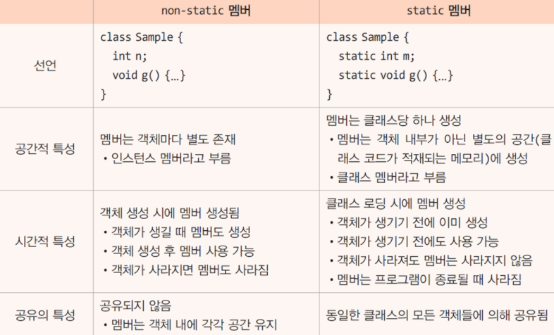

# Part 04.Java

## [객체지향](#OOP)

#### 💡 객체지향 프로그래밍과 절차지향 프로그래밍의 차이에 대해 설명하시오.

```
절차 지향

1. Top-Down 방식으로 설계
2. 함수(function)를 생성
3. 인수(parameter)와 반환값(value)으로 명령을 전달 및 수행
4. 데이터와 함수를 별개로 취급
5. 메소드를 직접 호출 ( 객체 지향에서는 인스턴스로 호출 )

단점 

1. 유지보수가 어려움
2. 순서가 바뀌면 결과값을 도출에 어려움
3. 프로그램을 분석이 어려움
4. 대형 프로젝트에는 부적합

객체 지향은 다음 항목에서

```

#### 💡 객제지향 프로그래밍의 4가지 특징은?

```
캡슐화 - 외부에서는 생성한 객체가 어떤 메서드와 필드로 일을 수행하는지 몰라도 된다.

상속 - 자식클래스는 부모클래스를 물려받으며 확장 가능 (재사용)

추상화 - 공통된 속성/기능을 묶어 이름을 붙인다. (단순화 및 객체모델링)
 
다형성 - 부모클래스와 자식클래스가 동일한 요청을 다르게 처리할 수 있다. (사용 편의성)
```

#### 💡 오버로딩과 오버라이딩에 대해 설명하시오.
```
오버로딩

하나의 메소드 이름으로 여러 기능을 구현하기 위한 기능

오버라이딩

부모 클래스로부터 상속받은 메소드를 자식 클래스에서 재정의하는 것
```

#### 💡 객체지향 설계 5원칙(중요도 낮음)

```
단일 책임 원칙
개방 폐쇄 원칙
리스코프 치환 원칙
인터페이스 분리 원칙
의존관계 역전 원칙
```

## [Java](#Java)

#### 💡 JVM의 JVM 구조는?


#### 💡 Java의 GC 콜렉터의 작동 방식은 무엇인가요?

```
프로그램을 개발 하다 보면 유효하지 않은 메모리인 가바지(Garbage)가 발생하게 된다. C언어를 이용하면 free()라는 함수를 통해 직접 메모리를 해제해주어야 한다. 하지만 Java나 Kotlin을 이용해 개발을 하다 보면 개발자가 메모리를 직접 해제해주는 일이 없다. 그 이유는 JVM의 가비지 컬렉터가 불필요한 메모리를 알아서 정리해준다
```

#### 💡 Java SE와 EE의 차이점은 무엇인가요?
```
JAVA SE (Java Standard Edition)

자바 표준 에디션은 가장 기본이 되는 에디션입니다.흔히 자바 언어라고 하는 대부분의 패키지가 포함된 에디션

JAVA EE (Java Enterprise Edition)

자바로 구현되는 웹프로그래밍에서 가장 많이 사용되는 JSP, Servlet을 비롯하여, 데이터베이스에 연동하는 JDBC, 그 외에도 JNDI, JTA, EJB 등의 많은 기술들을 포함

```

#### 💡 참조형 변수와 기본형 변수의 차이점을 설명해주세요.
```
기본형primitive type : 논리형, 문자형, 정수형, 실수형이 있다. 계산을 위해 실제 값을 저장한다.

참조형reference type : 객체의 주소를 저장한다. null 또는 객체의 주소(4byte, 0x0 ~ 0xffffffff)를 갖는다.
```
#### 💡 public 접근 제어자와 private 접근 제어자의 차이
```
Private 멤버는 class 외부에서 접근할 수 없는 변수

Public 멤버는 class 외부에서 접근할 수 있는 변수
```

#### 💡 non-static 멤버와 static 멤버의 차이에 대해 설명하시오.


#### 💡 main 메소드가 public static인 이유는?
```
클래스의 static으로 선언된 메서드를 객체 생성 없이 메모리에 할당시키고 할당된 메서드 중 "main"으로 네이밍된 메서드가 있는지 찾아 호출
```

#### 💡 Final 키워드의 용도에 대해 설명하시오.
```
변수나 메서드 또는 클래스가 ‘변경 불가능’하도록 만든다.

원시(Primitive) 변수에 적용 시
해당 변수의 값은 변경이 불가능하다.
참조(Reference) 변수에 적용 시
참조 변수가 힙(heap) 내의 다른 객체를 가리키도록 변경할 수 없다.
메서드에 적용 시
해당 메서드를 오버라이드할 수 없다.
클래스에 적용 시
해당 클래스의 하위 클래스를 정의할 수 없다.
```

#### 💡 Generic에 대해 설명하시오.

```
제네릭은 클래스나 메소드에서 사용할 내부 데이터 타입을 컴파일 시에 미리 지정하는 방법
이렇게 컴파일 시에 미리 타입 검사(type check)를 수행하면 다음과 같은 장점을 가짐

1. 클래스나 메소드 내부에서 사용되는 객체의 타입 안정성을 높일 수 있음
2. 반환값에 대한 타입 변환 및 타입 검사에 들어가는 노력을 줄일 수 있음
```

#### 💡 ==과 equals()의 차이에 대해 설명하세요.
```
== 연산자는 비교하고자 하는 두개의 대상의 주소값을 비교
String클래스의 equals 메소드는 비교하고자 하는 두개의 대상의 값 자체를 비교
```


#### 💡 Call by Reference와 Call by Value의 차이에 대해 설명하시오.
```
- Call by Reference

 참조에 의한 호출방식은 함수 호출시 인자로 전달되는 변수의 레퍼런스를 전달

- Call by Value

CallByValue 값에 의한 호출방식은 함수 호출시 전달되는 변수의 값을 복사하여 함수의 인자로 전달
복사된 인자는 함수 안에서 지역적으로 사용되는 local value의 특성을 가짐
따라서 함수 안에서 인자의 값이 변경되어도, 외부의 변수의 값은 변경되지 않음
```

#### 💡 추상 클래스와 인터페이스의 차이에 대해 설명하시오.

```
abstract class

추상 메서드를 선언하여 상속을 통해서 자손 클래스에서 완성하도록 유도하는 클래스
상속을 위한 클래스이기 때문에 따로 객체를 생성할 수 불가

interface class

interface는 다른 클래스를 작성하는데 도움을 주는 목적으로 작성하고 클래스와 다르게 다중상속(구현)이 가능

```

#### 💡 java reflection에 대해 설명하시오.
```
리플렉션이란 객체를 통해 클래스의 정보를 분석해 내는 프로그램 기법
```

#### 💡 String과 StringBuilder와 StringBuffer의 차이점을 설명해주세요.
```
String은 불변성을 가지기 때문에 변하지 않는 문자열을 자주 읽어들이는 경우 String을 사용해 주시면 좋은 성능을 기대할 수 있음 그러나 문자열 추가,수정,삭제 등의 연산이 빈번하게 발생하는 알고리즘에 String 클래스를 사용하면 힙 메모리(Heap)에 많은 임시 가비지(Garbage)가 생성되어 힙메모리가 부족으로 어플리케이션 성능에 치명적인 영향을 끼침

동기화의 유무로써 StringBuffer는 동기화 키워드를 지원하여 멀티쓰레드 환경에서 안전하다는 점(thread-safe) 입니다.  참고로 String도 불변성을 가지기때문에 마찬가지로  멀티쓰레드 환경에서의 안정성(thread-safe)을 가지고 있음 

반대로 StringBuilder는 동기화를 지원하지 않기때문에 멀티쓰레드 환경에서 사용하는 것은 적합하지 않지만 동기화를 고려하지 않는 만큼 단일쓰레드에서의 성능은 StringBuffer 보다 뛰어나다
```

#### 💡 Java 8에 추가된 기능은 무엇이 있나요?
```
1. 람다 표현식(lambda expression) : 함수형 프로그래밍

2. 스트림 API(stream API) : 데이터의 추상화

3. java.time 패키지 : Joda-Time을 이용한 새로운 날짜와 시간 API

4. 나즈혼(Nashorn) : 자바스크립트의 새로운 엔진
```
#### 💡 Lambda란 무엇이고 어떠한 장점이 있는가?
```
메소드를 하나의 식으로 표현.
식별자 없이 실행할 수 있는 함수 표현식
익명 함수(anonymous function)라고도 부름

 
메소드를 이렇게 람다 표현식으로 표현하면 클래스를 만들고 객체를 생성하지 않아도 메소드를 사용할 수 있음
메소드의 매개변수로 전달될 수도 있고, 메소드의 결괏값으로 반환될 수도 있습니다.
기존의 불필요한 코드를 줄여주고, 작성된 코드의 가독성을 높여주는 것이 목적
```


#### 💡 예외처리 방법을 설명해주세요.
```
try, catch, throw, finally를 사용해서 처리함
```

#### 💡 Collection 정의와 종류를 말씀해주세요


#### 💡 ArrayList와 LinkedList의 차이는 무엇인가요
```
ArrayList
ArrayList는 내부적으로 데이터를 배열에서 관리하며 데이터의 추가, 삭제를 위해 임시 배열을 생성해 데이터를 복사 하는 방법을 사용

LinkedList
LinkedList는 데이터를 저장하는 각 노드가 이전 노드와 다음 노드의 상태만 알고 있음
```

#### 💡 this 키워드는 언제 사용되나요?
```
1. 자기 자신의 메모리를 가르킨다.
2. 생성자에서 다른 생성자를 호출할 경우 사용한다.
3. 인스턴스 자신의 주소를 반환할 때 사용한다.
```
