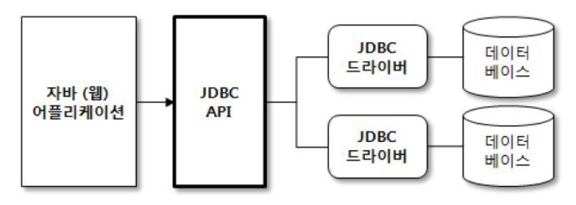
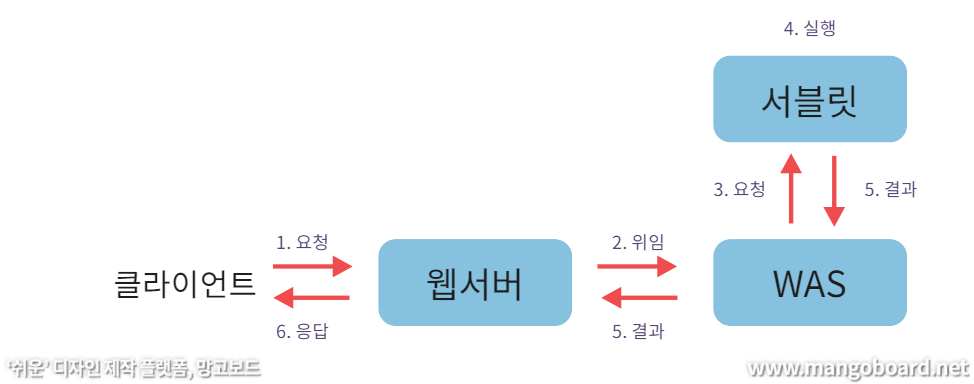

# Part 05. Spring

#### 💡 JDBC는 무엇인가요?

~~~
JDBC(Java Database Connectivity)는 데이터베이스에 연결 및 작업을 하기 위한 자바 표준 인터페이스입니다.
자바는 DBMS의 종류에 상관없이 하나의 JDBC API를 이용해서 데이터베이스 작업을 처리합니다.

이 JDBC는 DB에 접근해서 CRUD를 쉽고 효율적이게 할 수 있게 하고, 고성능에서의 세련된 메소드를 제공하며,
쉽게 프로그래밍 할 수 있게 도와줍니다.
~~~

 

#### 💡 Servlet이란 무엇인가요?

~~~
Servlet은 서버 쪽에서 실행되며, 클라이언트의 요청을 동적으로 처리할 수 있게끔 도와주는 자바 클래스입니다.

서블릿은 자바 클래스이므로, 자바의 일반적인 특징을 모두 갖고 있습니다.
하지만, 자바와 달리 서블릿은 톰캣과 같은 서블릿 컨테이너에서 실행되어야 합니다.

클라이언트가 웹 서버에 요청을 하면, 웹 서버는 그 요청을 톰캣과 같은 웹 어플리케이션 서버(WAS)에 위임합니다.
그러면 WAS는 각 요청에 해당하는 서블릿을 실행합니다.
그 후, 서블릿은 요청에 대한 기능을 수행한 후 결과를 반환하여 클라이언트에게 응답합니다.
~~~

 

#### 💡 JSP란 무엇인가?

#### 💡 pojo는 무엇인가요?

#### 💡 Spring AOP란?

#### 💡 Spring DI란?

#### 💡 Spring IOC란 무엇인가?

#### 💡 Spring MVC 흐름에 대한 설명

#### 💡 Spring MVC1과 MVC2의 차이점은?

#### 💡 Spring과 Spring Boot의 차이점은?

#### 💡 DAO와 DTO의 차이점은?

#### 💡 Mybatis란 무엇인가?

#### 💡 MyBatis와 Spring JPA의 장단점

#### 💡 Spring Bean 주입 방법

#### 💡 Web Server과 WAS의 차이점

#### 💡 JAR과 WAR의 차이점

---

**[참고]**

[JDBC](https://jaehoney.tistory.com/29)

[JDBC](https://velog.io/@modsiw/JDBC%EB%9E%80)

[Servlet](https://kingofbackend.tistory.com/22)