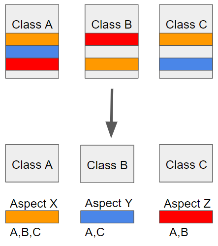
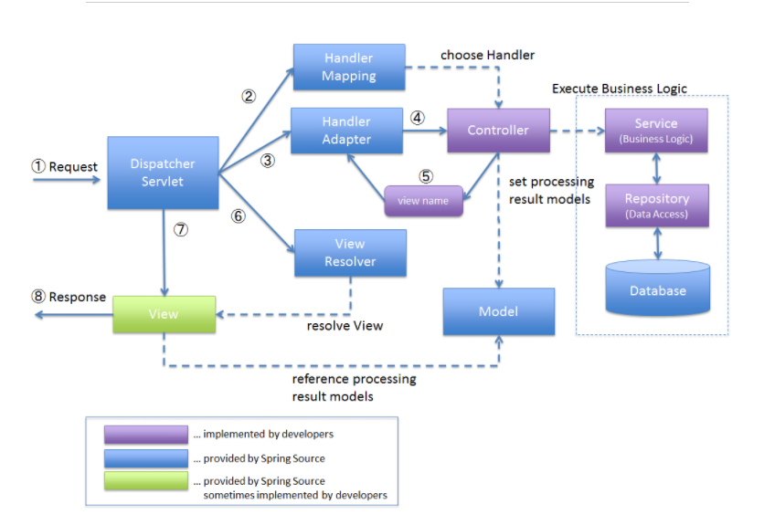

# Part 05. Spring

#### 💡 JDBC는 무엇인가요?

~~~
JDBC(Java Database Connectivity)는 데이터베이스에 연결 및 작업을 하기 위한 자바 표준 인터페이스입니다.
자바는 DBMS의 종류에 상관없이 하나의 JDBC API를 이용해서 데이터베이스 작업을 처리합니다.

이 JDBC는 DB에 접근해서 CRUD를 쉽고 효율적이게 할 수 있게 하고, 고성능에서의 세련된 메소드를 제공하며,
쉽게 프로그래밍 할 수 있게 도와줍니다.
~~~

 

#### 💡 Servlet이란 무엇인가요?

~~~
Servlet은 서버 쪽에서 실행되며, 클라이언트의 요청을 동적으로 처리할 수 있게끔 도와주는 자바 클래스입니다.

서블릿은 자바 클래스이므로, 자바의 일반적인 특징을 모두 갖고 있습니다.
하지만, 자바와 달리 서블릿은 톰캣과 같은 서블릿 컨테이너에서 실행되어야 합니다.

클라이언트가 웹 서버에 요청을 하면, 웹 서버는 그 요청을 톰캣과 같은 웹 어플리케이션 서버(WAS)에 위임합니다.
그러면 WAS는 각 요청에 해당하는 서블릿을 실행합니다.
그 후, 서블릿은 요청에 대한 기능을 수행한 후 결과를 반환하여 클라이언트에게 응답합니다.
~~~

 

#### 💡 JSP란 무엇인가?

~~~
JSP는 Java 언어를 기반으로 하는 Server Side 스크립트 언어입니다.

- HTML 코드에 Java 코드를 넣어 동적인 웹 페이지를 생성하는 웹 어플리케이션 도구입니다.
	1. JSP를 통해 정적인 HTML과 동적으로 생성된 contents(Http 요청 파라미터)를 혼합하여 사용할 수 있습니다.
	2. 즉, 사용자가 입력한 contents에 맞게 동적인 웹 페이지를 생성합니다.
	
- Servlet 기술의 확장
	1. Servlet을 보완한 스크립트 방식 표준
	2. Servlet의 모든 기능 + 추가적인 기능
~~~

##### JSP 동작과정

~~~
JSP가 실행되면 WAS는 내부적으로 JSP 파일을 Java Servlet(.java)로 변환합니다.

- Servlet의 경우 개발자가 .java 파일을 변환, 컴파일하여 동작하고,
- JSP의 경우 개발자가 jsp 파일을 작성하고 .java 파일로 변환하고, 변환한 .java 파일을 다시 컴파일해 동작합니다.
~~~

 

#### 💡 pojo는 무엇인가요?

~~~ 
POJO(Plain Old Java Object)는 오래된 방식의 간단한 자바 오브젝트로,
쉽게 말해 특정 '기술'에 종속되어 동작하는 것이 아닌 순수한 자바 객체를 말하는 것입니다.
특히, Spring은 POJO 방식으로 동작합니다.

POJO 방식과 가장 대비되는 대표적인 예는 Servlet으로, Servlet은 사용하려면 HttpServlet을 반강제적으로 상속받아야 합니다.
~~~

~~~java
UserServlet extends HttpServlet
~~~

~~~
이와 같이 반강제적으로 상속받으면, 단일 상속인 자바의 경우 다른 클래스는 상속받지 못하게 되고,
확장성 있는 유연한 활용이 어려워지게 됩니다.
~~~

 

#### 💡 Spring AOP란?

~~~
AOP(Aspect Oriented Programming)은 관점 지향 프로그래밍이라고 불립니다.
AOP는 쉽게 말해, 어떤 로직을 기준으로 핵심적인 관점, 부가적인 관점으로 나눠서 보고, 그 관점을 기준으로 각각 모듈화하는 것입니다.

AOP에서 각 관점을 기준으로 로직을 모듈화한다는 것은 코드들을 부분적으로 나눠 모듈화하겠다는 의미입니다.
이 때, 소스 코드상에서 다른 부분에 계속 반복해서 쓰는 코드들을 발견할 수 있는데, 이것을 흩어진 관심사(Crosscutting Concerns)라고 부릅니다.
~~~

~~~
위와 같이 흩어진 관심사를 Aspect로 모듈화하고, 핵심적인 비즈니스 로직에서 분리해 재사용하겠다는 것이 AOP의 취지입니다.
~~~

 

#### 💡 Spring DI란?

~~~
Spring DI(Dependency Injection)란, 스프링이 다른 프레임워크와 차별화되어 제공하는 의존 관계 주입 기능으로,
객체를 직접 생성하는 게 아니라 외부에서 생성한 후 주입 시켜주는 방식입니다.

DI(의존성 주입)을 통해, 모듈 간의 결합도가 낮아지고, 유연성이 높아집니다.
~~~

~~~
방법1은 A객체가 B와 C객체를 New 생성자를 통해 직접 생성하는 방법이고,
방법2는 외부에서 생성된 객체를 setter()를 통해 사용하는 방법입니다.

방법2가 의존성 주입의 예시인데,
A객체에서 B, C객체를 사용(의존)할 때, A객체에서 직접 생성하는 것이 아니라
외부(IOC 컨테이너)에서 생성된 B, C객체를 조립(주입)시켜 setter 혹은 생성자를 통해 사용하는 방식입니다.
~~~

 

#### 💡 Spring IOC란 무엇인가?

~~~
IoC(Inversion of Control)란 "제어의 역전"이라는 의미로,
말 그대로 메소드나 객체의 호출 작업을 개발자가 결정하는 것이 아니라, 외부에서 결정되는 것을 의미합니다.

IoC는 제어의 역전이라고 말하며, 간단히 말해 "제어의 흐름을 바꾼다"라고 합니다.

IoC는 객체의 의존성을 역전시켜 객체 간의 결합도를 줄이고, 유연한 코드를 작성할 수 있게 하여
가독성 및 코드 중복, 유지 보수를 편하게 할 수 있게 합니다.
~~~

~~~
기존에는 다음과 같은 순서로 객체가 만들어지고 실행되었습니다.
1. 객체 생성
2. 의존성 객체 생성
		- 클래스 내부에서 생성
3. 의존성 객체 메소드 호출

하지만, 스프링에서는 다음과 같은 순서로 객체가 만들어지고 실행됩니다.
1. 객체 생성
2. 의존성 객체 주입
		- 스스로 만드는 것이 아니라, 제어권을 스프링에게 위임하여 스프링이 만들어놓은 객체를 주입합니다.
3. 의존성 객체 메소드 호출

스프링이 모든 의존성 객체를 스프링이 실행될 때 다 만들어주고, 필요한 곳에 주입시켜줌으로써 Bean들은 싱글턴 패턴의 특징을 가지며,
제어의 흐름을 사용자가 컨트롤 하는 것이 아니라 스프링에게 맡겨 작업을 처리하게 됩니다.
~~~

 

#### 💡 Spring MVC 흐름에 대한 설명

~~~
보라색 - 개발자가 구현
파란색 - Spring Framework 제공
연두색 - Spring Framework 제공 or 개발자가 구현

1. DispatherServlet은 web.xml에 정의된 URL 패턴에 맞는 요청을 받고,
	 URL 컨트롤러의 맵핑 작업은 HandlerMapping에 요청합니다.
	 
2. HandlerMapping은 URL을 기준으로 어떤 컨트롤러를 사용하지 결정합니다.
	 결과는 HandlerExecution Chain 객체에 담아 리턴하는데, 요청에 해당하는 Interceptor가 있을 경우 함께 줍니다.
	 
3. HandlerAdapter는 컨트롤러의 메소드를 호출하는 역할을 합니다.
	 실행될 Interceptor가 있을 때는 Interceptor의 preHandle() 메소드를 실행한 다음, 컨트롤러의 메소드를 호출해 요청을 처리합니다.

4. 컨트롤러는 요청을 처리한 뒤, 처리한 결과 및 ModelAndView를 DispatcherServlet에 전달합니다.

5. DispatherServlet은 컨트롤러에서 전달받은 View 이름과 매칭되는 실제 View 파일을 찾기 위해 ViewResolver에게 요청합니다.

6. ViewResolver는 컨트롤러가 처리한 결과를 보여줄 뷰를 결정합니다.
	 컨트롤러에서 전달 받은 View 이름의 앞뒤로 prefix, suffix 프로퍼티를 추가한 값이 실제 사용할 뷰의 경로가 됩니다.
	 ViewResolver는 맵핑되는 View 객체를 DispatcherServlet에 전달합니다.
	 
7. DispatcherServlet은 ViewResolver에 전달받은 View Model을 넘겨 클라이언트에게 보여줄 화면을 생성합니다.
~~~

 

#### 💡 Spring MVC1과 MVC2의 차이점은?

~~~
MVC1은 웹 브라우저 요청을 JSP가 처리합니다.

JSP가 Controller와 View 기능을 모두 담당합니다.
쉽게 말하면, 하나의 JSP 페이지 내에서 Controller는 Java, View는 HTML, CSS 이벤트는 JavaScript를 사용합니다.
Model은 JDBC 인터페이스로 DB를 조작하며 class를 정의합니다.

MVC1의 장점은 페이지 흐름이 단순하고, 구조가 간단해 중소형 프로젝트에 적합합니다.
반면, 단점은 유지보수가 어려워 웹 규모가 커질수록 복잡해집니다.

규모가 작고, 유지보수가 적은 경우 사용합니다.
~~~

~~~
MVC2는 웹 브라우저 요청을 Controller에서 처리합니다.

Controller는 요청에 대한 로직 처리를 Model로 보내고, Model은 결과를 View로 보내며, 사용자에게 응답하게 됩니다.
Model은 MVC1, MVC2 모두 동일합니다.
View는 JSP로 구성되어 있으며, Java는 포함되지 않고 JSTL을 사용해 결과를 표현합니다.

MVC2의 장점은 유지보수, 확장에 용이하며 Controller와 View의 분리로 명료한 구조를 가집니다.
반면, 단점은 구조 설계를 위한 시간이 많이 소요되어 개발이 어렵고, 높은 수준의 이해도가 필요합니다.

규모가 크고, 유지보수가 많은 경우 사용합니다.
~~~

 

#### 💡 Spring과 Spring Boot의 차이점은?

~~~
Spring Framework 즉, Spring은 자바 플랫폼을 위한 오픈소스 어플리케이션 프레임워크로,
동적인 웹 사이트를 개발하기 위한 여러 서비스를 제공합니다.

Spring은 기능이 많은만큼, 환경설정이 복잡한데, 이를 해결하기 위해 나온 것이 Spring Boot입니다.

Spring Boot는 Spring을 사용하기 위한 설정의 많은 부분을 자동화하여 사용자가 편하게 Spring을 사용할 수 있도록 돕습니다.
~~~

~~~
Spring Boot는 Spring과 몇 가지 면에서 차이가 있습니다.

1. Embed Tomcat을 사용하기 때문에 (Spring Boot 내부에 Tomcat 포함),
	 따로 Tomcat을 설치하거나 매번 버전을 관리해줘야 하는 수고로움을 덜어줍니다.
2. Starter를 통한 Dependency 자동화
	 - 과거 Spring에서는 각각의 Dependency들의 호환되는 버전을 일일이 맞춰줘야 했고,
	 	 때문에 하나의 버전을 올리고자 하면 다른 Dependency에까지 영향을 미쳐 버전 관리에 어려움이 많았습니다.
	 	 하지만, 이제 Starter가 대부분의 Dependency를 관리해주기 때문에 이런 걱정을 많이 덜게 되었습니다.
	 - Starter란 특정 목적을 달성하기 위한 의존성 그룹이라고 생각하면 이해가 쉽습니다.
	 	 Starter는 npm처럼 간편하게 Dependency를 제공해주는데,
	 	 만약 우리가 JPA가 필요하다면 prom.xml(메이븐)이나 build.gradle(그레이들)에 'spring-book-starter-data-jpa'만 추가해주면 Spring Boot가 그에 필요한 라이브러리들을 알아서 받아옵니다.
	 	 명명 규칙 : spring-boot-starter-*
3. XML 설정을 하지 않아도 된다.
4. jar 파일을 이용해 자바 옵션만으로 손쉽게 배포가 가능합니다.
	 - Spring Actuaor를 이용한 어플리케이션의 모니터링과 관리를 제공합니다.
~~~

 

#### 💡 DAO와 DTO의 차이점은?

~~~
DAO(Data Access Object)는 데이터베이스의 Data에 접근하기 위한 객체이며,
데이터베이스 접근을 하기 위한 로직과 비즈니스 로직을 분리하기 위해 사용합니다.
DAO는 데이터베이스와 연결할 Connection까지 설정된 경우가 많습니다.
그래서 MyBatis 등을 사용할 경우, 커넥션 풀까지 제공되기 때문에 DAO를 별도로 만드는 경우는 드뭅니다.

DTO(Data Transfer Object)는 계층 간 데이터 교환을 위한 Java Beans입니다.
DTO는 데이터베이스 레코드의 데이터를 매핑하기 위한 데이터 객체를 말합니다.
DTO는 보통 로직을 갖고 있지 않고, data와 그 data에 접근하기 위한 getter, setter만 가지고 있습니다
정리하면, DTO는 데이터베이스에서 Data를 얻어, Service나 Controller 등으로 보낼 때 사용하는 객체를 말합니다.
~~~

##### DTO 클래스 예제

~~~java
public class PersonDTO {
  private String name;
  private int age;
  
  public String getName() {
		return name;
  }
  
  public void setName(String name) {
    this.name = name;
  }
  
  public int getAge() {
    return age;
  }
  
  public void setAge(int age) {
    this.age = age;
  }
}
~~~

 

#### 💡 MyBatis란 무엇인가?

~~~
MyBatis는 자바오브젝트와 SQL 사이의 자동 매핑 기능을 지원하는 ORM(Object Relational Mapping) 프레임워크입니다.
MyBatis는 SQL을 별도의 파일로 분리해서 관리하게 해줍니다.
SQL을 그대로 이용하면서 JDBC 코드 작성의 불편함도 제거해주고,
도메인 객체나 VO 객체를 중심으로 개발이 가능하다는 장점이 있습니다.
~~~

 

#### 💡 MyBatis와 Spring JPA의 장단점

~~~
MyBatis의 장점은, 복잡한 쿼리나 다이나믹한 쿼리에 강하다는 점이고,
Java, C#, .NET, Ruby 등 다양한 프로그래밍에 연동이 가능합니다.
반면 단점은, 필요없는 쿼리를 반복하는 경우도 생길 수 있습니다.

Spring JPA는 자바에서 DB에 데이터 CRUD를 편하게 해주는 API로, 자바 표준 ORM(객체 관계 맵핑) 프레임워크입니다.
SQL을 직접 다루게 되면, 요구사항 변경이 발생할 때 SQL과 맵퍼, 컨테이너 객체 모두에 수정이 가해져야 했습니다.
하지만 JPA를 사용하면 JPA가 대신 처리해주므로, 수정해야 할 코드가 줄어들어 유지보수가 용이합니다.
반면 단점은, JPA는 복잡한 쿼리보다는 실시간 처리용 쿼리에 더 최적화되어 있어,
복잡한 통계 쿼리는 SQL을 직접 작성하는 것이 더 쉬운 경우가 많습니다.
~~~

 

#### 💡 Spring Bean 주입 방법

~~~
Spring Bean을 등록하는 방법에는 2가지가 있습니다.

1. 컴포넌트 스캔과 자동 의존관계 설정
	 - @Component 어노테이션이 있으면 자동으로 스프링 빈으로 등록됩니다.
	   참고로, @Component 어노테이션은 @Controller, @Service, @Repository를 포함합니다.
	   
2. 자바 코드로 직접 스프링 빈 등록
	 - 자바 코드로 직접 등록할 때도 Controller는 컴포넌트 스캔으로 올라가기 때문에, @Controller를 추가해야 합니다.
~~~

 

#### 💡 Web Server과 WAS의 차이점

~~~
Web Server는 클라이언트가 웹 브라우저에서 어떤 페이지 요청을 하면,
웹 서버에서 그 요청을 받아 정적 콘텐츠를 제공하는 서버입니다.
여기서 정적 컨텐츠란 단순 HTML 문서, CSS, JavaScript, 이미지, 파일 등 즉시 응답이 가능한 컨텐츠입니다.

WAS는 웹 서버와 웹 컨테이너가 합쳐진 형태로,
웹 서버 단독으로는 처리할 수 없는 데이터베이스의 조회나 다양한 로직 처리가 필요한 동적 컨텐츠를 제공합니다.
WAS는 JSP, Servlet 구동 환경을 제공해주기 때문에 웹 컨테이너 혹은 서블릿 컨테이너라고도 불립니다.
~~~

 

#### 💡 JAR과 WAR의 차이점

~~~
JAR과 WAR는 모두 Java 기반의 application 배포 형태로, Java Jar Tool을 이용해 압축한 압축 파일입니다.
하지만 사용 목적이 다릅니다.

JAR(Java Archive)는 자바 클래스 파일과, 각 클래스들이 사용하는 관련 리소스 파일 및 메타데이터를 압축한 파일입니다.

WAR(Web Application Archive)는 웹 어플리케이션을 어떻게 설정할지에 대한 정의가 있는 web.xml 파일이 있습니다.
자바 서버 페이지, 자바 서블릿, 자바 클래스, XML, 파일, 태그 라이브럴, 정적 웹페이지(HTML 관련 파일) 및 웹 application을 구성할 때 필요한 자원을 압축한 jar 파일입니다.

JAR가 가장 적은 압축 범위를 갖고,
WAR는 JAR의 모든 파일 + WAR만의 파일을 더 압축합니다.
~~~

 

 

---

**[참고]**

[JDBC](https://jaehoney.tistory.com/29)

[JDBC](https://velog.io/@modsiw/JDBC%EB%9E%80)

[Servlet](https://kingofbackend.tistory.com/22)

[JSP란?](https://velog.io/@turtle601/JSP%EB%9E%80)

[POJO](https://velog.io/@walker/Java-POJO%EB%9E%80-%EB%AC%B4%EC%97%87%EC%9D%BC%EA%B9%8C)

[POJO](https://siyoon210.tistory.com/120)

[스프링 AOP](https://engkimbs.tistory.com/746)

[Spring DI & IOC](https://velog.io/@gillog/Spring-DIDependency-Injection)

[Spring MVC](https://wellbell.tistory.com/137)

[MVC1 & MVC2](https://chobopark.tistory.com/21)

[Spring과 Spring Boot](https://velog.io/@courage331/Spring-%EA%B3%BC-Spring-Boot-%EC%B0%A8%EC%9D%B4)

[DAO & DTO](https://m.blog.naver.com/cjhol2107/221757079506)

[MyBatis](https://velog.io/@changyeonyoo/Mybatis%EB%9E%80-%EC%9E%A5%EC%A0%90-%ED%8A%B9%EC%A7%95-%EC%BB%B4%ED%8F%AC%EB%84%8C%ED%8A%B8)

[MyBatis의 장단점](https://development-pro.tistory.com/entry/Mybatis-%EB%9E%80-%EC%9E%A5%EC%A0%90%EB%8B%A8%EC%A0%90-%EC%82%AC%EC%9A%A9%ED%95%98%EB%8A%94-%EC%9D%B4%EC%9C%A0)

[JPA](https://armful-log.tistory.com/67)

[JPA 장단점](https://henrybook.tistory.com/1)

[Spring Bean 주입](https://1-7171771.tistory.com/105)

[웹 서버와 WAS의 차이](https://codechasseur.tistory.com/25)

[Web Server & WAS](https://github.com/gyoogle/tech-interview-for-developer/blob/master/Web/Web%20Server%EC%99%80%20WAS%EC%9D%98%20%EC%B0%A8%EC%9D%B4.md)

[JAR & WAR](https://programmer93.tistory.com/40)