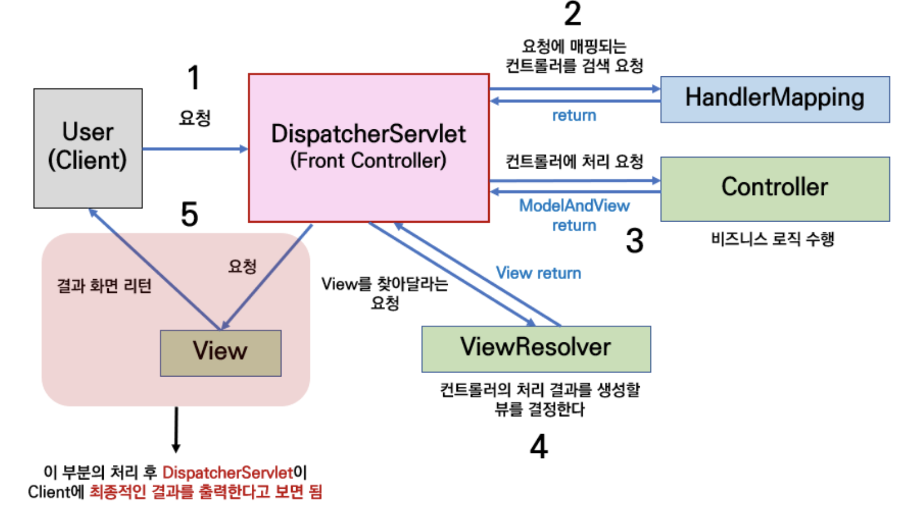

# Part 05. Spring

#### 💡 JDBC는 무엇인가요?

**JDBC**(Java Database Connectivity)는 자바에서 데이터베이스에 접속할 수 있도록 하는 자바 API이다. **JDBC**는 데이터베이스에서 자료를 쿼리하거나 업데이트하는 방법을 제공한다.

**안정화 버전:** JDBC 4.3 / 2017년 9월 21일

**종류:** 데이터 접근 API


#### 💡 Servlet이란 무엇인가요?

> - 클라이언트의 요청을 처리하고, 그 결과를 반환하는 Servlet 클래스의 구현 규칙을 지킨 자바 웹 프로그래밍 기술
> - Java를 웹어플리케이션에 조금 더 개발하기 쉽게 하기 위해 만든 API(라이브러리, 클래스 들)이며 이 규약에 맞는 라이브러리나 클래스들을 상속 및 구현하여 만든 클래스들을 서블릿이라고 한다.

- `Servlet`은 서버 쪽에서 실행되면서 클라이언트의 요청에 따라 동적으로 서비스를 제공하는 `자바 클래스`이다.

- 독자적으로 실행할 수 없으며, 톰캣과 같은 `JSP/Servlet 컨테이너`에서만 실행 가능하며, 컨테이너 독립적으로 실행된다.

- 서블릿은 서버에서 실행되다가 웹 브라우저에서 요청을 하면 해당 기능을 수행 후, 웹 브라우저에 결과를 전송한다.

  #### 특징

  - 클라이언트의 요청에 대해 동적으로 작동하는 웹 어플리케이션 컴포넌트
  - Java Thread를 이용하여 동작한다!
  - MVC 패턴에서 Controller로 이용한다.

  

#### 💡 JSP란 무엇인가?

> JSP (Java Server Page)

- 웹 사용자가 폭발적으로 증가하고, 웹 페이지도 복잡해지고 고도화됨에 따라, 개발자와 디자이너의 분업이 일어나기 시작하였다.
- 디자이너가 자바와 서블릿의 코드에 익숙하지 않아 화면 기능 구현시 불편함이 많았다.
- 서블릿의 기능 중 화면 부분을 디자이너가 쉽게 작업하기 위해 `JSP`가 등장하였다.
- JSP 파일에서는 HTML로 작성된 문서 안에 `<% %>` , `<%= %>` 등의 바구니 안에 자바코드를 삽입할 수 있다.
- `Java 컨테이너`는 JSP파일의 HTML코드와 자바코드를 분리하여 `class파일`을 만들고 실행한다.
- java언어 기반으로 **동적인 웹 페이지**를 구성할 수 있다


### Servlet과 JSP의 차이
#### Servlet
- Java 코드 안에 HTML 코드 (하나의 클래스)
- data processing(Controller)에 좋다. 즉 DB와의 통신, Business Logic 호출, 데이터를 읽고 확인하는 작업 등에 유용하다.
- Servlet이 수정된 경우 Java 코드를 컴파일(.class 파일 생성)한 후 동적인 페이지를 처리하기 때문에 전체 코드를 업데이트하고 다시 컴파일한 후 재배포하는 작업이 필요하다. (개발 생산성 저하)

#### JSP
- HTML 코드 안에 Java 코드

- presentation(View)에 좋다. 즉 요청 결과를 나타내는 HTML 작성하는데 유용하다.

- JSP가 수정된 경우 재배포할 필요가 없이 WAS가 알아서 처리한다. (쉬운 배포)

  

#### 💡 pojo는 무엇인가요?

> POJO (Plain Old Java Object), 본래 자바의 장점을 살리는 '오래된' 방식의 '순수한' 자바객체
>
> 진정한 POJO란 객체지향적인 원리에 충실하면서, 환경과 기술에 종속되지 않고 필요에 따라 재활용될 수 있는 방식으로 설계된 오브젝트를 말한다.

##### POJO를 정리하자면,

- 특정 규약(contract)에 종속되지 않는다. (Java 언어와 꼭 필요한 API 외에 종속되지 않는다.)
- 특정 환경에 종속되지 않는다.
- 객체지향원리에 충실해야 한다.

##### POJO를 사용하는 이유

- 코드의 간결함 (비즈니스 로직과 특정 환경/low 레벨 종속적인 코드를 분리하므로 단순하다.)
- 자동화 테스트에 유리 (환경 종속적인 코드는 자동화 테스트가 어렵지만, POJO는 테스트가 매우 유연하다.
- 객체지향적 설계의 자유로운 사용

##### POJO 프레임워크 

- **POJO를 이용한 애플리케이션 개발이 가진 특징과 장점을 그대로 살리면서 EJB에서 제공하는 엔터프라이즈 서비스와 기술을 그대로 사용할 수 있도록 도와주는 프레임워크**

###### **스프링 프레임워크**

- 스프링 : POJO 프레임워크 중 하나이며, 자바 애플리케이션 개발을 위한 포괄적인 인트라 스트럭처를 제공하는 자바 플랫폼이다. 

- 스프링을 사용하면 POJO로 어플리케이션을 만들고 엔터프라이즈 서비스를 비침투적으로 POJO에 적용할 수 있다. 


#### 💡 Spring AOP란?

- **AOP**는 **Aspect Oriented Programming**의 약자로 **관점 지향 프로그래밍**
- 관점 지향은 쉽게 말해 **어떤 로직을 기준으로 핵심적인 관점, 부가적인 관점으로 나누어서 보고 그 관점을 기준으로 각각 모듈화하겠다는 것이다**. (모듈화란 어떤 공통된 로직이나 기능을 하나의 단위로 묶는 것을 말한다.)
- 예) 핵심적인 관점은 결국 우리가 적용하고자 하는 핵심 비즈니스 로직이 된다. 또한 부가적인 관점은 핵심 로직을 실행하기 위해서 행해지는 데이터베이스 연결, 로깅, 파일 입출력 등을 예로 들 수 있다.
- **AOP**에서 각 관점을 기준으로 로직을 모듈화한다는 것은 코드들을 부분적으로 나누어서 모듈화하겠다는 의미다. 이때, 소스 코드상에서 다른 부분에 계속 반복해서 쓰는 코드들을 발견할 수 있는 데 이것을 **흩어진 관심사 (Crosscutting Concerns)**라 부른다. 


- 위와 같이 흩어진 관심사를 **Aspect로 모듈화하고 핵심적인 비즈니스 로직에서 분리하여 재사용하겠다는 것이 AOP의 취지**다.

  

**| AOP 주요 개념**

- Aspect : 위에서 설명한 흩어진 관심사를 모듈화 한 것. 주로 부가기능을 모듈화함.
- Target : Aspect를 적용하는 곳 (클래스, 메서드 .. )
- Advice : 실질적으로 어떤 일을 해야할 지에 대한 것, 실질적인 부가기능을 담은 구현체
- JointPoint : Advice가 적용될 위치, 끼어들 수 있는 지점. 메서드 진입 지점, 생성자 호출 시점, 필드에서 값을 꺼내올 때 등 다양한 시점에 적용가능
- PointCut : JointPoint의 상세한 스펙을 정의한 것. 'A란 메서드의 진입 시점에 호출할 것'과 같이 더욱 구체적으로 Advice가 실행될 지점을 정할 수 있음


**| 스프링 AOP 특징**

- 프록시 패턴 기반의 AOP 구현체, 프록시 객체를 쓰는 이유는 접근 제어 및 부가기능을 추가하기 위해서임
- 스프링 빈에만 AOP를 적용 가능
- 모든 AOP 기능을 제공하는 것이 아닌 스프링 IoC와 연동하여 엔터프라이즈 애플리케이션에서 가장 흔한 문제(중복코드, 프록시 클래스 작성의 번거로움, 객체들 간 관계 복잡도 증가 ...)에 대한 해결책을 지원하는 것이 목적


출처: https://engkimbs.tistory.com/746 


#### 💡 Spring DI란?

`DI(Dependency Injection)`란 **스프링이 다른 프레임워크와 차별화되어 제공하는 의존 관계 주입 기능**으로,
**객체를 직접 생성하는 게 아니라 외부에서 생성한 후 주입 시켜주는 방식**이다.

**DI(의존성 주입)를 통해서 모듈 간의 결합도가 낮아지고 유연성이 높아진다.**


첫번째 방법은 A객체가 B와 C객체를 New 생성자를 통해서 직접 생성하는 방법이고,

두번째 방법은 **외부에서 생성 된 객체를 setter()를 통해 사용하는 방법**이다.

이러한 두번째 방식이 의존성 주입의 예시인데,
`A 객체`에서 **`B, C객체`를 사용(의존)할 때** `A 객체`에서 **직접 생성 하는 것이 아니라** **`외부(IOC컨테이너)`에서 생성된 `B, C객체`를 조립(주입)시켜 `setter` 혹은 `생성자`를 통해 사용하는 방식**이다.


**스프링에서는 객체를 `Bean`**이라고 부르며, 프로젝트가 실행될때 사용자가 Bean으로 관리하는 객체들의 생성과 소멸에 관련된 작업을 자동적으로 수행해주는데 객체가 생성되는 곳을 스프링에서는 Bean 컨테이너라고 부른다.


#### 💡 Spring IOC란 무엇인가?

`IoC(Inversion of Control)`란 "제어의 역전" 이라는 의미로, 말 그대로 **메소드나 객체의 호출작업을 개발자가 결정하는 것이 아니라, 외부에서 결정되는 것을 의미**한다.


`IoC`는 **제어의 역전이라고 말하며, 간단히 말해 "제어의 흐름을 바꾼다"**라고 한다.

객체의 **의존성을 역전시켜 객체 간의 결합도를 줄이고 유연한 코드를 작성**할 수 있게 하여 **가독성 및 코드 중복, 유지 보수를 편하게** 할 수 있게 한다.

기존에는 다음과 순서로 객체가 만들어지고 실행되었다.

1. 객체 생성
2. 의존성 객체 생성
   *클래스 내부에서 생성*
3. 의존성 객체 메소드 호출

하지만, 스프링에서는 다음과 같은 순서로 객체가 만들어지고 실행된다.

1. 객체 생성
2. 의존성 객체 주입
   *스스로가 만드는것이 아니라 제어권을 **스프링에게 위임하여 스프링이 만들어놓은 객체를 주입**한다.*
3. 의존성 객체 메소드 호출

**스프링이 모든 의존성 객체를 스프링이 실행될때 다 만들어주고 필요한곳에 주입**시켜줌으로써 **Bean들은 `싱글턴 패턴`의 특징**을 가지며,

**제어의 흐름을 사용자가 컨트롤 하는 것이 아니라 스프링에게 맡겨 작업을 처리**하게 된다.


[출처] https://velog.io/@gillog/Spring-DIDependency-Injection


#### 💡 Spring MVC 흐름에 대한 설명

웹 어플리케이션은 크게 **MVC** 패턴을 따르게 되며 **Model, View, Controller**로 나뉘게 된다. 

- Model : DB와 상호작용하며 비즈니스 로직을 처리하는 모듈 
- View : Client에게 보여지는 결과화면을 반환하는 모듈
- Controller : Client 요청이 들어왔을 때 그 입력을 처리하고 어떤 로직을 실행시킬 것인지 제어하는 모듈


###### 출처 : 부스트코스(https://www.edwith.org/boostcourse-web/lecture/16762/)

- - Model 은 '데이터' 디자인을 담당한다.
    - ex. 상품 목록, 주문 내역 등
  - View 는 '실제로 렌더링되어 보이는 페이지' 를 담당한다.
    - ex. `.JSP` 파일들이 여기에 해당된다.
  - Controller 는 사용자의 요청을 받고, 응답을 주는 로직을 담당한다.
    - ex. GET 등의 uri 매핑이 여기에 해당된다.
- Spring MVC 모듈을 사용하여, 백엔드 프로그래밍의 기본 프레임워크를 잡는다.
  - Web 서버에 특화되어 만들어진 모듈이라, 개발자가 해야할 영역을 더 적게 만들어준다.
  - 즉 기존에 Spring 보다 더 깔끔하고 간편하게 개발 가능.
- 별다른 말이 없으면 MVC Model 2 아키텍처를 사용하는 것으로 생각한다.


#### 💡 Spring MVC1과 MVC2의 차이점은?

##### MVC1


MVC1 패턴의 경우 View와 Controller를 모두 JSP가 담당하는 형태를 가집니다. 즉 JSP 하나로 유저의 요청을 받고 응답을 처리하므로 **구현 난이도는 쉽습니다.**

단순한 프로젝트에는 괜찮겠지만 내용이 복잡하고 거대해질수록 이 패턴은 힘을 잃습니다. **JSP 하나에서 MVC 가 모두 이루어지다보니 재사용성도 매우 떨어지고, 읽기도 힘들어집니다.** 즉 **유지보수에 있어서 문제가 발생합니다.**


##### MVC2


MVC2 패턴은 널리 표준으로 사용되는 패턴입니다. **요청을 하나의 컨트롤러(Servlet)가 먼저 받습니다.** 즉 MVC1과는 다르게 **Controller, View가 분리되어 있습니다.** 따라서 역할이 분리되어 MVC1패턴에서의 단점을 보완할 수 있습니다. 그러므로 개발자는 M, V, C 중에서 수정해야 할 부분이 있다면, 그것만 꺼내어 수정하면 됩니다. 따라서 유지보수에 있어서도 큰 이점을 가집니다.

MV2는 MVC1 패턴보다 구조가 복잡해질 수 있지만, 개발자가 이러한 세부적인 구성까지 신경쓰지 않을 수 있도록 **각종 프레임워크들이 지금까지 잘 발전되어 왔습니다.** 그 중에서 대표적인 것이 바로 **스프링 프레임워크**입니다.


##### Spring & MVC2



[출처] https://chanhuiseok.github.io/posts/spring-3/


#### 💡 Spring과 Spring Boot의 차이점은?

- **스프링** 프레임워크는 기능이 많은만큼 환경설정이 복잡한 편이다. 이에 어려움을 느끼는 사용자들을 위해 나온 것이 바로 **스프링 부트**다. 

- **스프링 부트**는 **스프링** 프레임워크를 사용하기 위한 설정**의** 많은 부분을 자동화하여 사용자가 정말 편하게 **스프링**을 활용할 수 있도록 돕는다.

  

#### 💡 DAO와 DTO의 차이점은?

**DAO**

\- Data Access Object, 데이터베이스의 data에 접근하기 위한 객체

\- DAM(Data Access Module)과 유사한 역할

\- DB접근 로직과 비즈니스 로직을 구분하기 위함

-> DAO의 경우는 DB와 연결할 Connection 까지 설정되어 있는 경우가 많음. 그래서 현재 많이 쓰이는 Mybatis 등을 사용할 경우 커넥션풀까지 제공되고 있기 때문에 DAO를 별도로 만드는 경우는 드물다.


**DTO**

\- Data Transfer Object, 계층간 데이터 교환을 위한 자바 beans

\- 각 계층간 데이터 교환을 위한 객체

\- 로직을 갖고 있지 않는 순수한 데이터 객체이며, getter/setter 메서드만 보유한 클래스


#### 💡 Mybatis란 무엇인가?

- Mybatis는 자바 오브젝트와 SQL사이의 자동 매핑 기능을 지원하는 ORM(Object relational Mapping)프레임워크이다.

- SQL을 별도의 파일로 분리해서 관리하게 해준다.
  Hibernate나 JAP(Java Persistence Api)처럼 새로운 DB프로그래밍 패러다임을 익혀야하는 부담 없이 SQL을 그대로 이용하면서 JDBC코드 작성의 불편함도 제거해주고 도메인 객체나 VO객체를 중심으로 개발이 가능하다는 장점이 있다.

##### Mybatis의 특징

1. 쉬운 접근성과 코드의 간결함
   JDBC의 모든 기능을 Mybatis가 대부분 제공한다.
   복잡한 JDBC코드를 걷어내며 깔끔한 소스코드를 유지할 수 있다.
   수동적인 파라미터 설정과 쿼리 결과에 대한 맵핑 구문을 제거할 수 있다.

2. SQL문과 프로그래밍 코드의 분리
   SQL에 변경이 있을 때마다 자바 코드를 수정하거나 컴파일하지 않아도 된다.

3. 다양한 프로그래밍 언어로 구현가능
   Java, C#, .NET, Ruby

   

#### 💡 MyBatis와 Spring JPA의 장단점

```null
> SQL Mapper

SQL Mapper는 직접 SQL문을 작성해 DB를 접근하는 것이다.
Mybatis가 SQL Mapper에 해당한다.

> ORM (Object Relational Mapping)

DB의 데이터를 객체로 매핑시켜 데이터를 접근할 수 있는 것이다.
ORM을 사용하면 SQL을 작성하지 않고도 메소드를 사용해 데이터를 조작할 수 있다.
JPA, Hibernate 등이 해당한다.
```


#### @ Mybatis

Java에서는 DB에 접근할 수 있도록 **JDBC**라는 라이브러리를 제공한다.
JDBC는 학습이 쉬워서 처음 DB 접근을 배울 때 자주 사용된다.
그렇지만 사용할 때마다 Connection을 생성해줘야 하고, 중복되는 코드가 많아 실제 개발에는 잘 안쓰이는 느낌이다.

이 JDBC를 사용하기 쉽게 만들어주는 것이 **Mybatis**이다.
아까 말했듯, SQL Mapper에 해당한다. JDBC로 처리하는 부분의 일부를 코드와 파라미터 설정으로 매핑을 대신 해준다.

```null
장점
+ 학습이 쉽다.
+ 소스코드와 sql을 분리할 수 있다.

단점
+ 반복적인 작업이 반복된다.
```


#### @JPA (Java Persistent API)

Java ORM 기술에 대한 API 표준 명세로, 이것 또한 Java에서 제공하는 API이다.
사용할 때 JPA, Spring Data JPA, Hibernate를 혼동하기 쉽다.

- JPA는 자바 어플리케이션에서 RDBMS를 사용하는 방식을 정의한 인터페이스이다.
  **라이브러리가 아님**! -> 구현이 없다.
- Spring Data JPA는 JPA를 쓰기 좋게 만들어놓은 모듈이다.
  JPA interface를 구현해 **Repository**라는 인터페이스를 제공한다.
- Hibernate는 JPA의 구현체이다.

```null
장점
+ CRUD 쿼리를 자동으로 생성해준다.
+ Entity에 속성만 추가해준다면 쿼리를 건들 필요가 없다.

단점
+ 상대적으로 학습이 어렵다.
+ 복잡한 쿼리 작성이 어렵다고 한다.
```


[출처] https://velog.io/@leeinae/Spring-Mybatis-JPA-Hibernate-%EB%B9%84%EA%B5%90


#### 💡 Spring Bean 주입 방법

#### 1. 컴포넌트 스캔을 이용한 등록방법

>  컴포넌트 스캔과 자동 의존관계 설정
>
> 컴포넌트 스캔의 원리는 기본적으로 @Component 어노테이션이 있으면 자동으로 스프링 빈으로 등록된다.
>
> >  참고로, @Component 어노테이션은 @Controller , @Service, @Repository를 포함한다.

- 컴포넌트 스캔을 이용한 방법은 주로 실무에서 정형화된 컨트롤러, 서비스, 리포지토리 같은 곳에 사용한다.
- **즉, 고정화 되어 바뀔일이 없을 경우! 사용한다고 보면 된다. 무작정 쓰는거보다 상황에 맞게 사용하는것이 중요!!**


#### 2. 자바를 통한 직접 등록방법

> **자바 코드로 직접 등록할때도 Controller는 컨포넌트 스캔으로 올라가기 때문에 @Controller를 추가해야 한다.**

주로 정형화 되지 않거나 상황에 따라 구현 클래스를 변경해야 할일이 생기게 되거나, 그럴 여지가 있는 경우 직접 설정을 통해 등록한다.

**즉, 변경될 일 혹은 여지가 있는 경우에 직접 등록하게되면, 코드를 크게 수정하지않아도 쉽게 변경할 수 있는 장점이 있다!!**

- 별도의 Config 파일을 생성하여 직접 주입하는 방법이다.

- 스프링이 시작될때 @Configuration을 찾아가게 된다.

  

#### 💡 Web Server과 WAS의 차이점

### Web Server

1. **Web Server의 개념**
   - 소프트웨어와 하드웨어로 구분된다.
     1) 하드웨어
   - Web 서버가 설치되어 있는 컴퓨터
     2) 소프트웨어
     웹 브라우저 클라이언트로부터 HTTP 요청을 받아 정적인 컨텐츠(.html .jpeg .css 등)를 제공하는 컴퓨터 프로그램
2. **Web Server의 기능**
   - HTTP 프로토콜을 기반으로 하여 클라이언트(웹 브라우저 또는 웹 크롤러)의 요청을 서비스 하는 기능을 담당한다.
     요청에 따라 아래의 두 가지 기능 중 적절하게 선택하여 수행한다.
     - 기능 1)
       정적인 컨텐츠 제공
       WAS를 거치지 않고 바로 자원을 제공한다.
     - 기능 2)
       동적인 컨텐츠 제공을 위한 요청 전달
       클라이언트의 요청(Request)을 WAS에 보내고, WAS가 처리한 결과를 클라이언트에게 전달(응답, Response)한다.
       클라이언트는 일반적으로 웹 브라우저를 의미한다.
3. **Web Server의 예**
   Ex) Apache Server, Nginx, IIS(Windows 전용 Web 서버) 등


### WAS(Web Application Server)

1. **WAS의 개념**

   - DB 조회나 다양한 로직 처리를 요구하는 동적인 컨텐츠를 제공하기 위해 만들어진 Application Server
   - HTTP를 통해 컴퓨터나 장치에 애플리케이션을 수행해주는 미들웨어(소프트웨어 엔진)이다.
   - “웹 컨테이너(Web Container)” 혹은 “서블릿 컨테이너(Servlet Container)”라고도 불린다.
     - Container란 JSP, Servlet을 실행시킬 수 있는 소프트웨어를 말한다.
       즉, WAS는 JSP, Servlet 구동 환경을 제공한다.

2. **WAS의 역할**

   - WAS = Web Server + Web Container
   - Web Server 기능들을 구조적으로 분리하여 처리하고자하는 목적으로 제시되었다.
     - 분산 트랜잭션, 보안, 메시징, 쓰레드 처리 등의 기능을 처리하는 분산 환경에서 사용된다.
       주로 DB 서버와 같이 수행된다.

3. **WAS의 주요 기능**

   - 프로그램 실행 환경과 DB 접속 기능 제공
   - 여러 개의 트랜잭션(논리적인 작업 단위) 관리 기능
   - 업무를 처리하는 비즈니스 로직 수행

4. **WAS의 예**
   Ex) Tomcat, JBoss, Jeus, Web Sphere 등

   


#### 즉, 자원 이용의 효율성 및 장애 극복, 배포 및 유지보수의 편의성 을 위해 Web Server와 WAS를 분리한다. Web Server를 WAS 앞에 두고 필요한 WAS들을 Web Server에 플러그인 형태로 설정하면 더욱 효율적인 분산 처리가 가능하다.
[출처] https://gmlwjd9405.github.io/2018/10/27/webserver-vs-was.html


#### 💡 JAR과 WAR의 차이점

> **JAR** (**J**ava **Ar**chive), **WAR** (**W**eb **A**pplication A**r**chive) 모두 JAVA의 jar 툴을 이용하여 생성된 압축(아카이브) 파일이며 **어플리케이션을 쉽게 배포하고 동작시킬 수 있도록 있도록 관련 파일(리소스, 속성파일 등)들을 패키징**해주는 것이 주 역할

#### **JAR & WAR**

- **java 기반의 application의 배포 형태이다.**
- **JAVA JAR TOOL을 이용하여 압축한 압축 파일이다. ( 즉, 둘이 같은 압축 형태 )**
- **JAR와 WAR는 사용 목적이 다르다.**


#### **JAR**

- Java ARchive
- path 정보를 유지한 상태로 압축한다.
- 자바 클래스 파일과, 각 클래스들이 사용하는 관련 리소스파일 및 메타데이터을 압축한 파일이다.
- 실제로는 ZIP 파일 포맷으로 압축된 파일이다.

#### **WAR**

- Web application ARchive
- 웹 어플리케이션을 어떻게 설정할 지에 대한 정의가 있는 web.xml 파일이 있다.
- 자바 서버 페이지, 자바 서블릿, 자바 클래스, XML, 파일, 태그 라이브러리, 정적 웹페이지(HTML 관련 파일) 및 웹 application을 구성할 때 필요한 자원을 압축한 jar 파일이다.

