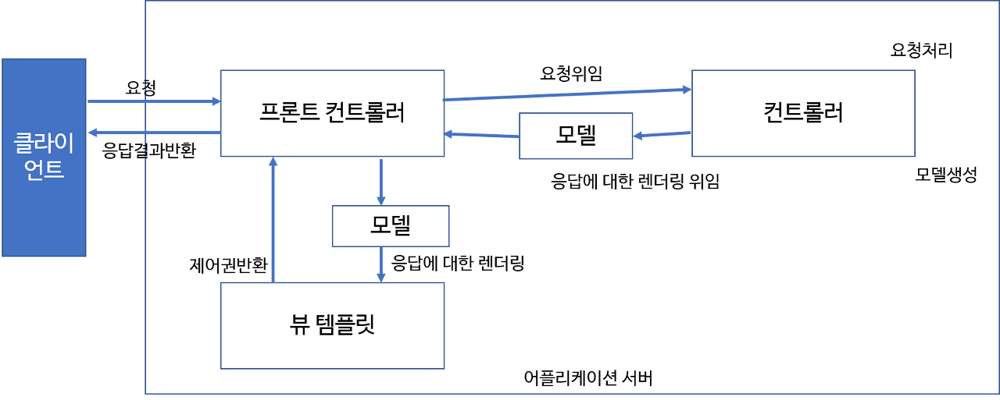

# Part 05.Spring

#### JDBC는 무엇인가요?

```
자바에서 DB 프로그래밍을 하기 위해 사용되는 API
```


#### Servlet이란 무엇인가요?

```
자바언어를 웹 어플리케이션에 개발하기 쉽게 하기 위해 만든 API

라이브러리나 클래스를 상속 및 구현하여 만든 클래스들

코드가 수정되면 다시 컴파일하고 배포해야 함
```

#### JSP란 무엇인가?
```
HTML 내부에 Java코드를 삽입하는 형식

서블릿 기반의 서버 스크립트 기술

자바코드를 <%%> 태그 안에 처리해주어야 한다

HTML처럼 태그를 사용하여 자바코드도 사용이 가능
```

#### pojo는 무엇인가요?
```
오래된 방식의 간단한 자바 오브젝트

Java EE 등의 중량 프레임워크들을 사용하지 않고 기술을 직접적으로 사용하는 객체를 설계
```

#### Spring AOP란?

```
개념 - 어떤 로직을 기준으로 핵심적인 관점, 부가적인 관점으로 나누어 보고 그 관점을 기준으로 각각 모듈화한다는 것

코드 - Aspect Annotation으로 공통된 비즈니스 로직을 모듈화하고 이를 재사용 한다는 것이 AOP의 취지 

특징 - AOP 기능을 제공하는 것이 아닌 IoC와 연동하여 중복코드, 객체간의 복잡도를 줄이는 것을 지원
```
#### Spring DI란?

```
의존성 관계 주입 기능으로 객체를 직접 생성하는 것이 아니라 외부에서 객체를 생성한 뒤 주입 시켜주는 방식이다

모듈 간의 결합도가 낮아지고 유연성이 높아진다

외부에서 1)new 생성자를 통한 생성 2)외부에서 생성된 객체를 setter()를 통해 사용하는 방법 
```


#### Spring IOC란 무엇인가?
```
메소드나 객체의 호출 작업을 개발자가 아니라 외부에서 결정하는 것

다른 방식) 객체 생성 -> 의존성 객체 생성 -> 객체 메소드 호출
IoC) 객체 생성 -> 의존성 객체 주입 -> 의존성 객체 메소드 호출
```

#### Spring MVC 흐름에 대한 설명

```
요청 -> 프론트 컨트롤러 -> 핸들러 매핑 -> 핸들러 어댑터 -> 컨트롤러 -> 로직 수행(서비스) -> 컨트롤러 -> 뷰 리졸버 -> 응답(jsp, html)
```



#### Spring MVC1과 MVC2의 차이점은?
```
MVC1 패턴의 경우 View와 Controller를 모두 JSP가 담당하는 형태
JSP 하나로 유저의 요청을 받고 응답을 처리하므로 구현 난이도는 쉬움

JSP 하나에서 MVC가 모두 이루어지다보니 재사용성이 떨어지고 가독성이 떨어짐 -> 유지보수가 어려움
```
MVC1


```
요청을 하나의 컨트롤러(Servlet)가 먼저 받음
Controller, View가 분리되어 있음
```
MVC2


#### Spring과 Spring Boot의 차이점은??

```
Spring Boot는 Spring를 사용하기 위한 설정의 많은 부분을 자동화
사용자가 편하게 Spring을 활용할 수 있도록 도움

a) Auto Configuration 자동 실행
b) 쉬운 의존성 관리
c) 내장 서버

1. Spring

POJO 기반의 Enterprise Application 개발을 쉽고 편하게 할 수 있도록 한다.
-. Java Application을 개발하는데 필요한 하부구조(Infrastructure)를 포괄적으로 제공
-. Spring이 하부구조를 처리하기 때문에 개발자는 Application 개발에 집중
-. 동적인 웹 사이트를 개발하기 위한 여러 가지 서비스를 제공

2. Spring Boot

-. Actuator: 애플리케이션을 고수준에서 모니터링하고 추적
-. Embedded Server Integrations: 서버가 애플리케이션에 통합
-. Default Error Handling
```

#### DAO와 DTO의 차이점은?
```
DAO - DB를 사용해서 데이터에 조회를 하거나 조작하는 기능을 가진 오브젝트

DTO(VO) - 계층간 데이터 교환을 위한 자바 Beans
```

#### Mybatis란 무엇인가?
```
JDBC를 통해 데이터베이스에 엑세스하는 작업을 캡슐화
일반 SQL 쿼리, 저장 프로 시저 및 고급 매핑을 지원

-> SQL을 쉽게 활용하기 위한 Framework
```

#### MyBatis와 Spring JPA의 장단점
```
ORM(JPA)은 DB 테이블을 자바 객체로 매핑함으로써 객체간의 관계를 바탕으로 SQL을 자동으로 생성
Mapper(MyBatis)는 SQL을 명시해주어야 한다.

ORM은 RDB의 관계를 Object에 반영하는 것이 목적
Mapper는 단순히 필드를 매핑시키는 것이 목적
```


#### Spring Bean 주입 방법

```
1. @Component를 추가해서 Bean으로 만듬
2. 직접 주입한다
```

#### Web Server과 WAS의 차이점

```
Web Server에서는 정적 컨텐츠만 처리하도록 기능을 분배하여 서버의 부담을 줄임
WAS에서는 요청에 맞는 데이터를 DB에서 가져와서 비즈니스 로직에 맞게  결과를 만들어서 제공

분리 효과
1.기능을 분리하여 서버 부하 방지
2.물리적 분리를 통한 보안 강화
3.여러 대의 WAS와 여러 방식의 웹 어플리케이션 사용 가능
```

#### JAR과 WAR의 차이점
```
JAR - .jar 확장자 파일에는 Class와 같은 Java 리소스와 속성 파일,  라이브러리 및 액세서리 파일이 포함되어 있습니다. 
쉽게 JAVA 어플리케이션이 동작할 수 있도록 자바 프로젝트를 압축한 파일

WAR -  WAR는 웹 응용 프로그램를 위한 포맷이기 때문에 웹 관련 자원만 포함
따라서WAR파일을 실행하려면 Tomcat, Weblogic, Websphere 등의 웹 서버 (WEB)또는 웹 컨테이너(WAS)가 필요
```